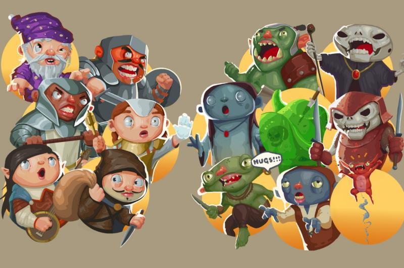
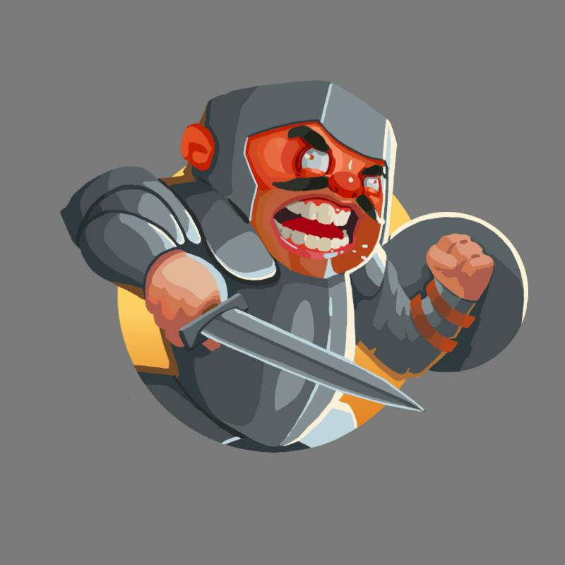
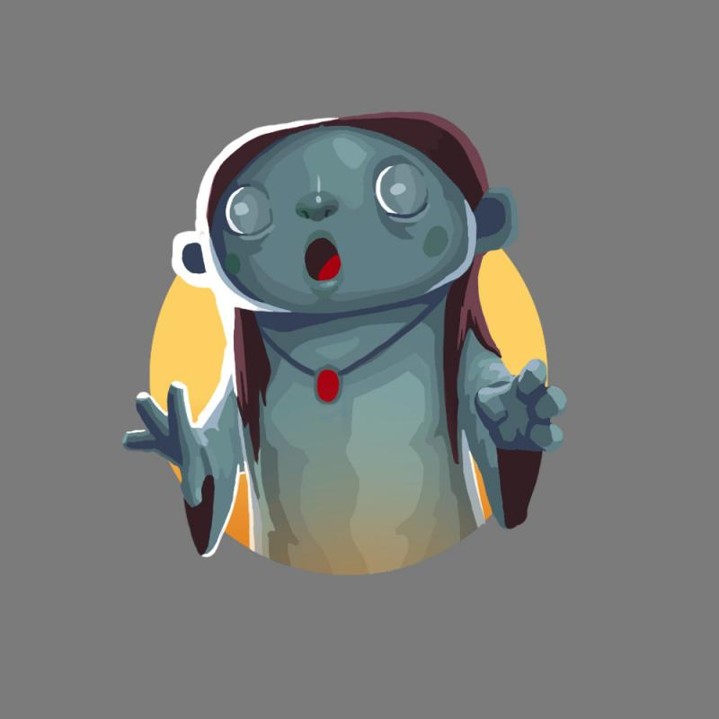
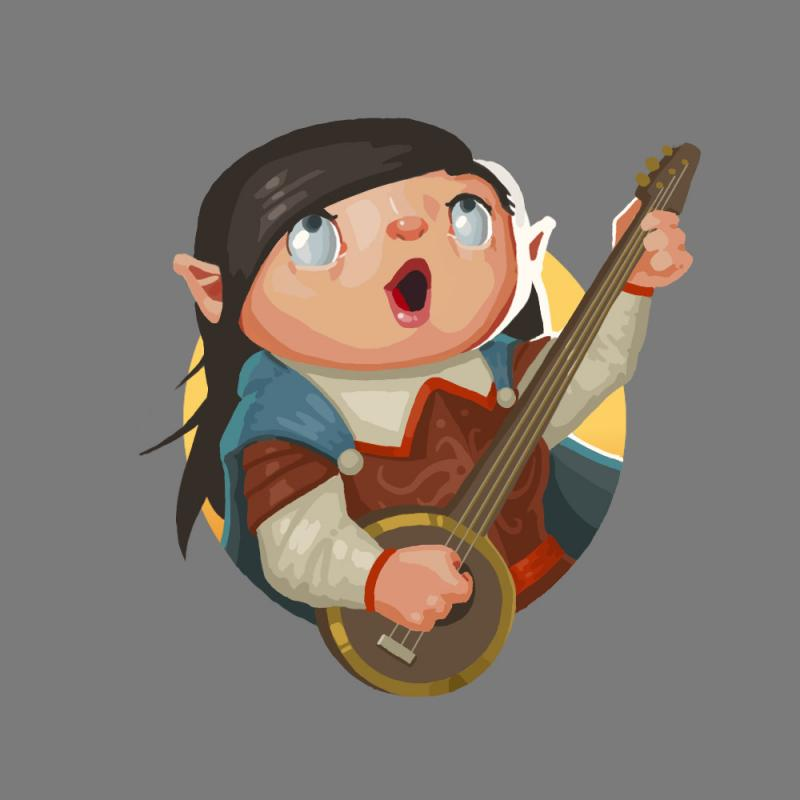
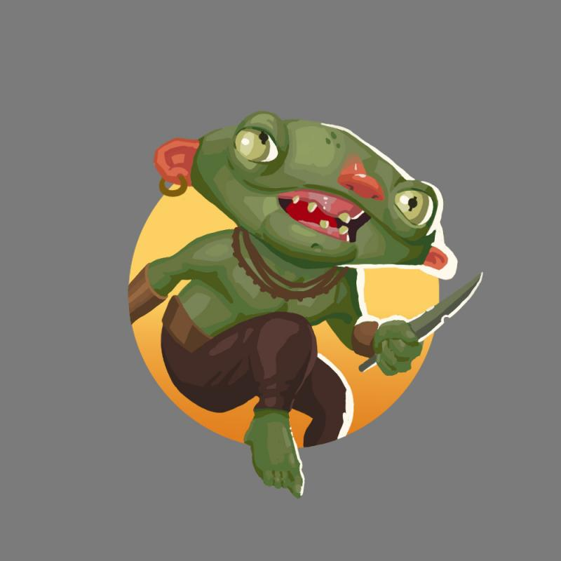
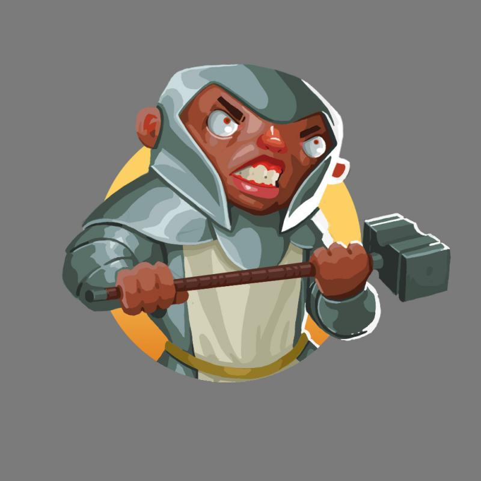
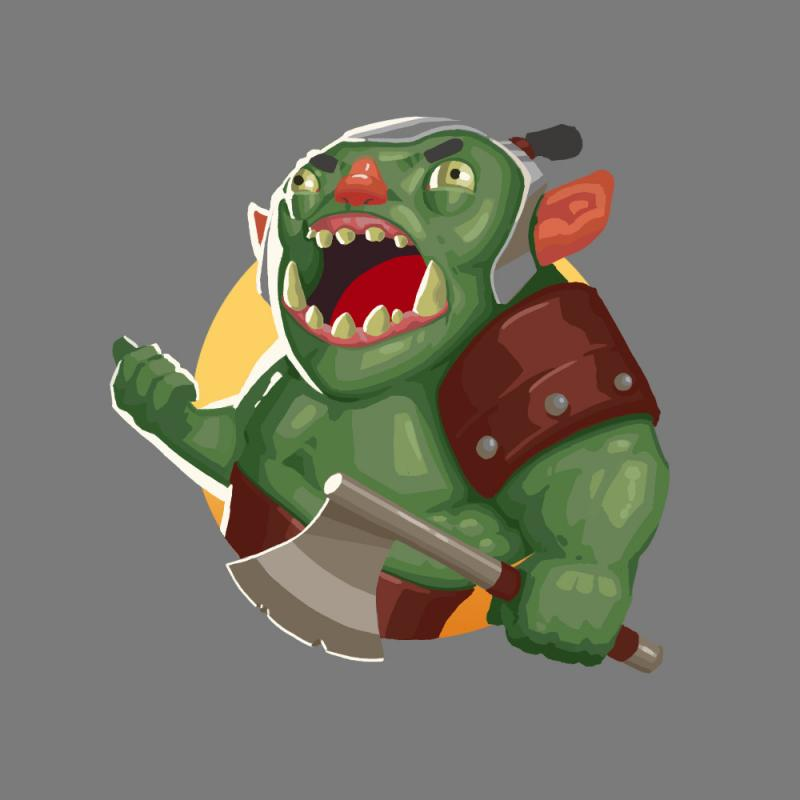

_Guest post by Justin Nichol. More game art with Krita! [Support the project here on Indiegogo](https://www.indiegogo.com/projects/horde-of-cuteness#/)!_

My name is Justin and I have been making illustrations and game art with open source software for some time, and release my work under open licenses for others to use. I use Linux and Blender, and I initially used GIMP but have now transitioned to use Krita, given its more advanced tools and better workflow for painters.  I began Horde of Cuteness as a project through my Patreon ([https://www.patreon.com/justinnichol](https://www.patreon.com/justinnichol)), and created an initial set of 12 figures, but have since added another two for a total of 14. My  Patreon is perfect for creating small packs of art in many styles, but with [Indiegogo](https://www.indiegogo.com/projects/horde-of-cuteness#/) I can dig deeper into individual collections.  If the preliminary funding is obtained from this campaign, I can eschew freelance for the time necessary to add an additional 10 characters to the collection (2 heroes, 5 monsters, and 3 boss monsters chosen by the backers). I do this because I want to create large packs of art for game designers, writers and other creative people.  Backers can also grab rewards that allow them to choose a monster for me to paint, to become one of the heroes themselves, or even to add a whole new boss monster to the campaign.  All the characters will be released under a Creative Commons Attribution Share-Alike 4.0 license, and will be made available as .pngs with transparent backgrounds as well, and will include .kra source files for editing the characters yourself. All of the images will be 2000px by 2000px.  I've gotten over half the initial funding I hoped for in just over a week, and I think support from the open source community could push me over the top.  The characters I have already created are available on my website: [freeforall.cc](http://freeforall.cc)
