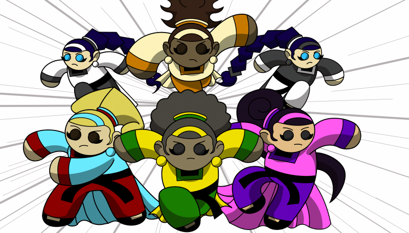
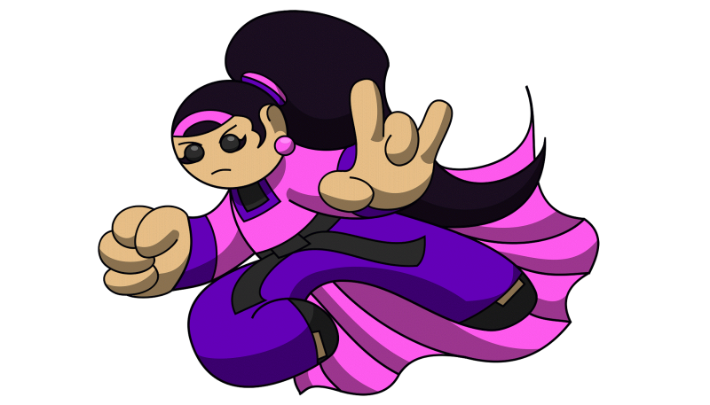

### Could you tell us something about yourself?

Hello all. I'm originally from the city of Chicago, Ill., USA. I've been hardwired as an artistic and creative geek my whole life experiencing comic books/manga, cartoons/anime, RPG's, video games and such since I was very young. The strongest pull came from Marvel/DC comics which lea me into teaching myself a bit of cartoon art and animation. I'm a hip-hop music lyricist under the name "Demygawd Tha Urthmaan", beatmaker, producer (some of my rap music is still online). I also DJ in the deep/house, disco, acid, hardhouse genres.

### Do you paint professionally, as a hobby artist, or both?

Basically a pro-hobbyist, I've published digital comics to Amazon.com, done stuff for Xbox Live indie games, created an app for Apple on their iTunes marketplace. All independent but sold through various online marketplaces.

### What genre(s) do you work in?

Comic book action adventure, mostly. Episodic adventure storytelling, I've been reading comics for over 30 years, so writing fantasy is pretty much in me.

### Whose work inspires you most -- who are your role models as an artist?

Walt Disney, Craig McCracken, Genndy Tartikofsky, Bruce Timm, Jim Lee, Joe Madureira, & J. Scott Campbell. My art is very stylized and cartoony, kinda like movable stuffed toys.

### How and when did you get to try digital painting for the first time?

1995 with Adobe Photoshop, until I was introduced to Macromedia/Adobe Flash. I was commissioned to write a comic book and Photoshop is what they used. The rest was history.

### What makes you choose digital over traditional painting?

Unfortunately due to an economic downturn, I lost everything and fell into homelessness for about 4 years, sleeping on the streets. I could no longer afford art supplies and such or a steady place to be besides a local library, but I had a laptop and software which allowed me to create. This is where I started to attempt to use storytelling as a means to try to help me out of a bad situation, it kept me sane and kept me focused until something came along. My situation has gotten better, dusted myself off, and I've been digital ever sense.

### How did you find out about Krita?

Actually I was looking for some GIMP update news online, ended up on a Blender 3D forum and heard about Krita from one of the posts, never hearing of it before. I nosed around, followed the trail to the .org website, and the rest was history. Krita and I have been buddies ever since.

### What was your first impression?

Took a moment to get adjusted, but it was nothing I couldn't get familiar with. I know I felt more comfortable with Krita than I did with Gimp for drawing content. There is nothing wrong with Gimp, Krita just suits me and my way of creating art.

### What do you love about Krita?

1st) - VECTOR LAYERS! Coming from an Adobe Flash background and having the ability to tweek and manipulate vector points for inking is a must have and my go to line art finishing move.

2nd) - small software footprint/minimum processing power, I have Blender 3D, Inkscape, Gimp, Scibus, Calibre, and Krita running on a Dell Venue 8 Pro tablet with Windows 10 OS with no issue. Toss in a Adonit Jot Pro stylus and I have a whole graphic design studio that fits in a cargo pants pocket. You can't ask for more. You "could", but you would be greedy, ... stop it.

### What do you think needs improvement in Krita? Is there anything that really annoys you?

I would like a revamp of the text engine. I got spoiled with having Krita be a layout, storyboard, pencil, and inking solution for my creative needs, I probably would use vector layers to letter if it wasn't so non-intuitive unlike how it is using Illustrator and Flash, based on my experience. Plus it's a bit glitch-buggy. Inkscape is what I use for lettering and that needs work in itself, but the Krita text engine needs a hug and a healing, IMO.

### What sets Krita apart from the other tools that you use?

Although it wasn't my first choice in the beginning, it's become my de-facto for cartoon and comic art creation. Hands down, it's basically my all-in-one, start to end 2D digital creation suite. Unless I "NEED"  Blender 3D for what it does, for now in the realm of 2D, its Krita all the way.

### If you had to pick one favourite of all your work done in Krita so far, what would it be, and why?

Easily my "Guardians of the Cloudgate: Attack of the Ebonseed" tabletop board game. This is the first time I ventured into toy design and used Krita for everything from the playing board, the pull cards, the cartoon art, the meeple stickers, the box art, the banner ads for the online storefront ... everything.

### What techniques and brushes did you use in it?

Depending on the requirements, I measured the art board to fit the need. My brush tools are the circle and hard erasures, the circle fill marker, ink open 10 ink pen, and the 2B pencil. I lay out my art and design on blueline, sketchwork, coloring, shading, and inking layers. Export as png's. Compress file sizes using tinypng.com. Upload to the manufacturer. Order a physical prototype via snail-mail. Backup all art to a cloud drive. Call it a wrap for that project. Pretty straightforward for my workflow.

### Where can people see more of your work?

Please feel free to check out our "Guardians of the Cloudgate" IP at [https://guardiansofthecloudgate.blogspot.com](https://guardiansofthecloudgate.blogspot.com). The "Guardians of the Cloudgate: The Wrath of Elaina" digital comic on Amazon Kindle devices and PC, smartphone and tablet apps. I also have cartoony superhero fan art at [maadvectorstudios.blogspot.com](https://maadvectorstudios.blogspot.com), still being updated and under construction. Stay tuned, this is just the beginning.

### Anything else you'd like to share?

I want to thank everyone at Krita for creating such special software. Allowing artists everywhere, regardless of skillset, the opportunity to be creative, tell fantastic stories to entertain people, and bring them enjoyment. Also, to all who have an artistic itch, do your thing to the best of your ability. Have fun, start a project, finish the project, repeat. Don't let anyone tell you what you can or can't do, keep going and keep growing. You only lose when you quit, so don't quit. :)
