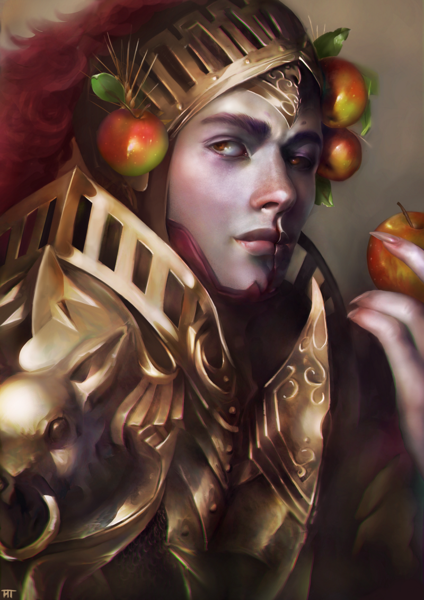
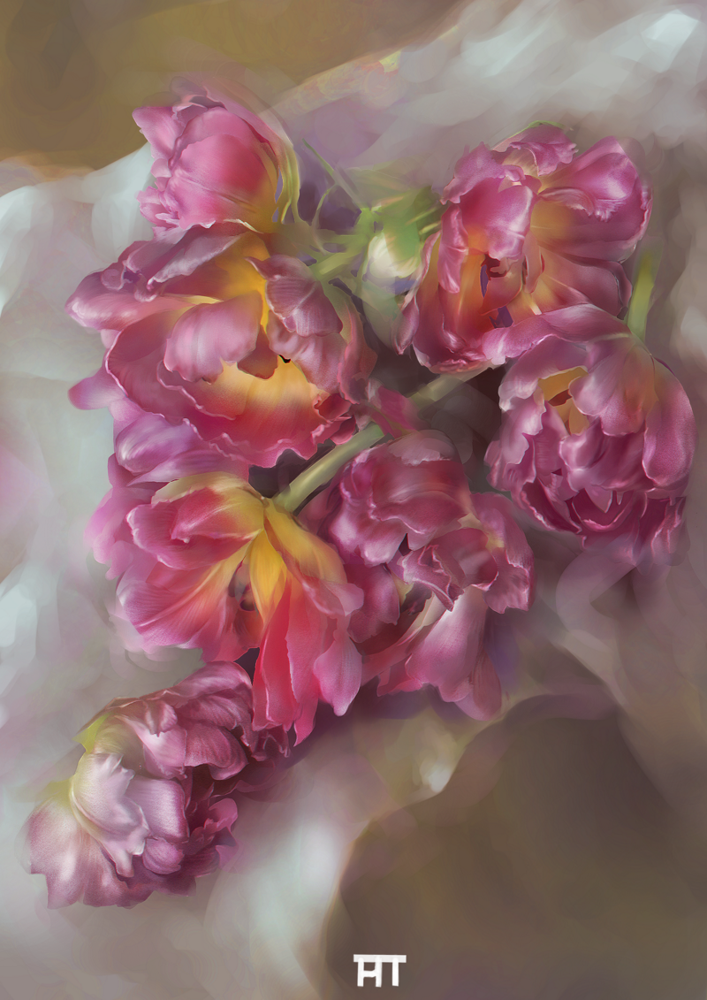
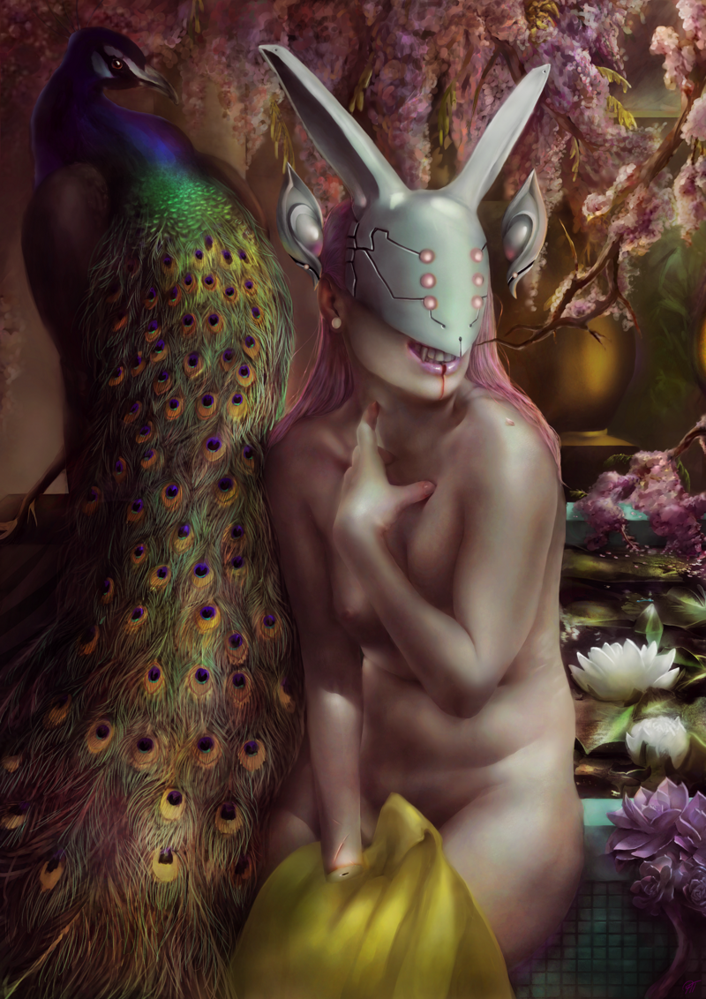
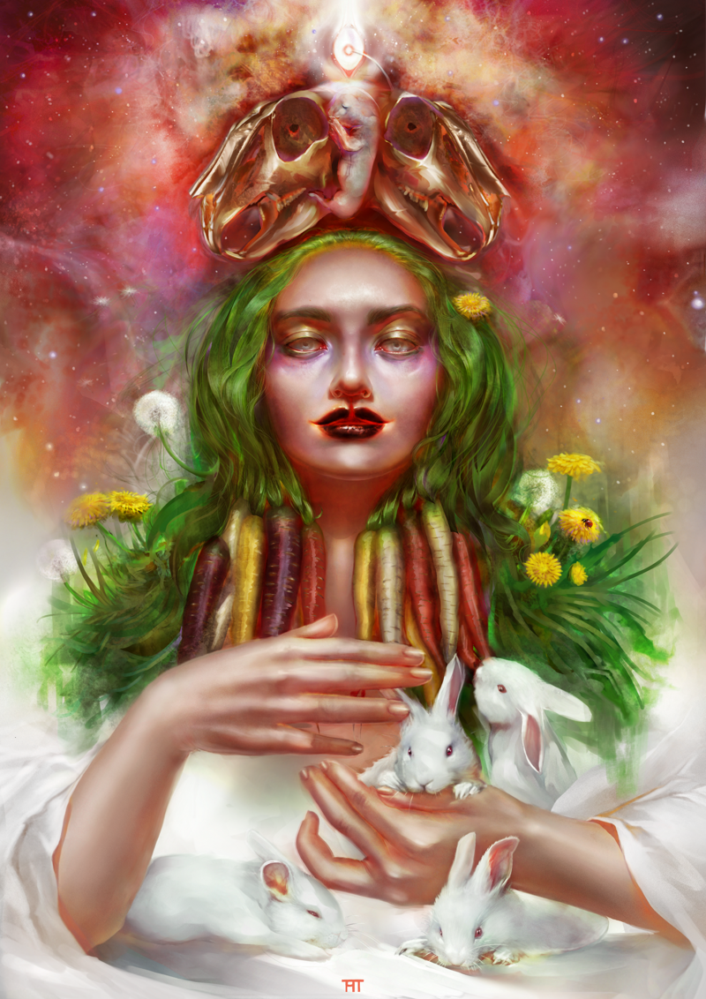

### Could you tell us something about yourself?

My name is Katharina and I am from Germany. I study in Cologne and share a flat with my fiancé and three rabbits.

### Do you paint professionally, as a hobby artist, or both?

Drawing is mainly a hobby for me, to express myself and getting my thoughts together. But from time to time I do a little freelance work, mostly fanart of games.

### What genre(s) do you work in?

My works are mainly fantasy inspired, and I try to communicate through them. I like to address topics such as environmental protection and animal rights. For me, perfect fantasy drawings are not too cheesy but invite you to dream and contemplate.

### Whose work inspires you most -- who are your role models as an artist?

When it comes to my role models I am rather focused on artists who create esthetical, dramatic and dark images. Even though I love vibrant colours, I am also a fan of ghoulish and gloomy works. I am mostly inspired by digital artists such as Ruan Jia, Guangjian Huang, Dave Rapoza, Jeff Simpson and Tobias Kwan (his works for the Motherland Chronicles are insane.)

One of the most important aspects for me is to always go back to the roots of art. I am deeply obsessed with classical and traditional art, I adore Gustav Klimt. Also Rousseau and Mucha. And I am most vigorously attracted to art of the 1800s to early 1900s, like Adolf Hirémy-Hirschl, Sir Lawrence Alma-Tadema and Edmund Blair Leighton. One of my favourite drawings is Guillaume Seignac's Pierrot's Embrace.

And even though I am not really into drawing manga I deeply admire Hayao Miyazaki for always addressing delicate topics such as environmental pollution and violence in a way everyone can understand it. He manages to merge art and understanding. I know that artists often do not want to use the moral club because they do not want to scare away their fanbase, so I think he and Studio Ghibli are kind of pioneers in that matter.

In my opinion, the perfect digital artwork is based on the understanding of traditional arts. It connects future and past, tradition and innovation.

### How and when did you get to try digital painting for the first time?

I bought my graphic tablet in 2012 from the money my father gave me as graduation gift. The catalyst was actually one single picture, which was Ruan Jia's Vanishness. It has shaken my very foundations that a human being could create such delicate art... with a computer.

### What makes you choose digital over traditional painting?

The most wonderful thing about digital art is the endless amount of vibrant and crazy colours one can use. Or you can create a completely authentic, classical 'oil' painting. As you wish. And no cleaning up afterwards. (Yess!) Of course one should not forget that, to a certain point, the comprehension of traditional art and art techniques is the key to deeply succeed with the graphic tablet. But of course digital art also gives the artist the possibility to create art effectively, quick and clean, which can speed up the learning process. Ideally digital art goes hand in hand with traditional.

### How did you find out about Krita?

Krita originally was a stopgap for me. As a student I just could not afford an expensive program. A friend of mine told me about various freeware, among others Krita. As I started to use Krita, I got used to it very quickly. Might sound cheesy, but right now I am not looking forward to getting my hands on another program. In fact, I have  not spent a single thought on it for years.

### What was your first impression?

One of my first impressions was the fact that every artist who saw WIP posts from my works wanted to know the name of that extremely handsome program and were very curious about that new kid in the neighbourhood. And they were kind of right, Krita neither looks nor feels like freeware. This surely impressed me, since I was kinda ashamed at the beginning to use freeware.

By now I am really proud when I can lecture clueless people about the benefits of Krita.

### What do you love about Krita?

I love the professionality of Krita. It really does not need to hide behind the big guys in business. You can use your photoshop or whatever brushes and formats and many more, there is no "Meh, that brush is not made by us, you can't use it!“. The user interface is smart and chic, the brushes work smooth and I never had any problems with my hardware. It simply combines everything I need, without the need to check a manual too often. It feels effortless to use it! And also it is nice to find other Krita artists randomly on the internet, it is always a nice way to start a conversation.

### What do you think needs improvement in Krita? Is there anything that really annoys you?

I actually can not think of anything that bugs me about Krita itself. Of course I am not a professional who could tell you something about the technical features. Back then, when I first downloaded Krita it crashed from time to time, especially while auto-saving. But the Krita team did a very good job fixing bugs and little mistakes, listening to the community and stepping up their game. There is actually nothing negative to tell you about right now.

I just wish for more advertising and awareness for Krita; I think a bigger community would be wonderful and beneficial for all users, sharing experience and love. Also a bigger presence in all social medias and especially art-oriented platforms, contests and live-streams or local events would be amazing. It could help Krita to reach more potential, influential supporters, artists and media personalities. I am excited to see how the Krita Foundation will develop in the next years, not only the program itself but also the public relations section.

### What sets Krita apart from the other tools that you use?

As I already mentioned, I am really not in the position to talk about technical stuff, since I am not really into that. But I can share my experience so far. The most frequent compliment I get for my digital artworks are the colours. And I think Krita's colours and colour management are highly satisfying. Definitely one of the most outstanding features. Combined with the lovely user interface and well working brushes, it just creates something other programs don't have. I can not exactly pin down what makes Krita so unique, I guess it is the whole package. It is just right for lazy people like me who just want to download and start drawing. And also for professionals, who are well informed and who like to get deeper into detail.

### If you had to pick one favourite of all your work done in Krita so far, what would it be, and why?

One of my favourite drawings completely done with Krita is 'Garden of the Creator' (originally Des Schöpfers Garten) which was inspired by Eugene Bidau's 'A Peacock And Doves In A Garden' from 1888 and the movie Blade Runner, or to be precise the book 'Do Androids Dream Of Electric Sheep?'. I wanted to draw a prosperous garden like Bidau did, moist air, the screeching sound of an artificial peacock and a damaged android, waiting in the gloomy light. The android's hand has been cut off, and the viewer does not know what happened. Did the creator try to destroy it, another android? Who is it waiting for, someone to fix it or someone to finally kill it? I enjoy to add little story-telling elements to my works which one does not see at first glance. I love to explore other artists' artworks. So you could say that I mainly aim to create art for art's sake, but I often try to add a little twist.

### What techniques and brushes did you use in it?

I did a sketch first, afterwards a greyscale layer to define shadows and lights. Later, I coloured this layer and drew all details by hand. (I will never draw a peacock again.) I do use the lasso tool a lot to render and define. I often do not use texture brushes while drawing, often I add some textures in the end, if necessary. I also try not to use the undo function too often, but to overpaint my mistakes like you would on canvas. I aim to keep my working process as traditional as possible. 'Normal', 'multiply' and 'overlay' are my most frequently used brush modes.

### Where can people see more of your work?

You can find me on ArtStation, this is where I upload my digital artworks only. ([https://kathiptt.artstation.com/](https://kathiptt.artstation.com/)) . On my blog ([http://postinett.blogspot.de/](http://postinett.blogspot.de/)) you can see my digital works, sketchbook pages, practices, commissons, news and traditional stuff. I am also on DeviantArt as PTTartwork, but I do not like to use it anymore.

### Anything else you'd like to share?

I would like to motivate everyone, especially experienced artists, not to judge a book by its cover. Krita might be freeware, but there is actually no downside to it.

Furthermore I want to address aspiring artists to always be honest with yourself, stay true to your heart and do not try to be someone else. Of course great artists always have been inspired by each other, but they only grew bigger than their fellows by being unique and breaking rules.

One more thing; be kind, respect nature, create love.

