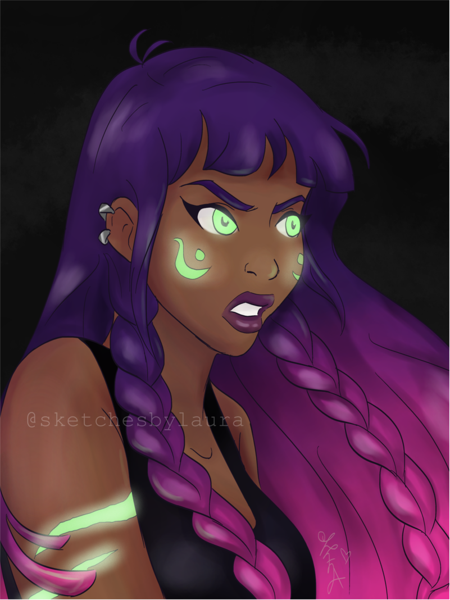
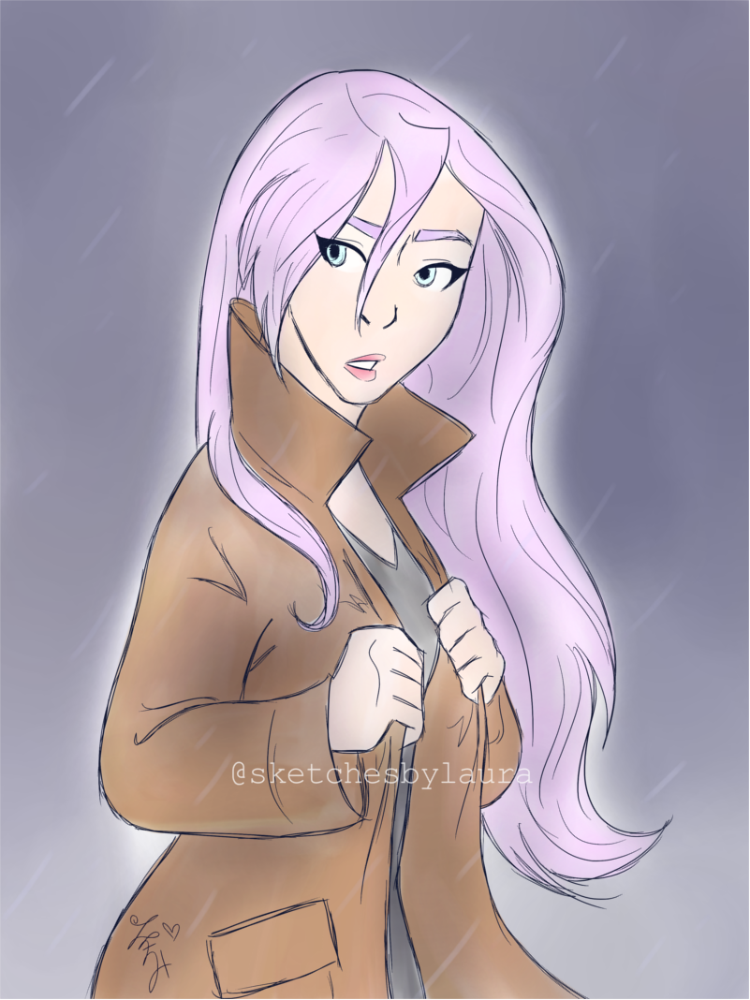

### Could you tell us something about yourself?

I recently graduated college with a Bachelor's degree in Graphic Design, English, and Biblical Studies. Drawing has been a passion of mine for over 15 years, and I'm very happy to still have time to do it! Now I'm married and stay at home to work on my art, jewelry store, and blog.

### Do you paint professionally, as a hobby artist, or both?

I would consider myself a freelance artist and hobbyist. Most of my art is just my hobby, but I also do commissions and other freelance work here and there.

### What genre(s) do you work in?

I mostly draw digital art in my cartoon style. I have a lot of original characters with elaborate designs and backstories, so those are fun to draw. I also really enjoy drawing fanart. Occasionally I'll draw realistic things as well, like portraits and still life.

### Whose work inspires you most -- who are your role models as an artist?

I admire quite a few artists, but a couple of my most favorite ones are [Cyarine](http://instagram.com/cyarine) and [Loish](http://loish.net). I love their painting styles and techniques, as that is one area I always want to improve on.

### How and when did you get to try digital painting for the first time?

When I was around 7 years old (I think?) my family got our first iMac computer, which came with a program called Appleworks. I would draw pictures and create animations on that and GIMP using only my mouse, and I actually got pretty good at it! Then when I got a real drawing tablet, I lost the ability to draw with just the mouse haha.

### What makes you choose digital over traditional painting?

Ctrl+Z is a beautiful thing. So are the lasso and transform tools. They make it easier to perfect tiny details until you get it right!

### How did you find out about Krita?

My friend [Amelia Hamrick](http://ameliadrawsthings.tumblr.com/) was doing commissions to help raise money to donate to Krita, and I love her work as well, so I thought I'd try it out!

### What was your first impression?

I LOVED IT SO MUCH. I had been used to drawing with GIMP which really isn't great for drawing, and Photoshop didn't work exactly the way I wanted either. I kept telling everyone about how great Krita was because it felt so much more realistic to draw on.

### What do you love about Krita?

Pressure sensitivity, smooth blending, super cool useful brushes for shading and stuff, the ability to flip and rotate the canvas (my favorite part), and autosave (also my favorite part). 

### What do you think needs improvement in Krita? Is there anything that really annoys you?

I do wish there was an option to have a preview window in the corner. Like some art programs have a small window showing the whole canvas and a square to show where you've zoomed in. It does get kind of annoying to have to zoom in and out all the time to make sure the drawing doesn't look weird.

### What sets Krita apart from the other tools that you use?

Again, I've only really used Photoshop and GIMP (and Appleworks but that was basically MS Paint). Those programs weren't very cooperative with pressure sensitivity and being realistic to traditional drawing/painting. Krita is great because it seems to be very customizable and runs smoothly, and definitely seems meant for artists who draw and paint.

### If you had to pick one favourite of all your work done in Krita so far, what would it be, and why?

I feel like I'm always finding new drawing methods that I like better than my old ones, so it's hard to pick a favorite because I'm always improving. However, [this doodle](http://<http://sketchesbylaura.tumblr.com/post/144509538912/i-love-how-this-turned-out-this-sketchy>) was definitely one that I had the most fun drawing. The brushes and colors worked so well together, and I was super excited with it when it was finished!

### What techniques and brushes did you use in it?

I believe I used the Ink\_Tilt brushes for sketching and Basic\_Wet brushes for coloring. Those are the ones I use for most of my more "finished" work now, but they're also great for more sketchy drawings like the one I mentioned!

### Where can people see more of your work?

[Main website](http://sketchesbylaura.com) [Instagram](http://instagram.com/sketchesbylaura) [Twitter](http://twitter.com/sketchesbylaura) [Tumblr](http://sketchesbylaura.tumblr.com) [Facebook](http://facebook.com/sketchesbylaura) [Twitch](http://twitch.tv/sketchesbylaura) [YouTube](http://www.youtube.com/channel/UCTlkAk2N0ZZOc_3dJljhn4g) [Patreon](http://patreon.com/sketchesbylaura)

### Anything else you'd like to share?

I am so glad Krita is available for so many different artists to use, and I appreciate these interviews as a way to find new artists to get to know better!
