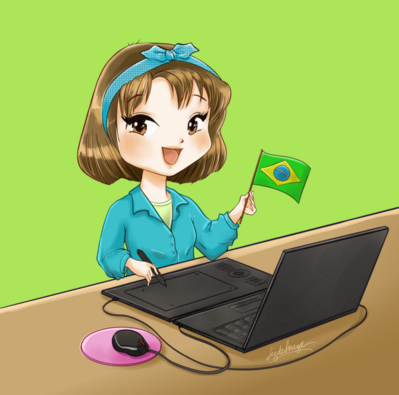
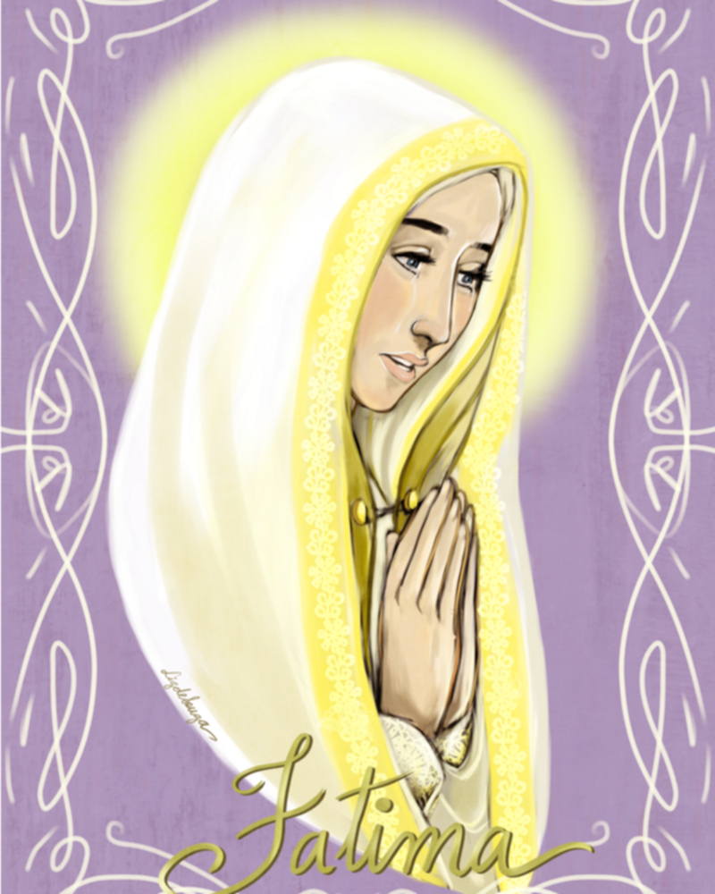
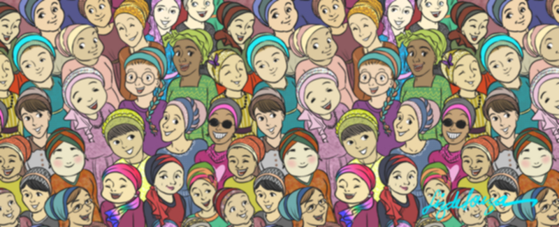
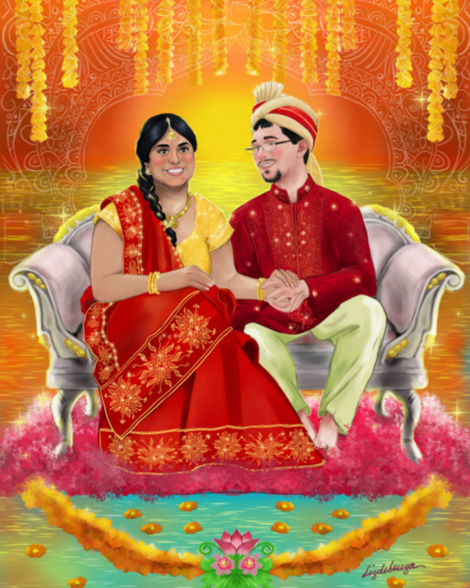
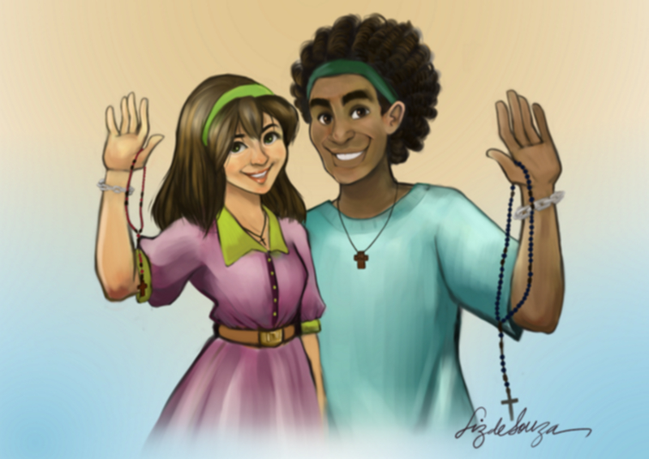
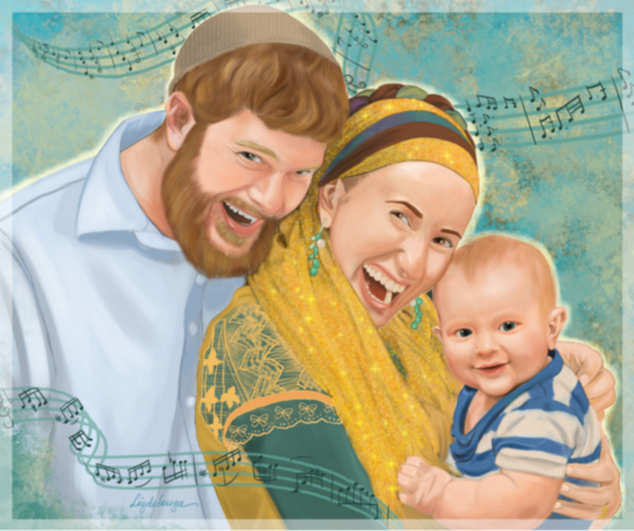

### 

### Could you tell us something about yourself?

Hi! I'm 32 years old, Brazilian, I'm a full-time wife and mother, and also an illustrator.

### Do you paint professionally, as a hobby artist, or both?

Both, but after having children I paint mostly professionally. I still have sketchbooks to carry in my backpack when I have to go to the doctor or do something where I'll stay waiting - while I wait, I draw. At home, I honor my daughters' requests for specific drawings or drawing lessons.

### What genre(s) do you work in?

I'm working mostly in portraits, character designs, concept art and illustration. People call me specially for portraits/illustrations for wedding invitations and family drawings. Another genre that I work with as a favorite is illustrating Catholic themes. My faith is always portrayed in my personal works.

### 

### Whose work inspires you most -- who are your role models as an artist?

I admire artists from all periods of history. I love Giotto, Fra Angelico, Michelangelo, Leonardo da Vinci, Caravaggio, Renoir, Ingres, Monet... Great masters always inspire me.

I really have as role models the Eastern Orthodox iconographers. The Eastern icons are so full of meaning and an inexplicable beauty.

And I have lots of artists I admire that work with digital painting. Some of them I follow for the technique, others because of the use of colors, others because of the way they illustrate abstract concepts... But I can list some: Yuko Shimizu, Lois Van Baarle (Loish), Charlie Bowater, Vicktoria Ridzel (Viria), Cyarine, Bobby Chiu, David Revoy, well... and hundreds more. My favs list is huge :)

As a Brazilian, my role model in my Country is the artist Maurício de Sousa. He has been an inspiration for me since I was a toddler. I love comics. Oh, I love Will Eisner also. Well.... I love lots of artists Did I mention I like manga too?

### 

### How and when did you get to try digital painting for the first time?

When I was in my 3rd or 4th semester of College (2001), I had a class called "Electronic Art" (yes, creepy name). I bought my first tablet, a huge Genius model I can't even remember the name of. I did works scanning my lineart and coloring with Photoshop 5.

After that, I only got into digital painting, started to research and really practice after 2 years I finished College, in 2007, when I bought a Genius Wizard Pen and tried hard to make this thing happen. Bobby Chiu was a great mentor and friend that year. I heard all his podcasts and drew a lot, when I was not at my job.

In 2009 I got married and had the opportunity to leave the job to dedicate my professional efforts to what I love: illustrating and digital painting. It took some years to get somewhere, but I can tell that having children helped so much to make my brain work quickly to learn new techniques and improve, since I never have too much spare time.

In 2013 I started using social media to post free drawings, and got a new tablet, a Wacom Intuos. After that, I've always had commissions, thank God!

### What makes you choose digital over traditional painting?

I work mostly with digital media because it's easy to correct problems, the client can ask for changes without making me do everything from scratch again, and because I've never actually learned how to paint with real paint (even if I tried hard in College -- with no result).

I like the opportunity digital painting gives me to share my work and get commissions from anywhere. I've done commissions for USA and Germany and had lot of feedback about my free drawings from several countries!

I still love traditional drawing, specially black and white drawings with pen, brush and india ink.

### How did you find out about Krita?

My husband and I started using only Linux on our computers when we got married and I installed all paint programs I had available to test and find something that was close or better than Photoshop. I used GIMP for a couple of years, but more or less in 2012 I found Krita at the Ubuntu Software Center and tried it. And liked it. And never left it.

### What was your first impression?

Krita seemed to me very similar to Photoshop. It took several months to get used to it. It had at that time many bugs that shut down the app without warning, what annoyed me a lot. But after I changed my OS from Ubuntu to Kubuntu, I work a lot better with it.

### What do you love about Krita?

It's great software, and I love that such a great project has been made free software (of course there are paid versions, but the free one is the most popular). All functionalities and features are fantastic and work so well for  the digital artist. But what I admire the most is the fact that the team is so available to answer questions, and work so hard to make Krita better and better. My husband is a software engineer and I know how much work it is to build a program, how much time you spend on it, how many nights you lose due to the project deadline, and how great it is to hear the feedback from people who use your app and help you to make it better. If all human beings had this inner good will, so many good things would happen in the world. God bless the Krita Foundation.

### What do you think needs improvement in Krita? Is there anything that really annoys you?

Well... Actually there are some issues about importing brushes I would like to happen (like importing MyPaint brushes and PS.TPL brushes), but I believe I should only thank the team for all the hard work, and try to help them with the bugs so Krita become the great software for digital painting. Sometimes I ask if the team plans to implement this or that feature, but when they answer with the expression "reverse engineering" I have goosebumps. I know what it is and how hard it is. I saw my husband doing that once. It was a nightmare. So, I feel that my duty is to be thankful for them and do something to help Krita Foundation (like the Krita Training in Portuguese I'm doing right now).

### What sets Krita apart from the other tools that you use?

It is high-quality open-source software. Runs in my dear Kubuntu. That's happiness for me. I have other tools installed in my OS, such as GIMP and MyPaint. But Krita does everything, it has all the features a professional digital artist needs. I still like MyPaint, but only for sketches.

### If you had to pick one favourite of all your work done in Krita so far, what would it be, and why?

I'm always drawing something new, and the newest drawings are always the best ones, because we learn something every day. I don't know if I can pick only one drawing! Mmmmm... maybe the portrait I made for a family of a dear friend in 2015, the first real digital painting I made, is still my favourite. The result was awesome, I was so proud of myself when I finished it and my friend loved it. Happiness everywhere.\*

### What techniques and brushes did you use in it?

I used one of the three techniques I'm used to; it is doing a layer with a  very realistic drawing, painting a basic color one layer below, and then complete the painting with a third layer above it, making all lines disappear. It gives a look of a real portrait, and people love it. I also use two other techniques for painting below and using lots of layers, but this one is for simple drawings, usually cartoon portraits, memes and T-shirt illustration. In fact, I love trying other people's techniques,there is always many ways to solve digital painting problems. I love learning with other artists!

### Where can people see more of your work?

My commissions and best drawings (and very old stuff) are in my DeviantArt - [artelizdesouza.deviantart.com](http://artelizdesouza.deviantart.com) Best quality memes and other drawings you can see in my Tumblr - [lizdesouza.tumblr.com](http://lizdesouza.tumblr.com) News, updates, memes, and thoughts at my Facebook - [facebook.com/lizdesouza](http://facebook.com/lizdesouza) Random photos, paper sketches and sometimes memes at Instagram - [https://instagram.com/artelizdesouza/](https://instagram.com/artelizdesouza/) Recently I've joined twitter, but I use it to talk with the developers of Krita and MyPaint - [https://twitter.com/artelizdesouza](https://twitter.com/artelizdesouza) My Youtube channel has some speedpaints - [https://www.youtube.com/channel/UC1MVazT8tdIV0t6LNnD8Kcw](https://www.youtube.com/channel/UC1MVazT8tdIV0t6LNnD8Kcw) I have a Patreon page, which isn't really active yet but people can follow me to receive news when I make it happen - [https://www.patreon.com/lizdesouza](https://www.patreon.com/lizdesouza)

### Anything else you'd like to share?

I'm right now doing a Krita training in Brazilian Portuguese, and it has taken a lot of the little spare time I have. But if the English-Spanish-other-Portuguese speakers want to have access to it, I'm doing a closed class, where I post the videos and share knowledge with the students. To have more information, please join my crowdfunding to feed my family while I work sending me an email to [artelizdesouza@gmail.com](mailto:artelizdesouza@gmail.com) - you can write in Portuguese, English or Spanish, and I answer it. And with the help of my husband I can answer German and Italian speakers too.

I also take commissions - to ask for it and get information, email me: [artelizdesouza@gmail.com](mailto:artelizdesouza@gmail.com)

And... Thank you Krita Foundation! God bless you all!
