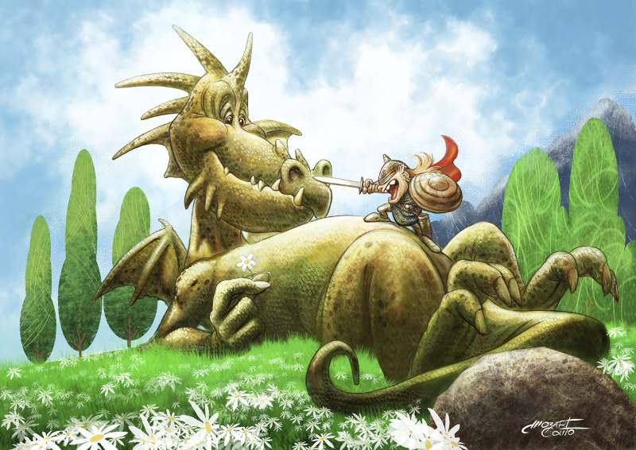
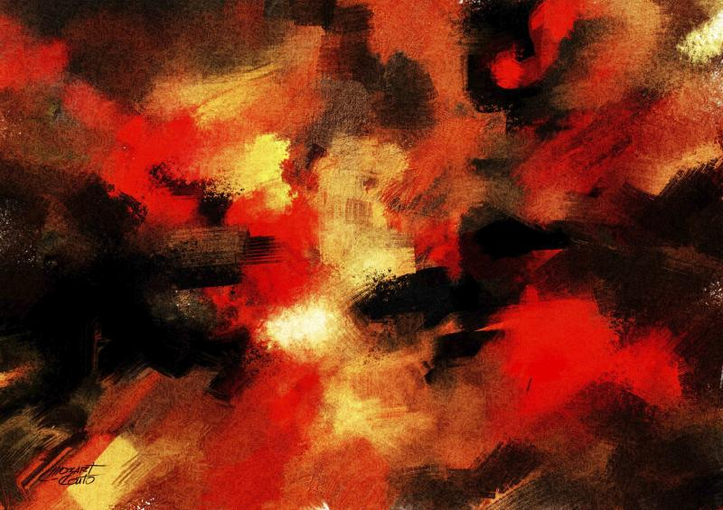
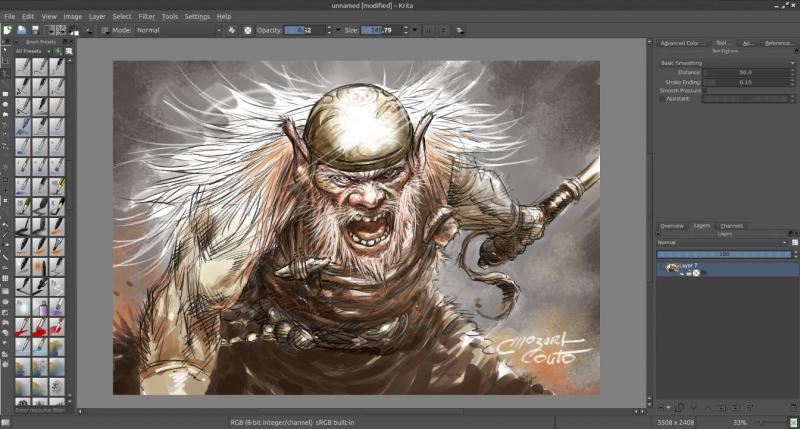
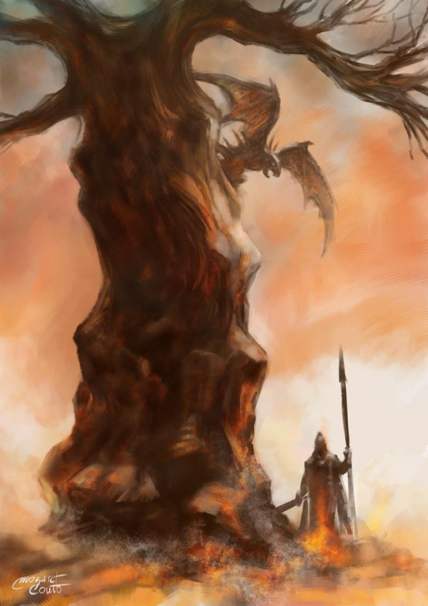

### 

### Could you tell us something about yourself?

I was born and live in Brazil. I have worked as an illustrator and comic book artist since 1979 and a few years ago I started to use only open source software. I published my comics in Brazil, in Europe ([https://www.lambiek.net/artists/c/couto\_mozart.htm](https://www.lambiek.net/artists/c/couto_mozart.htm)) and in the American comics market (Marvel, DC, image, Dark Horse and Valiant) in the late 1990s.

### Do you paint professionally, as a hobby artist, or both?

Both.

### What genre(s) do you work in?

I work in various genres, including illustration for children's books and also for teenagers, fantasy art and, most recently, abstract digital painting.

### Whose work inspires you most -- who are your role models as an artist?

When I was younger, my inspiration came from the great artists of American comics, like John Buscema, Hal Foster, Frank Frazetta and others. Later, the European stars, like Moebius, Serpieri, Herman, etcetera. And also the Japanese manga.

### How and when did you get to try digital painting for the first time?

I think it was around 1998 or 2000. I bought a tablet and started. Then the PC became a much more interesting thing to me.

### What makes you choose digital over traditional painting?

I think it's fascinating. You can experience many things and get the craziest results. The possibility of immediate correction is a major factor in my choice of digital painting for professional production. But also I like to try something new in art all the time. I think that artists should always keep experimenting with new tools.

### How did you find out about Krita?

It was a long time ago. I used a Brazilian Linux distribution called "Kurumin", which is very famous here. As this distribution used KDE, I did find Krita. Then I started using GIMP and also MyPaint. I liked Krita but thought it needed improvement. Currently, I use it again because I think that the program is much more robust now and can better serve the digital illustrator.

### What was your first impression?

As I said before, I really liked the program, but thought it needed improvement.

### What do you love about Krita?

Many things. I'm still learning how to use the resources, so I would say that the various possibilities of use of the brushes are very useful for my work.

### What do you think needs improvement in Krita? Is there anything that really annoys you?

I wish there was the possibility of working with brushes with impasto effects (as in paintings Alla Prima) and real watercolor. Also, to use a dual brush effect (two brushes painting together). What annoys me? I do not like having to open a file each time the program starts in order to access the interface or the program crashes if I touch somewhere on the screen! Also I miss a free selection tool that could be used as a brush.

### What sets Krita apart from the other tools that you use?

Krita has many useful functions that I like to use but can not find in other tools. One is to work with textures in the brushes. Something simple but very useful for me. Another thing are the functions of mixing colors that can be applied to brushes. Also distortion in the images directly on the screen is great.

### If you had to pick one favourite of all your work done in Krita so far, what would it be, and why?

I think my best work is always the last because it always applies new things I learned.

### 

### What techniques and brushes do you use most?

Often I use brushes that I have built myself and use in Gimp and also the excellent brushes of [https://krita.org/learn/resources/](https://krita.org/learn/resources/). I usually work exploring layers styles and mix brushes and various brushes that simulate bristles and acrylic or oil painting. Also I always use textures in some default brushes in some phases of the work.

### Where can people see more of your work?

[http://mozartcoutoimagens.blogspot.com.br/](http://mozartcoutoimagens.blogspot.com.br/)

### Anything else you'd like to share?

As I said before, I am still in a learning phase but I think Krita perfectly meets the illustrator and comic book artists in general through its additional tools and resources to create perspective drawings, for example. I hope that the team of developers and users will work enough for the program to become increasingly used and known. Thank you for the invitation to the interview.
