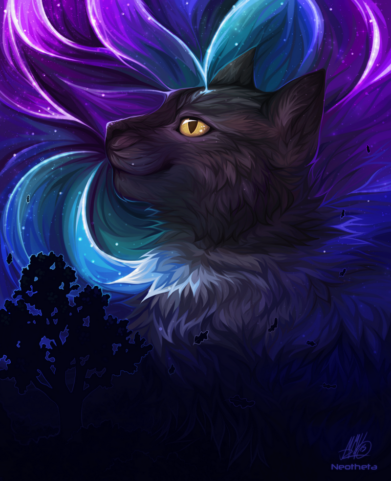
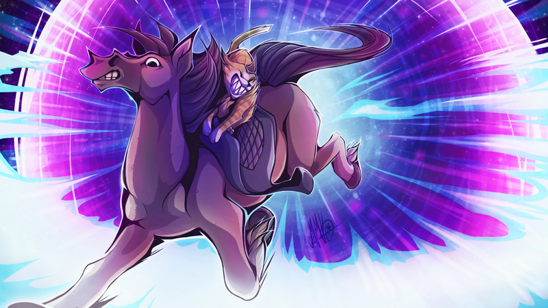
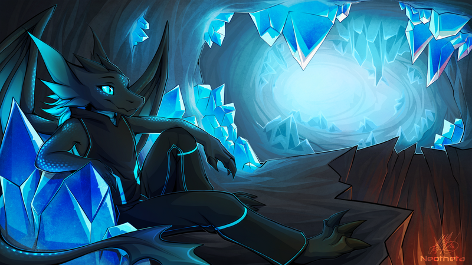
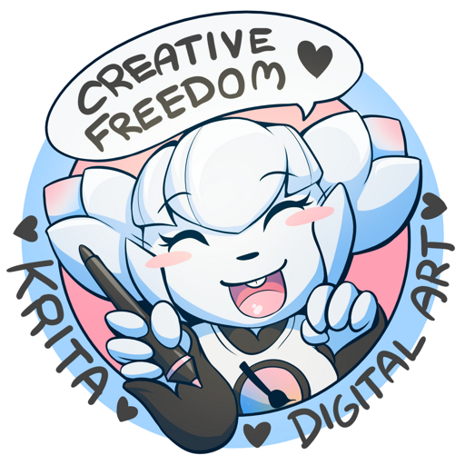

### 

### Could you tell us something about yourself?

I'm Neotheta, 23-year-old from Finland and draw colourful pictures with animals, furries and alike. Drawing has been my passion since I was little, I was also interested in digital art early on but had a love&hate relationship with that because computers were not for kids, unstable and tools were pretty awkward back in those days. So I learned drawing mostly with traditional tools first.

### Do you paint professionally, as a hobby artist, or both?

Both, I work full-time as an artist right now and hope to continue so!

### What genre(s) do you work in?

Is furry a genre? I practice my own styles to draw animals and furries - luckily this is where the most demand for my work is as well. But I've also drawn more cartoony & simplified styles for children's books.

### Whose work inspires you most -- who are your role models as an artist?

My mom draws really well, she got me drawing! After that it's been a blender of many inspirations, they tend to change pretty frequently - except I've always loved cats! I'm more of a role-maker than a taker, so I often do things differently on purpose - it's not always a good thing but probably the reason why I'm currently drawing for a living.

### How and when did you get to try digital painting for the first time?

6-years-old, I drew a colourful bunny with MS paint at my mom's workplace (a school) and told her students that this is the future! After that my parents also gave me a drawing tablet but I was somewhat disappointed at the programs intended for digital art at the time - they were all kind of awkward to use. So I gave up digital art for many years and went back to traditional tools. I think I was 15 when I decided to try again seriously.

### What makes you choose digital over traditional painting?

I enjoy bright colours, many of those are difficult to produce with traditional colours. Also the ability to print the finished drawing on desired material, such as fabrics - or test what it looks best on and what size. I can also share the same drawing with many people if the outcome is awesome.

### How did you find out about Krita?

I was actually on a sort of mental breakdown because my computer had kicked the bucket and my new setup simply didn't function together. I had recently experienced how stable and awesome Debian was for PC and I really wanted to give it a try instead of windows. In the middle of the mess and new things someone told me I should try Krita because it sounded like it'd fit my needs - a drawing program for Linux.

### What was your first impression?

I was in total awe because first I was ready to sacrifice not using my old favorite programs just so I could work stable. But then Krita turned out to be better than my previous combination of using Paint tool Sai + Photoshop CS2, it had all the same features I needed in one. Krita on Linux was also SO STABLE and FAST and there was autosaving just in case. I learned to use Krita really quickly (also thanks to the helpful community!) and kept finding new useful tools like a constant stream. It was like a dream come true (still is).

### What do you love about Krita?

It's so stable and fast, I have it on my powerful desktop and old laptop and it functions so nicely on both of them! The community is wonderful. The brush engine is so diverse, interface is customizable, g'mic plugin, line smoothing, perspective assistants... to name a few!

### What do you think needs improvement in Krita? Is there anything that really annoys you?

Better text tools and multipage pdf saving would make Krita perfect for comics.

### What sets Krita apart from the other tools that you use?

Stability, fast performance, for Linux, well designed for drawing and painting, and lots of features!

### If you had to pick one favourite of all your work done in Krita so far, what would it be, and why?

Everything I've drawn in the recent years have been on Krita so it's a difficult pick. My current favorite is a personal drawing of my dragon character in a mystical crystal cavern.

### 

### What techniques and brushes did you use in it?

This is my more simple style, first I sketch, then lineart, colour and add textures last. I've mostly used Wolthera's dynamic inking pen, airbrush, gradients and layer effects. A more detailed description and .kra file for inspecting can be found from my site here: [https://neotheta.fi/tutorials/wips/crystal/](https://neotheta.fi/tutorials/wips/crystal/)

### Where can people see more of your work?

[https://neotheta.fi](https://neotheta.fi)

### Anything else you'd like to share?

I recently made a telegram sticker pack with one sticker to spread word about Krita (when people get my pack they get the Krita sticker too). Feel free to add it to yours too or use in another creative way!

