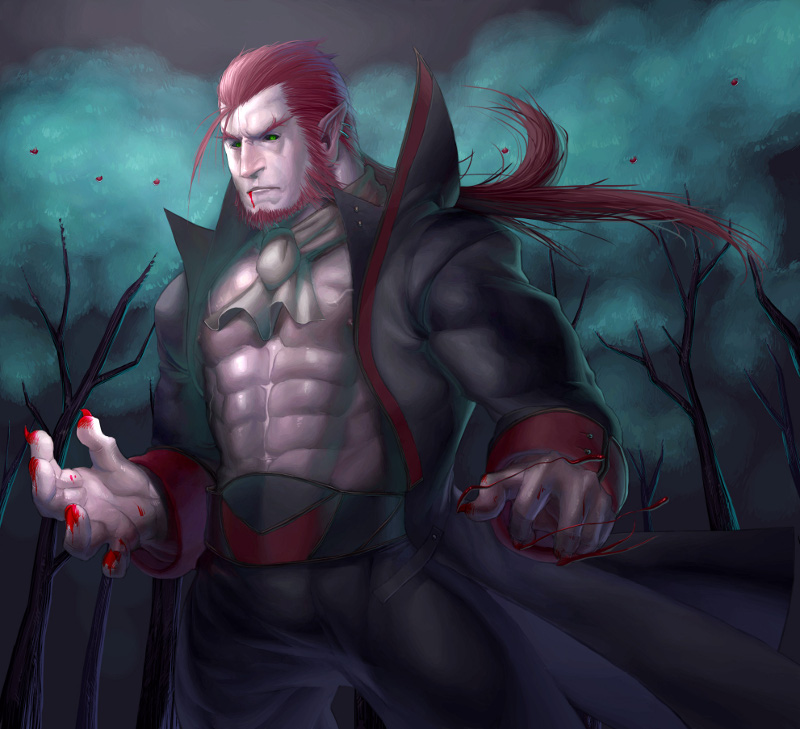
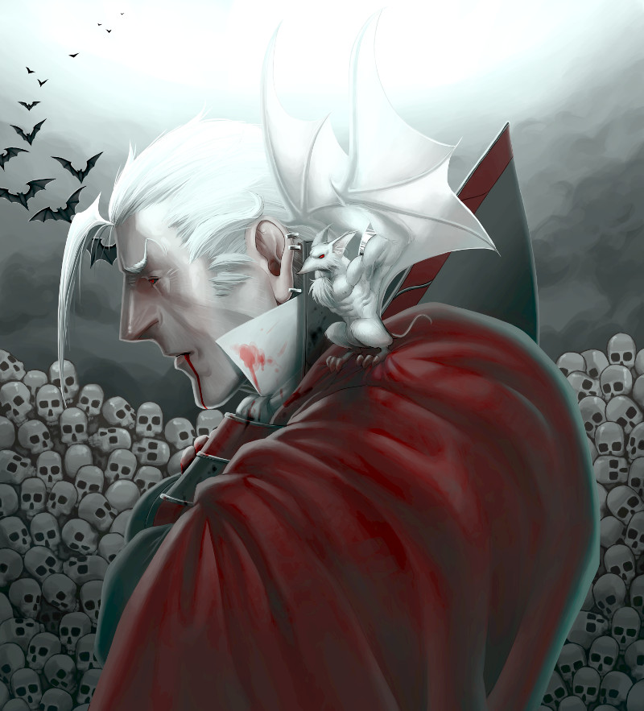

### Could you tell us something about yourself?

I moved to Germany from Canada after a thought experiment involving the German language. I work as a software developer now.

### Do you paint professionally, as a hobby artist, or both?

I would consider myself to be primarily a hobby artist, but I have worked on a few projects in a professional capacity. Those are projects I've chosen to be involved with though.

### What genre(s) do you work in?

I tend to draw a lot of fantasy-horror subjects, and would probably describe my work as something like semirealism. My work has probably also been influenced by manga/anime from previous interest.

### Whose work inspires you most -- who are your role models as an artist?

It's difficult to point to a particular artist or work that really inspires me--I get my inspiration from various sources. Sometimes, it will just be some picture I see on Tumblr or random stuff my other artist friends reblog or draw themselves. I guess I am just content to have my own unique art style not dependent on other artists, and since realism/semirealism is all based off of reality and science, I just rely on real life references if I get stuck on a drawing.

### How and when did you get to try digital painting for the first time?

When I was still in high school and I got my first digital tablet as a gift. I would switch between using Photoshop and Corel Painter, and then finally settle on Photoshop for a long time.

### What makes you choose digital over traditional painting?

I have to honestly admit I have rather limited exposure to traditional painting, though I have done pencil sketching before. I guess I just gravitate towards digital painting in general though because it appears very convenient. You don't need a lot of space setting up, and you don't have to prepare for a lot of mess. Then you can do a lot of convenient stuff like undo, resize, move, etc. that you can't through traditional mediums. However, I do think that the traditional painting experience is at least worth it for workflow reasons. I regret not having spent at least some time learning it the proper way.

### How did you find out about Krita?

After Adobe announced their Cloud only offering of Photoshop, I became disillusioned with their tools and found out about Krita ironically enough through one of the threads discussing alternatives on the Adobe forums.

### What was your first impression?

I wasn't honestly expecting much to begin with. Maybe my previous experience with Gimp colored my perception there. I would say by the time I considered switching, I already cleaned up the workflow I used to paint stuff with on Photoshop, so I didn't require a lot of features for painting, and I think that has helped. If Krita even just supported layers, transparency masks and a quick and convenient way to use the eyedropper tool, I would be happy. I didn't need a lot of fancy brushes, filters or all the other bells and whistles that come with programs like Photoshop. At the time I tried Krita, it had all those, so I was fairly happy with it. It wasn't entirely intuitive where everything I wanted to use or try was though, and there were a few small adjustments I had to make going from Photoshop to Krita, so I had some help from other people to explain or point out to me where features are and how to use them.

### What do you love about Krita?

There's a lot to love about Krita. I was pleasantly surprised at the sheer number of blending modes available in Krita. My technique generally involves layering colors on top of a grayscale image, so having more blending modes available means more choice. I also liked that there was an autosave feature. I rarely had problems with crashing on Photoshop, so I didn't think too much about crashes then, and didn't have to save often. But earlier versions of Krita would sometimes crash, and having an autosaved file was very useful, especially if you are not in the habit of saving frequently. I like that there are keyboard shortcuts to grab colors off of the current layer or the entire picture and to instantly resize your brush. And of course, I absolutely love that Krita is free software. I would never have considered even using it if it wasn't free software.

### What do you think needs improvement in Krita? Is there anything that  really annoys you?

Well right now, I think just the performance on larger canvases and brushes could use some work, but they have a Kickstarter for that, and have already fixed some of those issues. I guess better Mac support would be nice, since that's the computer I'm currently running Krita on. Although I do understand the lack of support for the Mac OSX platform is due to lack of developers working on that platform. Since I'm one of the few people interested in Krita who owns a Mac and can at least program, I try to help out there when I can.

### What sets Krita apart from the other tools that you use?

That it's specifically geared towards digital painting. It contains a subset of the features that are available on Photoshop, and some of those features are not as well implemented. But that's because Krita doesn't try to be an all purpose generic image manipulation program like Gimp. I'm not disappointed that some of these features weren't implemented or aren't as polished as they are in other programs. Because they were never the focus of Krita. But on the upside, there are other features that Krita has that other graphics software don't have because of this focus. I also find that besides being free software, Krita offers many many options. As I mentioned before, it has a very large set of blending modes. It also incorporates G'mic, which has a lot more filters than Photoshop does. You have a lot of freedom and flexibility in doing your art, and there are many ways to do that.

### If you had to pick one favourite of all your work done in Krita so far, what would it be, and why?

"Höllentat", which I did recently after it was recommended I give the 16-bit mode a try for better blending. The result looks great, and I think I will use it for future pictures as well. I spent more time on the background details than I usually do. 

### What techniques and brushes did you use in it?

I used the basic brushes that came with Krita. I didn't need too many brushes as I paint the textures manually unless they're too small for that. A hard brush and a soft brush for blending are generally all I need for stuff like this. I used alpha inheritance to split the foreground objects from the background objects. It allows me to paint and add lots of coloring and adjustment layers on top of the foreground objects without worrying that it will spill over into the background.

### Where can people see more of your work?

I post sometimes on Deviantart: [angelus-tenebrae.deviantart.com](http://angelus-tenebrae.deviantart.com)

### Anything else you'd like to share?

I get very excited when people get together to make free software like this. I am impressed with the positivity that this community generates, and above all, the great work on the software that Krita developed into I do hope that more people will continue to learn about, try, promote and/or consider using Krita.
