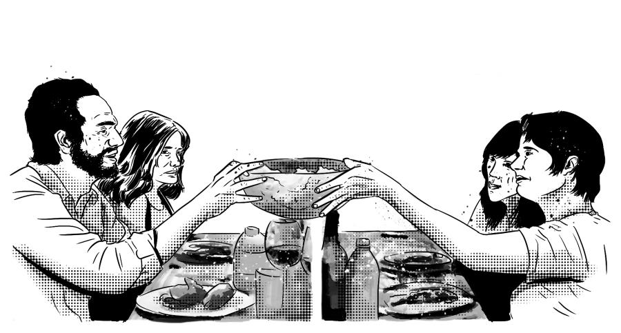
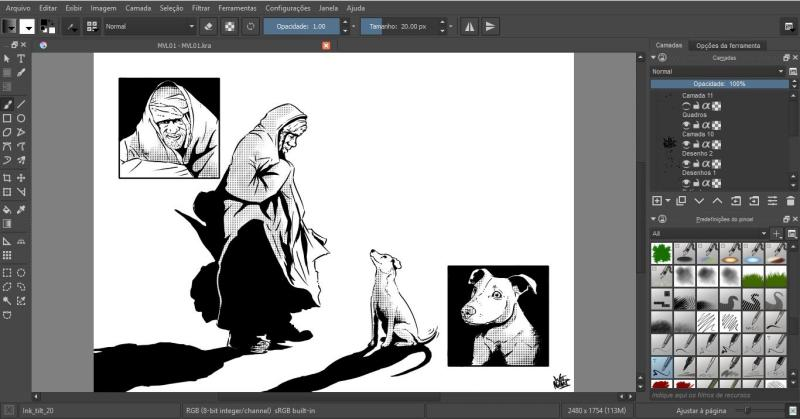
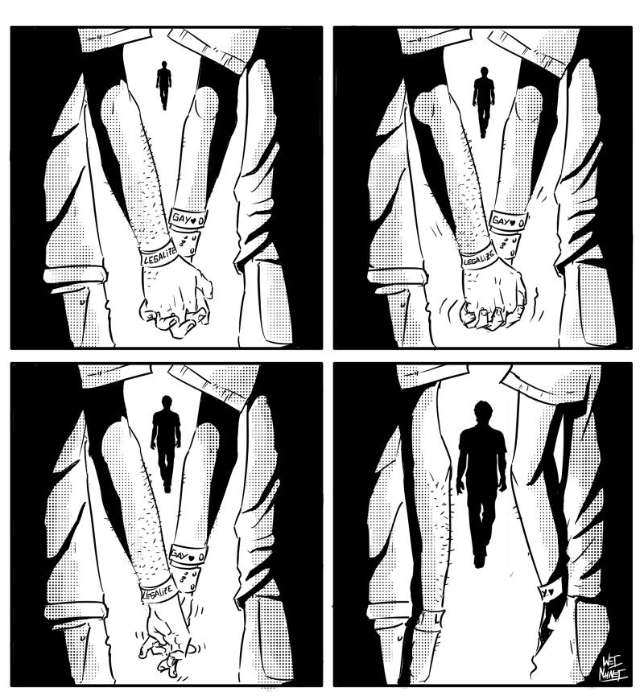

### Could you tell us something about yourself?

My name is Weslley but everyone since my childhood calls me Wes, that’s why I sign my works as Wes Nunes. I'm 24 years old and I live in São Paulo, Brazil. I'm militant for the LGBT cause in my country and I work as a writer and comic book illustrator.

### Do you paint professionally, as a hobby artist, or both?

I think every hobby has something of professional and every professional has something of hobby. Whatever if I illustrate to make money or not because it doesn’t change the fact tha this is my source of satisfaction and passion. I think the freedom and joy to do illustrations as a hobby associated with the responsibility to do illustrations for a living is the perfect way to do my work.

### What genre(s) do you work in?

I do comics, from webcomics to graphic novels. I did some political cartoons publishted in newspapers here in South America. Well, I'm a gay author and a militant for the LGBT cause, so all my work revolves around social problems involving this population here. Many people from other countries think that Brazil is the country of sexual freedom. This is not true. There is much more violence than freedom, both for LGBT people and for blacks and women. My comics and illustrations are public evidence for all this violence and social conflict in my country.

### Whose work inspires you most -- who are your role models as an artist?

I'm openly a fan of the works of Alan Moore, Frank Miller and Neil Gaiman. All work they made exercised some influence on me but I have to say that my strongest influence was the work of Brazilians like Laerte Coutinho (kind of a goddess who I've been reading since I was a kid) and Fábio Moon & Gabriel Bá, who were awarded the Eisner Awards some years ago. All these form the package that determines my illustration style and comic book creation.

### How and when did you get to try digital painting for the first time?

It was four years ago. I started with digital illustration because I had the intention of publishing political cartoons and webcomics. I ended up really enjoying the thing, you know? Very much. Now I do almost everything digitally and I have nothing to complain about it.

### What makes you choose digital over traditional painting?

It is like if you were in an art supply store and could take everything for one dollar – or for free. It is like magic for artists like me who live in a rented small house that the owner will not let you mess the walls with ink.

### How did you find out about Krita?

A few years ago I was looking for illustration software that would satisfy me on the Linux operating system, which I was using at that moment. I had been looking for a long time when I found Krita and I have to say I fell in love with it. It was everything I was looking for and perfect to do my work. Even when I returned to the Windows system I continued to use Krita. All other software has become insignificant next to it.

### What was your first impression?

"Oh my gosh this thing has everything! Everything!" I think that it was my first impression. The second must have been, "can a person marry a program?" Seriously, I adapted myself very quickly to Krita and it was so ideal for me, I loved it.

### What do you love about Krita?

What I love about Krita? Just everything. Tools, brushes, it does not weigh on my computer, it was extremely easy to learn how to work on and it is a well-organized program. Not to mention that it has a beautiful interface. What else could I want in software?

### What do you think needs improvement in Krita? Is there anything that really annoys you?

I think Krita needs more users. The more users the software has the better it will be and also with it the development team will get the recognition they deserve both financially and intellectually. I have done numerous independent works so I know how it is. Public recognition is very important for those who develop a work because it motivates you to do more and more.

### What sets Krita apart from the other tools that you use?

Its ease of use, simple interface and it is completely free. There is strong community support for the development of Krita, and no wonder it's completely different from what is on the market. Krita is clean software. It doesn’t flood you all the time with the responsibility to make a donation. After using it, you feel spontaneously that is fair to pay for it to encourage the work of developers.

### If you had to pick one favourite of all your work done in Krita so far, what would it be, and why?

I made a stripcomic for my blog Manifesto dos Quadrinhos (something like The Comics Manifest in English) called LAVAT, published months ago. It is a symbolic work because it toured the world and gave me visibility. It was an extremely emotional work because I portrayed a terrifying death scene of a young gay couple killed by strict anti-LGBT laws in fundamentalist countries in the Middle East. This was my favorite work made using Krita.

### What techniques and brushes did you use in it?

I often use David Revoy's paintbrushes, nothing more. It is enough for me. My work is very traditional comic book art, I think.

### Where can people see more of your work?

You can see more of my work on tumblr ([http://manifestodosquadrinhos.tumblr.com](http://manifestodosquadrinhos.tumblr.com)) and facebook, on my page ([http://www.facebook.com/manifestodosquadrinhos](http://www.facebook.com/manifestodosquadrinhos)) and my personal profile ([http://www.facebook.com/wescomics](http://www.facebook.com/wescomics)).

### Anything else you'd like to share?

I leave here my thanks to my family, friends and my boyfriend to put up with me even in more difficult moments. In addition, I send special thanks to the Krita team by developing such an excellent software and still make this space where I can show my work.
