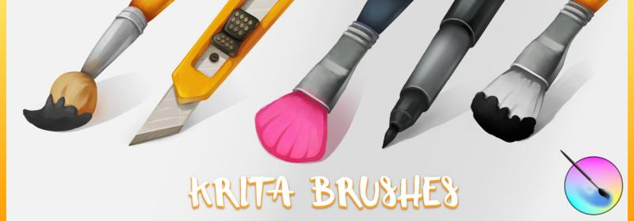

Nathan Lovato tells us about new brushes he has on offer:

"Krita brushes for game artists" is a set of brushes and video tutorials designed by a game artist, for game artists and illustrators.

It comes in two flavors: as a premium product, with exclusive tutorials and monthly updates. There is also a smaller, free version, so that everyone can enjoy the brushes!

As of the 4th version, the pack contains 17 presets and 3 tutorials. In August, there are 6 new pixel art presets coming, along with 2 more videos. And from there on, it is only getting bigger and better.

Use the coupon code "krita" to get a 20% discount!

Direct link with coupon applied: [https://gum.co/krita-brushes-for-game-artists/krita](https://gum.co/krita-brushes-for-game-artists/krita) Krita brushes for game artists: [https://gumroad.com/l/krita-brushes-for-game-artists](https://gumroad.com/l/krita-brushes-for-game-artists) Lite (free) version: [https://gumroad.com/l/krita-brushes-gdquest-lite](https://gumroad.com/l/krita-brushes-gdquest-lite)
