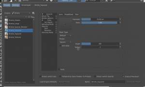

Apenas lanzamos [Krita 3.1](https://krita.org/en/item/krita-3-1-released-and-looking-forward/), y ya estamos trabajando en el código de la siguiente versión. La corrección de errores de código de Krita 3.1.x seguirá en vigencia hasta el lanzamiento de la versión 3.2 (o tal vez la versión 4.0...), y al igual que con la versión 2.9, algunas correcciones vendrán acompañadas con nuevas funciones cuando sea posible. Por lo pronto vendrán los lanzamientos de prueba además de la compilación diaria para [Windows](https://ci.appveyor.com/project/alvinhochun/krita-packaging/build/artifacts).

**De las funciones elegidas en el evento de Kickstarters 2015, estas son en las que estamos trabajando:**

- Lazy Brush: La herramienta para colorear de manera interactiva, en la cual hemos empeñado bastante tiempo hasta que la hicimos funcionar, la cual puede ser activada la versión 3.1 añadiendo la linea **disableColorizeMaskFeature=false** en el documento de la configuración kritarc. Sin embargo el algoritmo utilizado es simplemente bastante lento para ser útil, la interfaz esta terminada pero seguimos trabajando en un mejor y mas rápido algoritmo.
- Un mejor manejo de paletas de color: hemos añadido la funcionalidad de dos nuevos formatos de paletas que puedes manejar los colores correctamente, la idea ahora es el recrear el editor de la paleta en Python y para ello necesitamos terminar primero la capacidad de implementar programación de Python, función elegida en 2016. Éste trabajo va progresando sin contratiempos, mas información mas adelante.
- Brochas apiladas: Esta nueva herramienta ya funciona y es de hecho bastante novedosa, pero es difícil el apilar brochas con la interfaz existente del editor de brochas. Ya se ha hecho bastante trabajo en el nuevo diseño del editor, y una ves listo nos dará la oportunidad de implementar esta nueva función, es cuestión de refinar los últimos detalles.

 

 

**De las funciones elegidas en el evento de Kickstarters 2016, estas son en las que estamos trabajando:**

- Implemento de SVG: Hemos comenzado a reescribir el código para el suso del formato SVG, a éste punto ya podemos guardar y abrir documentos de este tipo en ves de ODG, con algunos detalles que necesitan de trabajo. Una vez terminados podremos añadir el funcionamiento con con la interfaz que ya ha sido nuevamente diseñada.
- Programación con Python: Ya se ha establecido el funcionamiento de la API, ya la podemos integrar al programa, solo necesitamos conectar el funcionamiento para que trabaje adecuadamente, de hecho ya se puede programar y aplicar en capas y mascaras y guardarse en el documento. También lo hemos dispuesto en la linea de comandados para usar "scripts" sin que se necesite abrir toda la interfaz de Krita. Solo nos queda el averiguar la mejor manera de construir y añadir Python en OSX y Windows. Eliakin Costa, estudiante de KDE esta construyendo una interfaz para usar y guardar "scripts".
- Herramientas de Texto: Aun estamos en la etapa de planeamiento, especialmente respecto al cuales serán las opciones y el como implementarla dentro del diseño de la interfaz de Krita. Ésta herramienta usará SVG, por lo que es necesario el terminar SVG primero antes de empezar con esta función.
- Panel de Referencia: También en etapa de planeamiento, el cual queremos reconstruirlo desde cero con Python.

Y por supuesto, esto es solo lo planeado dentro de los eventos, con mas gente contribuyendo al código y uniéndose al equipo, es toda una aventura el ver cual dirección tomara el proyecto. ¡No cabe duda que habrá mas interesantes funciones para 2017!
