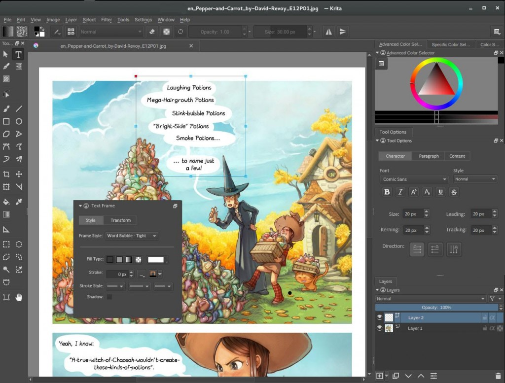
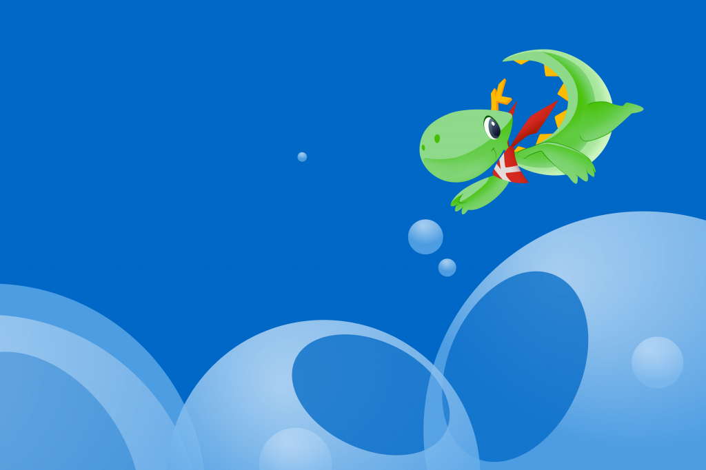
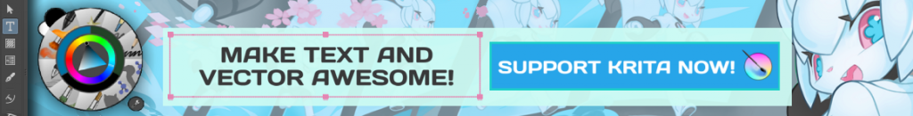

Even while we're still working on fixing the last bunch of bugs for what promises to become a great 3.0 release, we're taking the next step! It's time for [the 2016 Krita Kickstarter](http://www.krita.org/2016kickstarter)! Last year, our backers funded a big performance improvement in the form of the Instant Preview feature and wickedly cool animation support, right in the core of Krita. And a bunch of stretch goals, some of which are already implemented in 3.0, some of which will come in Krita 3.1.

<iframe src="https://www.youtube.com/embed/pThKpaDXxj8?rel=0" width="640" height="360" frameborder="0" allowfullscreen="allowfullscreen"></iframe>

This year, we're focusing on two big topics: the text tool and the vector layers. Plus, there are a lot of exciting stretch goals for you to vote on!

Krita's text tool used to be shared with the rest of KOffice, later Calligra. It's a complete word processor in a box, with bibliography, semantic markup, tables, columns and more! But not much fine typographic control and besides... It has always been a bad fit, it has never worked well!

Now is the time to join us and make it possible to create an awesome text tool, one that is really suitable to what you need text for in Krita: real typographic and artistic control, support for various languages, for translations, for scripts from all over the world. One integrated text tool that is easy to use, puts you in control and can be extended over the years with new features.

The second topic is vector graphics. It's related to the text tool, since both are vector layer features. Currently, our vector graphics are defined in the OpenDocument Graphics format, which is fine for office applications, but not great for artwork. There's already a start for supporting the SVG standard instead, and now's the time to finish the job! And once we're SVG to the core, we can start improving the usability of the vector tools themselves, which also suffer from having been designed to work in a word processor, spreadsheet or presentation application. Now that Krita is no longer part of a suite of office applications, we can really focus on making all the tools suitable for artists! Let's make working with vector art great!

And of course, there are a bunch of stretch goals, ranging from small ones to a really big stretch goal, Python scripting. Check out the kickstarter page for a full list!

One of the fun parts of backing a kickstarter project are the rewards. For a Krita kickstarter, these are mostly small, fun things to remember a great campaign by. But we're trying to do something special this year! After the kickstarter is funded, we will commission Krita artists from all over the world to create art for us that we will use in various rewards!
