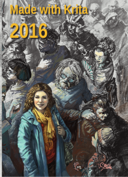

**Made With Krita 2016** is now available for pre-order! Forty artists from all over the world, working in all kinds of styles and on all kinds of subjects show how Krita is used in the real world to create amazing and engaging art. The book also contains a biographical section with information about each individual artist.

\[caption id="attachment\_4645" align="aligncenter" width="217"\] Made with Krita 2016\[/caption\]

The book is professionally printed on 130 grams paper and softcover bound in signatures. The cover illustration is by Odysseas Stamoglou.

Made with Krita 2016 is 19,95€, excluding shipping. Shipping is 11.25€ outside the Netherlands and 3.65€ inside the Netherlands.
