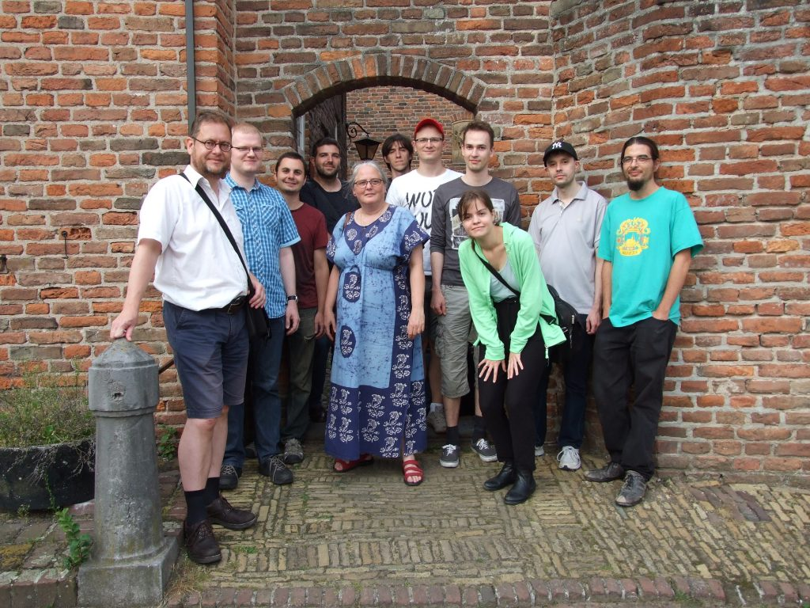
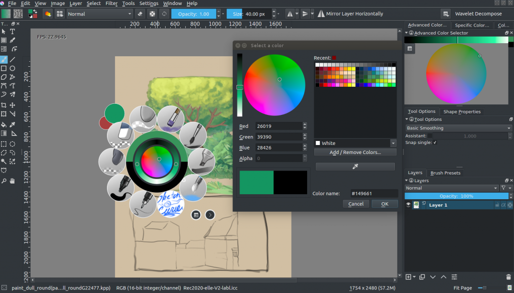
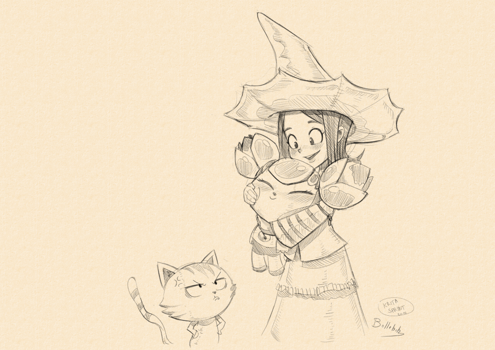
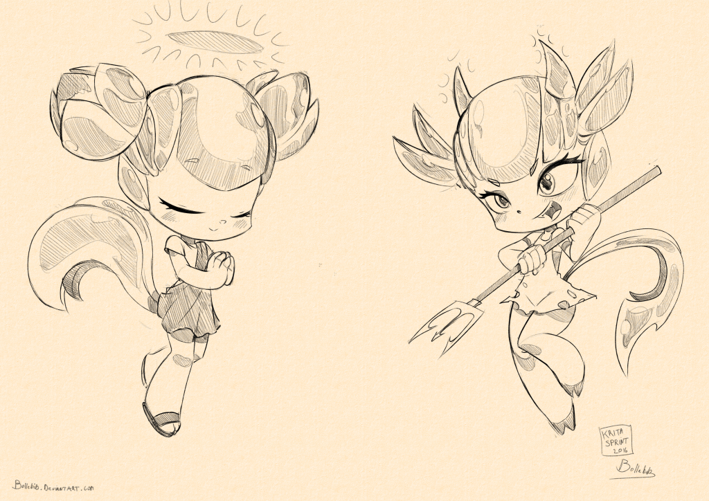
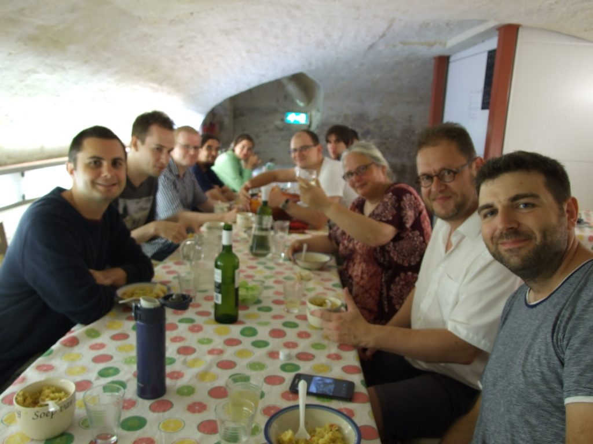

The artists, developers, website maintainers and documentation writers who were in Deventer for the Krita sprint  since Thursday are now slowly returning home. Some will stay for a bit longer, others had to leave on Sunday already.

There is something extremely exhausting and exhilarating about a real-live meeting like this! Lots and lots of topics were discussed:

- We discussed, are actually still discussing, the user interaction design for the vector and [text projects](https://phabricator.kde.org/T1004#5 0665) this year's kickstarter funded.
- Lots of work was done to support [OSX properly](https://codereview.qt-project.org/#/c/166202) -- the opengl patch looks ready to land in Qt! There were also some fixes to tablet handling.
- We had all three Google Summer of Code students present! Wolthera finished the second part of her project (the first was [soft proofing](http://wolthera.info/?p=802) and is in 3.0.1): a new color selector internal to Krita that is fully color managed. Jouni presented his animation work and Julian his work on Qt's OpenGL QPainter engine.

 

- We discussed the publication of a [Pepper and Carrot](http://www.peppercarrot.com/) book by the Krita Foundation with David Revoy.

\[caption id="attachment\_4233" align="alignnone" width="1024"\] Pepper loves Kiki!\[/caption\]

- We refined the release process and the process by which we take [feature requests](https://krita.org/en/item/ways-to-help-krita-work-on-feature-requests/) all the way to implemented and released features.
- Jouni sat together with Steven, the author of this post's sketches and who is also an accomplished animator to go through Krita's animation workflow
- We discussed how badly we need a new architecture and UX design for resource management
- We made plans for improving the website and the webshop
- Dmitry showed a new brush engine (alcohol markers) that can handle enormous brush diameters -- 2500 pixels isn't impossible
- We fixed bugs, bugs and bugs....

- And finally, we had a great time. Many dedicated contributors to Krita had never met in person before, and now we've got faces and voices mapped to chat channel nicknames and commit message email addresses!

The 2016 Krita sprint was sponsored by [KDE e.V.](https://www.kde.org/community/donations/) (travel) and the [Krita Foundation](https://krita.org/en/support-us/donations/) (accomodation and food). Thanks! We also happened to have planned the sprint right for the week the Dutch summer decided to present us with a heatwave. Fortunately we could use [a nice and cool cellar](http://petrusenpaulus.eu/). Add some internet and power strips, and it was a great hack and dinner room!

#### Builds

And we've got new builds! With a new splash screen! And some bug fixes.

- Fixed 100% opacity blobs at the start of a line on OSX
- Don't allow users to remove the autogenerated gradients
- Fix a crash when the resource selector tries to display a deleted resource
- Update the default workspace set
- Fix exporting animations to the CSV format
- Fix translations on Windows

#### Windows

On Windows, Krita supports Wacom, Huion and Yiynova tablets, as well as the Surface Pro series of tablets. The portable zip file builds can be unzipped and run by double-clicking the krita link.

Krita on Windows is tested on Windows 7, Windows 8 and Windows 10. There is only a Windows 64 bits build for now. Also, there is debug build that together with the DrMingw debugger can help with finding the cause of crashes. See the new [FAQ entry](https://docs.krita.org/KritaFAQ#How_can_I_produce_a_backtrace_on_Windows.3F). The Windows builds can be slower than usual because vectorization is disabled.

- [krita\_3.0.99.91-x64.zip](http://files.kde.org/krita/3/windows/devbuilds/krita_3.0.99.91-x64.zip)
- [krita3-x64-dbg-latest.zip](http://files.kde.org/krita/3/windows/debugbuilds/krita3-x64-dbg-latest.zip)

#### Linux

For Linux, we offer [AppImages](http://appimage.org/) that should run on any reasonable recent Linux distribution. You can download the appimage, make it executable and run it in place. No installation is needed. At this moment, we only have appimages for 64 bits versions of Linux. This appimage has experimental desktop integration.

- [krita-3.0.99.91-Beta-x86\_64.appimage](http://files.kde.org/krita/3/linux/devbuilds/krita-3.0.99.91-Beta-x86_64.appimage)

You can also get Krita from [Ubuntu’s App Store in snap format](https://uappexplorer.com/app/krita.krita). This version includes the translations for Krita itself. Install with

snap install --beta krita

#### OSX and MacOS

Krita on OSX will be fully supported with version 3.1. Krita 3.0 for OSX is still missing Instant Preview and High Quality Canvas scaling. There are also some issues with rendering the image — these issues follow from Apple’s decision to drop support for the OpenGL 3.0 compatibility profile in their display drivers and issue with touchpad and tablet support. We are working to reimplement these features using OpenGL 3.0 Core profile. For now, we recommend disabling OpenGL when using Krita on OSX for production work. Krita for OSX runs on 10.9, 10.10, 10.11 and is reported to work on MacOS too.

- [krita-3.0.99.91.dmg](http://files.kde.org/krita/3/osx/devbuilds/krita-3.0.99.91.dmg)

#### Source

The source tarbal contains all translations.

- [krita-3.0.99.91.tar.gz](http://files.kde.org/krita/3/source/krita-3.0.99.91.tar.gz)
