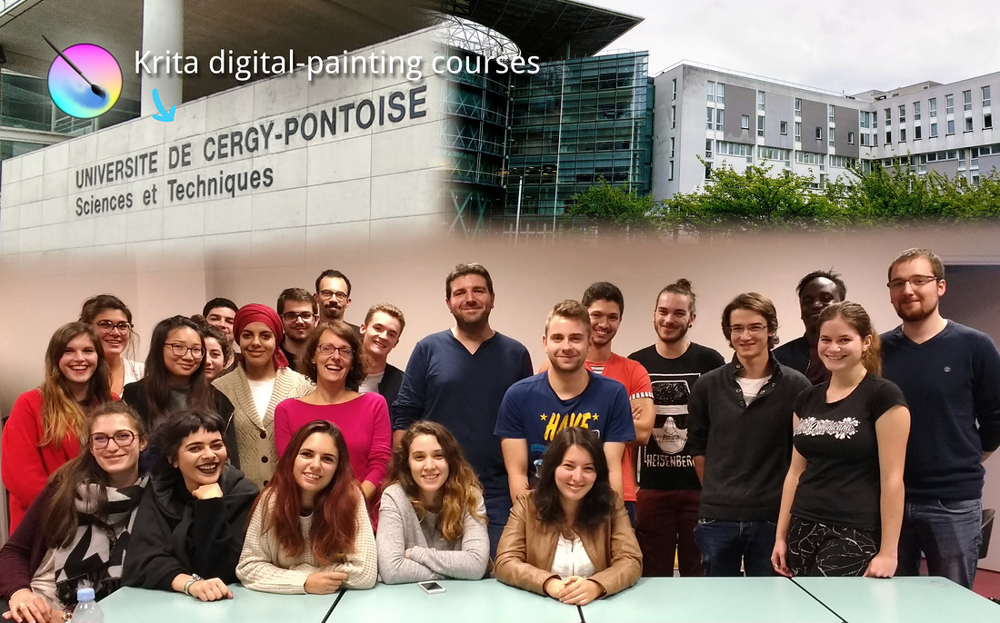

This past week artist David Revoy visited the Université Cergy-Pontoise in Paris France to give a Krita training. The university's teacher, Nicolas Priniotakis, has been using linux and other open source technology such as Blender. This was the first time the students have been exposed to Krita...and the results were a success with the help of David!

You can read more about David's trip and see what was taught during the class from his blog: [https://www.davidrevoy.com/article335/krita-digital-painting-courses-at-university-cergy-pontoise](https://www.davidrevoy.com/article335/krita-digital-painting-courses-at-university-cergy-pontoise)

