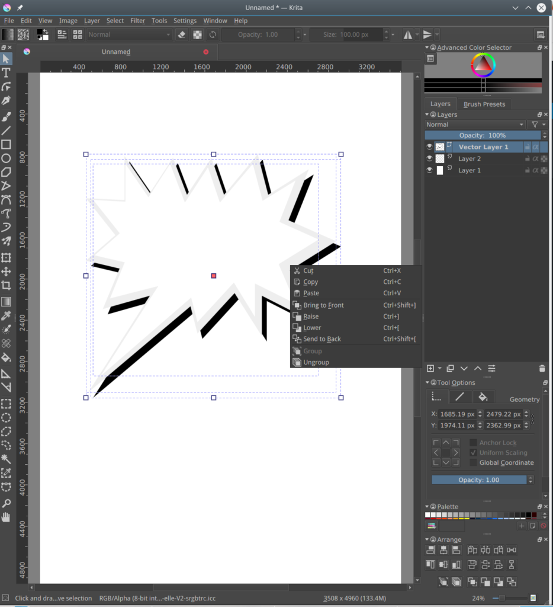
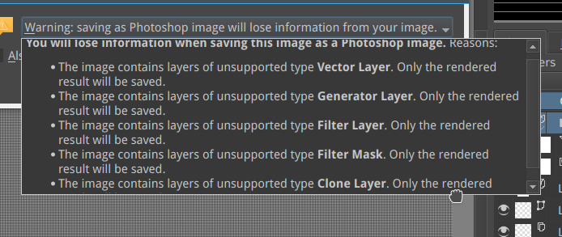
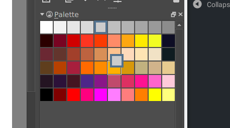
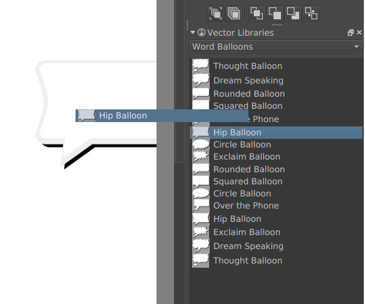
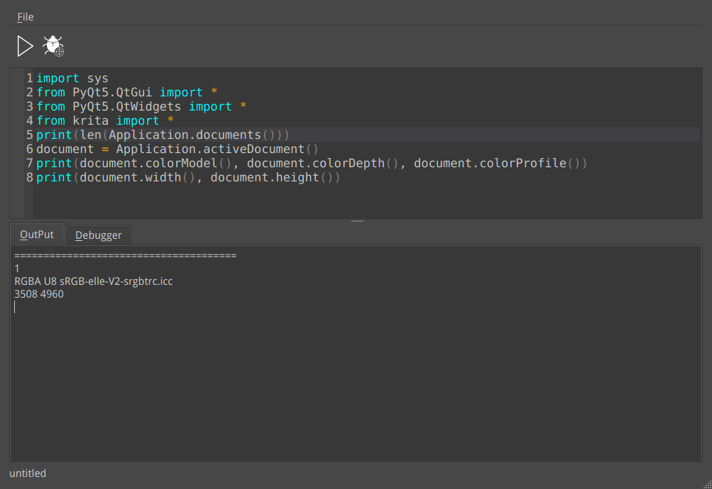

It's still early days, and we have to say this up-front: these builds are not ready for daily work. We mean it, you might luck out, but you might also seriously lose work. Please test, and please report issues on [bugs.kde.org!](https://bugs.kde.org) (But check whether your issue has already been reported...) That said...

**Here are the first builds of Krita 4.0 pre-alpha!**

This is as big, if not bigger a step than it was going from Krita 2.9 to Krita 3.0. No, we haven't ported Krita to Qt6 (phew!), but we have replaced the entire vector layer system: instead of using the [Open Document Graphics](https://docs.oasis-open.org/office/v1.2/OpenDocument-v1.2.html) standard, Krita now uses the [SVG](https://www.w3.org/TR/SVG/) standard to store vector information. This makes Krita more compatible with other applications, like [inkscape](https://inkscape.org). Krita can still load existing Krita documents with ODG vector layers, but will only save SVG vector layers. **Once a file has been saved with Krita 4.0 pre-alpha, Krita 3.x cannot open vector layers in that file any more**.

We have also rewritten a lot of the interaction with vector objects, to make working with vector layers easier and more productive, and we'd like your feedback on that as well.

And of course, this isn't the only big change.

There is a complete new airbrush system, developed by Allen Marshall, that replaces the existing airbrush system. This will affect brush presets that use the airbrush option, but the new system is so much better that there was no reason to keep the old system in parallel.

Eugene Ingerman has added a healing brush tool. Just select the sticky plaster icon in the toolbox, and paint over the area you want to be patched out!

https://youtu.be/jI87VzDtkPY

There is a new system for saving images that should be much safer than the old one, and that warns you when saving to a format that will lose you data.

There's a much improved palette docker, by Wolthera van Hövell tot Westerflier, that allows you to organize a palette in groups of colors, and reorganize the palettes using drag and drop, and edit swatches by double-clicking.

There's a new docker that makes it possible to load SVG symbols and drag and drop them as shapes onto the image. Handy for speech bubbles, and we've included David Revoy's Pepper and Carrot speech bubble library to get you started!

And there's much more ready for you to explore and experiment with!

We're still working on the new text tool. We got the basics working only last week, but that isn't in these development builds yet. It's too rough for even that!

The Python plugin has been merged, and is ready for testing, but here we've run into another problem: we haven't been able to figure out yet how to bundle Python and the Python modules for scripting Krita yet. It works fine when building Krita from source on supported Linux systems. We haven't managed to build it on Windows or on OSX yet, at all. **If you can help us with that, please contact us!**

\[caption id="attachment\_5377" align="alignnone" width="1003"\] The Scripter -- ad-hoc scripting in Krita, created by Eliakin Costa.\[/caption\]

#### Download

#### Windows

Note for Windows users: if you encounter crashes, please follow [these instructions](https://docs.krita.org/Dr._Mingw_debugger) to use the debug symbols so we can figure out where Krita crashes.

For development builds, we only create 64 bits windows portable zip files, Linux appimages and OSX disk images.

- Portable 64 bits Windows: [krita-4.0.0-prealpha.1-x64.zip](https://download.kde.org/unstable/krita/4.0.0-prealpha/krita-4.0.0-prealpha.1-x64.zip)
- [Debug symbols. (Unpack in the Krita installation folder)](https://download.kde.org/unstable/krita/4.0.0-prealpha/krita-4.0.0-prealpha.1-x64-dbg.zip)

- Portable 32 bits Windows: [krita-4.0.0-prealpha-x86.zip](https://download.kde.org/unstable/krita/4.0.0-prealpha/krita-4.0.0-prealpha-x86.zip)
- [Debug symbols. (Unpack in the Krita installation folder)](https://download.kde.org/unstable/krita/4.0.0-prealpha/krita-4.0.0-prealpha-x86-dbg.zip)

#### Linux

- 64 bits Linux: [krita-4.0.0-prealpha-x86\_64.appimage](https://download.kde.org/unstable/krita/4.0.0-prealpha/krita-4.0.0-pre-alpha-x86_64.appimage)

#### OSX

- OSX disk image: [krita-4.0.0-pre-alpha.dmg](https://download.kde.org/unstable/krita/4.0.0-prealpha/krita-4.0.0-prealpha.dmg)

### Source code

- Source code: [krita-4.0.0-pre-alpha.tar.gz](https://download.kde.org/unstable/krita/4.0.0-prealpha/krita-4.0.0-prealpha.tar.gz)

#### md5sums

For all downloads:

- [md5sums.txt](https://download.kde.org/stable/krita/3.1.4/md5sums.txt)

#### Key

The Linux appimage and the source tarball are signed. You can retrieve the public key over https here: [0x58b9596c722ea3bd.asc](https://share.kde.org/index.php/s/fJ99V5mZvuyD0z8). The signatures are [here](http://download.kde.org/stable/krita/3.1.4/).

#### Support Krita

Krita is a free and open source project. Please consider supporting the project with [donations](https://krita.org/en/support-us/donations/) or by [buying training videos or the artbook!]("https://krita.org/en/support-us/shop) With your support, we can keep the core team working on Krita full-time.
