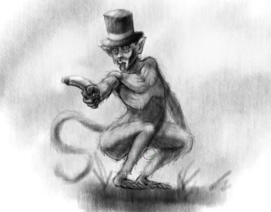

### Could you tell us something about yourself?

Good day. My name is Adam and I am a 26-year-old person who is trying to learn how to draw...

### Do you paint professionally, as a hobby artist, or both?

Hobby :)

### What genre(s) do you work in?

I try to draw everything, I don't want to get stuck in drawing only one thing over and over again and leave behind everything else.

### Whose work inspires you most -- who are your role models as an artist?

People who inspired me when i was younger ... much younger ... were Satoshi Urushihara, Masamune Shirow and DragonBall artists.

### How and when did you get to try digital painting for the first time?

My first adventure with digital painting was about 4-5 years ago, when I bought my first small Wacom Bamboo tablet that I am still using.

### How did you find out about Krita?

A friend of mine mentioned it.

### What was your first impression?

I uninstalled it and then came back after a while ;-)

### What do you love about Krita?

Everything!

### What do you think needs improvement in Krita? Is there anything that really annoys you?

Maybe make it less laggy, but that can be the fault of my laptop.

### If you had to pick one favourite of all your work done in Krita so far, what would it be, and why?

The featured image. Not really my favourite, but I don't have anything else worth showing!

### What techniques and brushes did you use in it?

It was all random without any technique! I used Pencil 2B and pencil texture, nothing more or less.

### Anything else you'd like to share?

Have a nice day everyone and let the Krita grow :D
