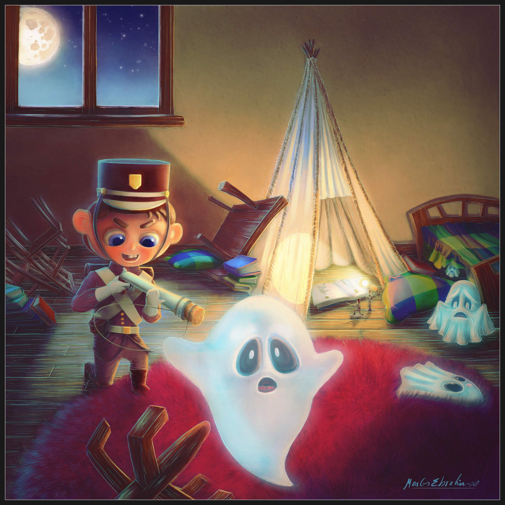
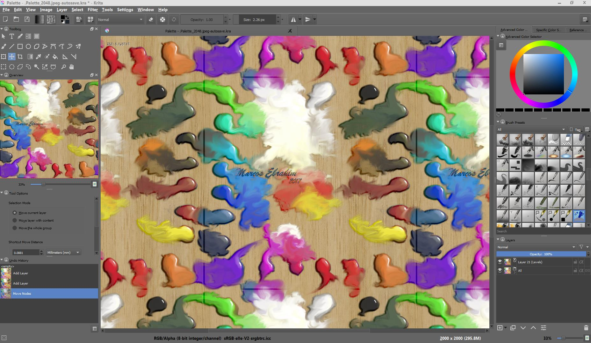
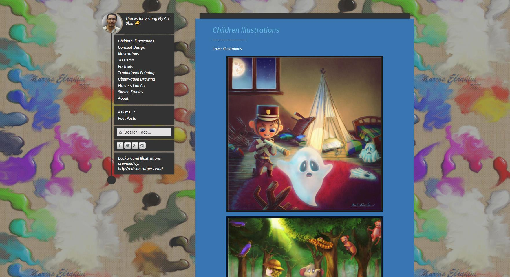
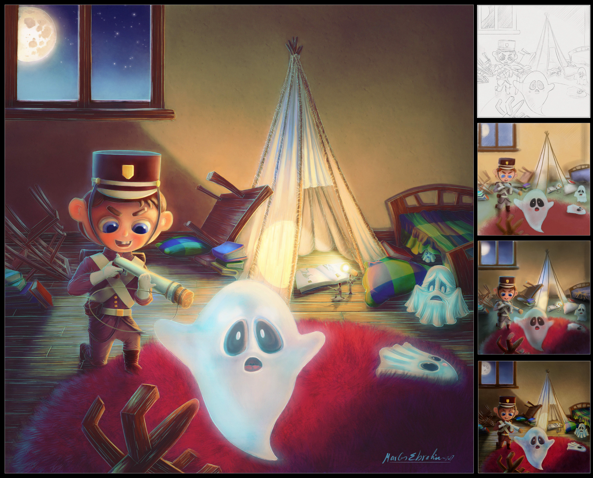

### 

### Could you tell us something about yourself?

My name is Marcos Ebrahim. I'm an Egyptian artist and illustrator specialized in children's book art, having 5 years experience with children's animation episodes as computer graphics artist. I have just finished my first whole book as children's illustrator on a freelance basis that will be on the market at Amazon soon. I'm also working on my own children's book project as author and illustrator.

### What genre(s) do you work in?

Children's illustrations and concept art in general or children's book art specifically.

### Do you paint professionally, as a hobby artist, or both?

Because I'm not a member of any children's illustration agencies, associations or publishing houses yet, I'm now doing this work on a small scale as a freelancer. I changed careers to be an illustrator a few months ago, so I can't call myself a professional yet. I hope to achieve that soon.

### Whose work inspires you most -- who are your role models as an artist?

[Nathan Fowkes](http://nathanfowkesart.com)' works and illustrations. I found this illustrator and concept artist on a website that called him "the master of value and colour". I was lucky engough to study online (an art program by Schoolism) under his supervision and learn a lot. However, I’m not a brilliant student :)

Other great illustrators and artists I like: Goro Fujita, Marco Bucci, Patrice Barton, Will Terry, Lynne Chapman, John Manders and many others. I always look forward to seeing their art works to learn from them.

### How and when did you get to try digital painting for the first time?

About three years ago, when I was trying to use my new Wacom Intuos tablet for painting and drawing, practicing studies from the great Renaissance masters as fan art.

### 

### What makes you choose digital over traditional painting?

Let me describe it like this: “The Undo-Time Machine -- the great digital button”. Beside the ability to make changes in illustrations easily, I found its benefit when I tried to work with authors and they asked me to make changes that I couldn't have made in traditional painting without redoing the illustration from scratch.

### How did you find out about Krita?

I used to surf Youtube for viewing Illustrations and artists demo their work. Then I heard about Krita as open source art software. So I decided to search more and found out that the illustrations made with it could be similar to my work, so I should devote some of my time to know more about it and try it. Then I searched out more learning videos on Youtube. Frankly, the most impressive and helpful one was a long video tutorial by the art champion of the Krita community, David Revoy, making a whole comic page from scratch using Krita. He showed the whole illustration process, as well as the brushes and tools he provides for others to use (thank you very much!).

### What was your first impression?

I think the Krita program has a user-friendly interface and tools that become more familiar when I configure the shortcuts similarly to most popular other art programs. This make it easier to work without the need to learn many things in a short time.

### What do you love about Krita?

I think the most wonderful thing is the brush sets and the way they look like real-world tools. In addition some other tools like the transformation tool (perspective) and the pop-up tool.

Also I can say that working with Krita is the first time that I can work on one of my previous sketches and achieve a good result (according to my current art skills) that I’m happy with.

### What do you think needs improvement in Krita? Is there anything that really annoys you?

As I mentioned to the Krita team, there are some issues that we could call bugs. However, I know that Krita is in development and the great Krita team makes things better from one version to another and add new features all the time. Thanks to them and hoping that they will continue their great work!

### What sets Krita apart from the other tools that you use?

I think that Krita, as open-source art software, could soon compete with commercial art software if it continues on this path (fixing bugs and adding new features).

### If you had to pick one favourite of all your work done in Krita so far, what would it be, and why?

Frankly, I've only recently started to use Krita and I've finished only two pictures. One I could call an illustration, the other is the background of my art blog, trying to use the wrap tool to make a tiled pattern. You can see this in the screenshots.

### What techniques and brushes did you use in it?

I prefer to make a sketch, then work on it adding base colors and adjusting the lighting value to reach the final details.

### Where can people see more of your work?

I add new works to my art blog once or twice every month or more often, depending on the time I have available and whether I make anything new.

[http://marcosebrahimart.tumblr.com](http://marcosebrahimart.tumblr.com)

And also here: [https://www.behance.net/MarcosEbrahim](https://www.behance.net/MarcosEbrahim) [http://marcosebrahim.deviantart.com/gallery/](http://marcosebrahim.deviantart.com/gallery/) [https://www.artstation.com/artist/marcosebrahim](https://www.artstation.com/artist/marcosebrahim)

### Anything else you'd like to share?

All the best wishes to the great Krita team for continuing success in their work in developing Krita open source software for all artists and all people.
