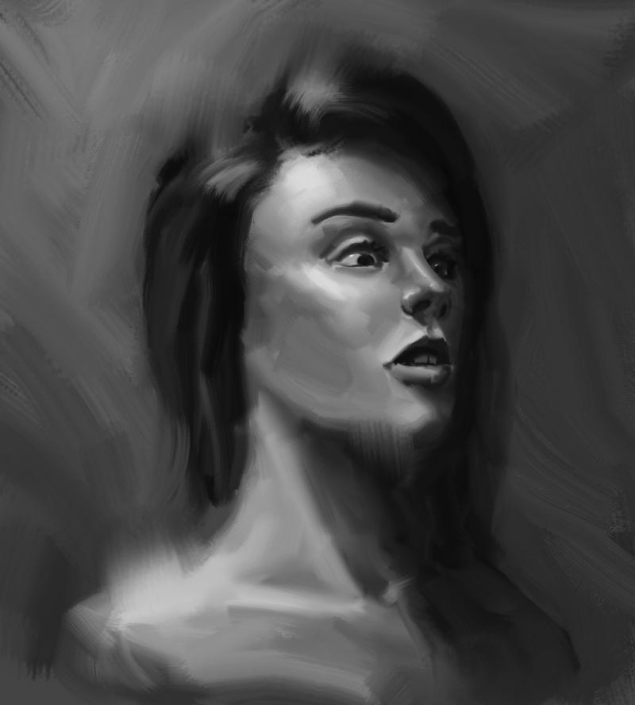
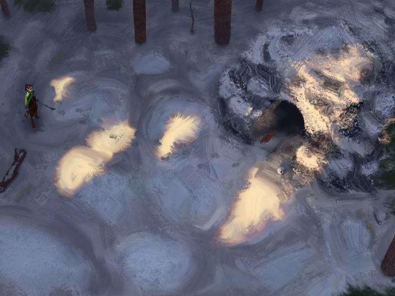
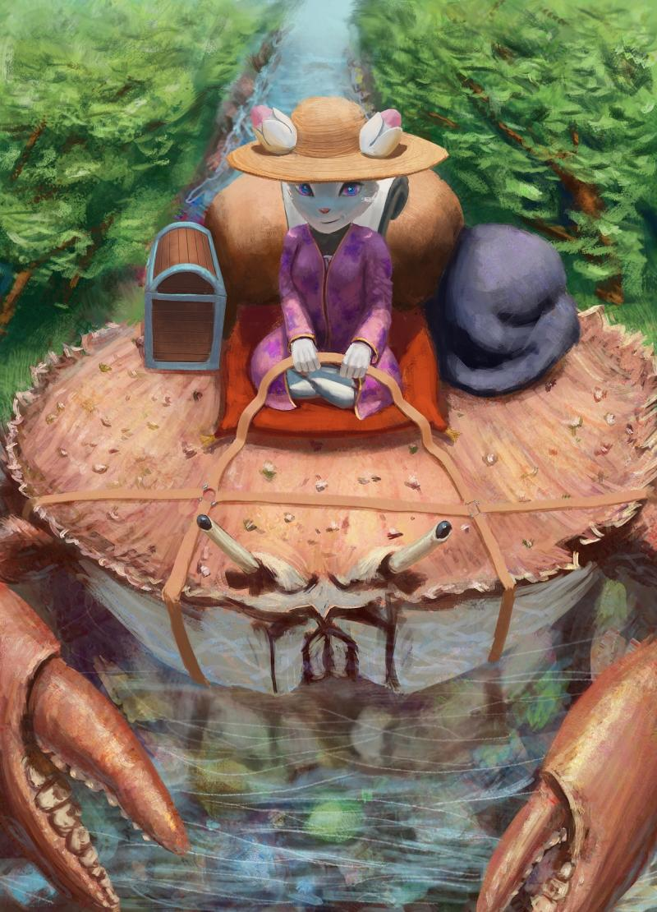

### 

### Could you tell us something about yourself?

Hello, I’m Radian. I'm a digital artist from Russia. Honestly, I don’t know what else to say here :)

### Do you paint professionally, as a hobby artist, or both?

I’m not working professionally yet but I’m aiming for it! I want to find work in-house because that will speed up my progress, but there is like only one serious company in my city.

### What genre(s) do you work in?

I like to make neat atmospheric illustrations, usually it’s fantasy inspired works. Actually, I care more about making it look cool so I can paint whatever I like. Except cityscapes and street views. I hate those.

### Whose work inspires you most -- who are your role models as an artist?

I think I can name two – Mike Azevedo and Craig Mullins. I like Mike’s colors and light work so much, he definitely knows how to make it awesome. He was one of the artists who inspired me a lot from the start of my art journey. Craig – digital art pioneer who managed to keep progressing and experimenting for so many years. I’d say I like his "philosophy", his way to do things, his way to think.

### How and when did you get to try digital painting for the first time?

About 3 years ago, I tried to make a drawing with vector tools and mouse :)

### What makes you choose digital over traditional painting?

Colors, all of them! It’s easy to mess with, easy to experiment. I like good traditional art, I like its aesthetics, but I don’t like working with traditional media, mixing colors, cleaning brushes and such.

### How did you find out about Krita?

From a comment on some entertainment site. It was something like "hey, there is also Krita, it can do the same things as SAI and even more, plus it’s free".

### What was your first impression?

"Whoa, so many buttons! I’m gonna press them all"

### What do you love about Krita?

Someone can say that they like blending brushes or a lot of tools or something else. But I’ll say Krita is extremely comfy. It’s very logical (in most areas :) and it has many little but very handy things.

### What do you think needs improvement in Krita? Is there anything that really annoys you?

There are some things that slightly annoy me but those are either very hard to fix or super small and not even worth ranting about. Sometimes both. Improvements? I’m sort of an idea guy so I can write a kilometer-long text about what can be improved. Though I can’t say anything needs to be improved in Krita. Vectors and text tools aren’t good but they're already in development.

### What sets Krita apart from the other tools that you use?

The best balance between comfort and functionality. There are a few cool Photoshop things that I’d like to have in Krita but if I start Photoshop I can count a lot of things there that I’d like to get from Krita. It’s just hard to use for me. Any other program I tried could win one or two rounds, but Krita always had more. More functions, more tricks for artists, more little handy things and more possibilities. Also I think Python scripting will add a new level of comfort that will never be defeated.

### If you had to pick one favourite of all your work done in Krita so far, what would it be, and why?

I tend to hate any of my artwork if it is more than 1-3 months old but there are a couple of exceptions. The Kiki painting I made for the artbook "[Made with Krita](https://krita.org/en/item/made-with-krita-2016-the-krita-artbook/)" is one of them. I used a bunch of new tricks in here and probably made a few good choices by accident.

### What techniques and brushes did you use in it?

I used [my own brush pack](https://forum.kde.org/viewtopic.php?f=274&t=137532), many brushes "inspired" by some Photoshop brushpack from pro artists. There was't a single brush that satisfied me so I had to learn brush creation magic :)

As I said, I like Mullins’s philosophy: more looking, more thinking, less painting. I usually trying to do as much as I can with as few strokes as I can. But I like to experiment as well. If there are so many techniques, why should I use only one? Try everything, break all rules! Learn from mistakes and especially learn from successful experiments.

### Where can people see more of your work?

[http://radian-art.tumblr.com/](http://radian-art.tumblr.com/) [https://radian1.deviantart.com/](https://radian1.deviantart.com/) [https://www.artstation.com/radan](https://www.artstation.com/radan)

### Anything else you'd like to share?

It’s kinda funny to see how such a small team makes such big progress in development while Photoshop stagnates for years with a big company full of professionals.

Thanks for all your work guys, keep it up!
