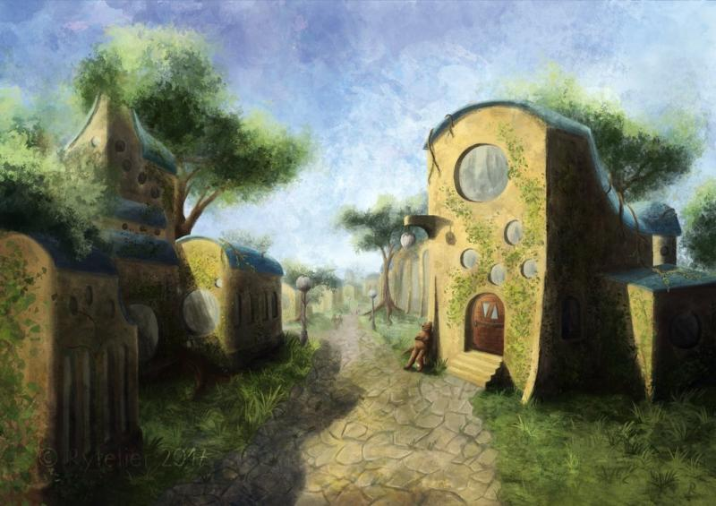
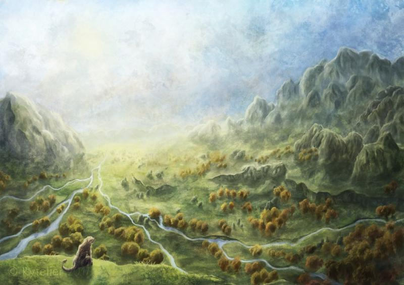
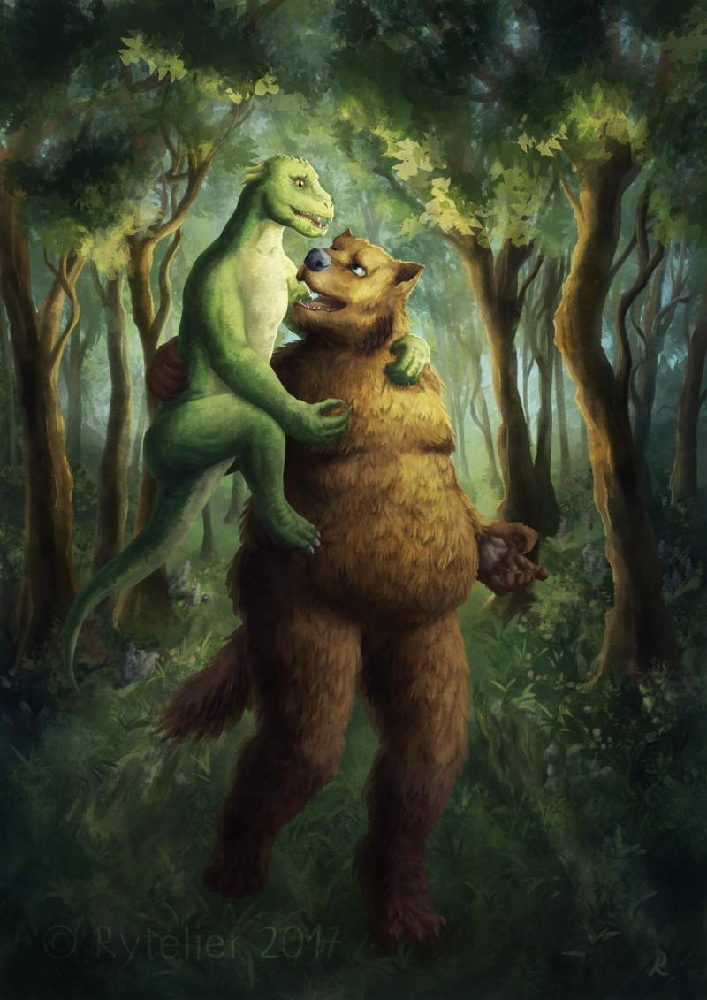

### 

### Could you tell us something about yourself?

I'm Rytelier, a digital artist. I've had an interest in creating art for a few years, I mainly want to visualize my original world.

### Do you paint professionally, as a hobby artist, or both?

Currently I do only personal work, but I will look for some freelance job in the future.

### What genre(s) do you work in?

I work mainly in science fiction - I'm creating an original world. I like to try various things, from creatures to landscapes and architecture. There are so many things to design in this world.

### 

### Whose work inspires you most -- who are your role models as an artist?

It's hard to point out certain artists, there are so many. Mainly I get inspired by fantasy art from the internet, I explore various websites to find interesting art.

I recommend looking at [my favourites gallery](https://rytelierart.deviantart.com/favourites/), there are many works that inspire me.

### How and when did you get to try digital painting for the first time?

It was years ago, I've got interested in the subject after I saw other people's work. It was obviously confusing, how to place strokes, how to mix colors, and I had to get used to not looking at my hand when doing something on the tablet.

### What makes you choose digital over traditional painting?

I like the freedom and flexibility that digital art gives. I can create a variety of textures, find colors more easily and fix mistakes.

### How did you find out about Krita?

I saw a news item about Krita on some website related to digital art and decided to try it.

### What was your first impression?

I liked how many interesting brushes there were. As time went on I discovered more useful features. It was surprising to find out that some functions aren't available in Photoshop.

### What do you love about Krita?

It has many useful functions and very high user convenience. I love the brush editor - it's clean and simple to understand, but powerful. The dynamics curve adjustment is useful, the size dependent brush with sunken curve allows me to paint fur and grass more easily.

Also different functional brush engines. Color smudge is nice for more traditional work, like mixing wet paint. Shape brush is like a lasso, but better because it shows the shape instantly, without having to use the fill tool. Filter brush is nice too, I mainly use it as sharpen and customizable burn/dodge. There are also ways to color line art quickly. For a free program that functionality is amazing -- it would be amazing even for a paid program! I like this software much more than Photoshop.

### What do you think needs improvement in Krita? Is there anything that really annoys you?

The performance is the thing I most want to see improved for painting and filters. I'm happy to see multi-threaded brushes in the 4.0 version. Also I would like more dynamic preview on applying filters like the gradient map, where it updates instantly when moving the color on the color wheel. It annoys me that large brush files (brushes with big textures) don't load, I have to optimize my textures by reducing the size so the brush can load.

### What sets Krita apart from the other tools that you use?

The amount of convenience is very high compared to other programs. The amount of "this one should be designed in a better way, it annoys me" things is the smallest of all the programs I use, and if something is broken, then most of these functions are announced to improve in 4.0.

### If you had to pick one favourite of all your work done in Krita so far,  what would it be, and why?

It's hard to pick a favourite. I think this, because I challenged myself in this picture and they are my original character, which I like a lot.

### What techniques and brushes did you use in it?

I use brushes that I've created myself from resources found on the internet and pictures scanned by myself. I like to use slightly different ways of painting in every artwork, still looking for techniques that suit me best. Generally I start from sketch, then paint splatter going all over the canvas, then adding blurry forms, then adding details. Starting from soft edges allows me to find good colors more easily.

### Where can people see more of your work?

[https://rytelierart.deviantart.com/](https://rytelierart.deviantart.com/) I will open galleries in other sites in the future.

### Anything else you'd like to share?

I hope that Krita will get more exposure and more people, including professionals, will use it and will donate to its development team instead of buying expensive digital art programs. Open source software is having a great time, more and more tools are being created that replace these expensive ones in various categories.
