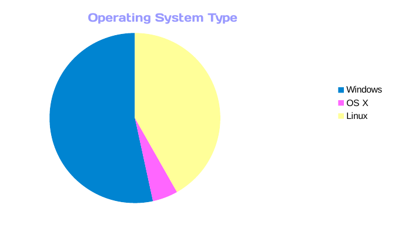
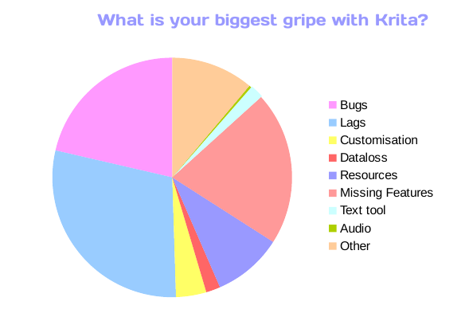

A bit later than planned, but here are the 2017 Krita Survey results! We wanted to know a lot of things, like, what kind of hardware and screen resolution are most common, what drawing tablets were most common, and which ones gave most trouble. We had more than 1000 responses! Here's a short summary, for the full report, head to [Krita User Survey Report](https://files.kde.org/krita/marketing/Krita_User_Survey_Report_April_2017.pdf).

- About 55% of respondents use Windows, about 40% Linux, about 10% MacOS. Web-traffic, wise, 75% browses krita.

- Almost half of respondents have an NVidia graphics card, less than 25% AMD: the rest is Intel.
- The most common amount of RAM is 8GB
- The most common screen resolution 1920x1080
- The most common tablet brand is Wacom, the next most common Huion; the tablet brand that gives people most trouble is, unsurprisingly, Genius
- The most common image sizes are 1920x1080, then A4 at 300 DPI: 2480x3508
- And finally, most people wish that Krita were a bit faster -- something we suspect will be the case forever!

And we've also learned (as if we didn't know!) that Krita users are lovely people. We got so many great messages of support in the write-in section!
