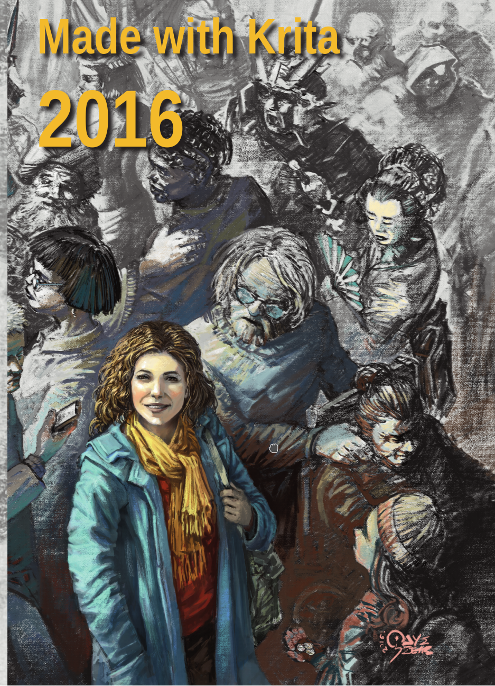

It's summer -- a bit rainy, but still summer! So it's time for a summer sale -- and we've reduced the price for the Made with Krita 2016 art books to just 7,95. That means that shipping (outside the Netherlands) is more expensive than the book itself, but it's a great chance to get acquainted with forty great artists and their work with Krita! The book is professionally printed on 130 grams paper and softcover bound in signatures. The cover illustration is by Odysseas Stamoglou. Every artist is showcased with a great image, as well as a short bio.

Made with Krita 2016

On sale: **€7,95**

Forty artists from all over the world, working in all kinds of styles and on all kinds of subjects show how Krita is used in the real world to create amazing and engaging art. The book also contains a biographical section with information about each individual artist. Made with Krita 2016 is now on sale: 7,95€, excluding shipping. Shipping is 11,25€ (3,65€ in the Netherlands).

[Get Made with Krita 2016](https://gum.co/LLUIt?wanted=true)
