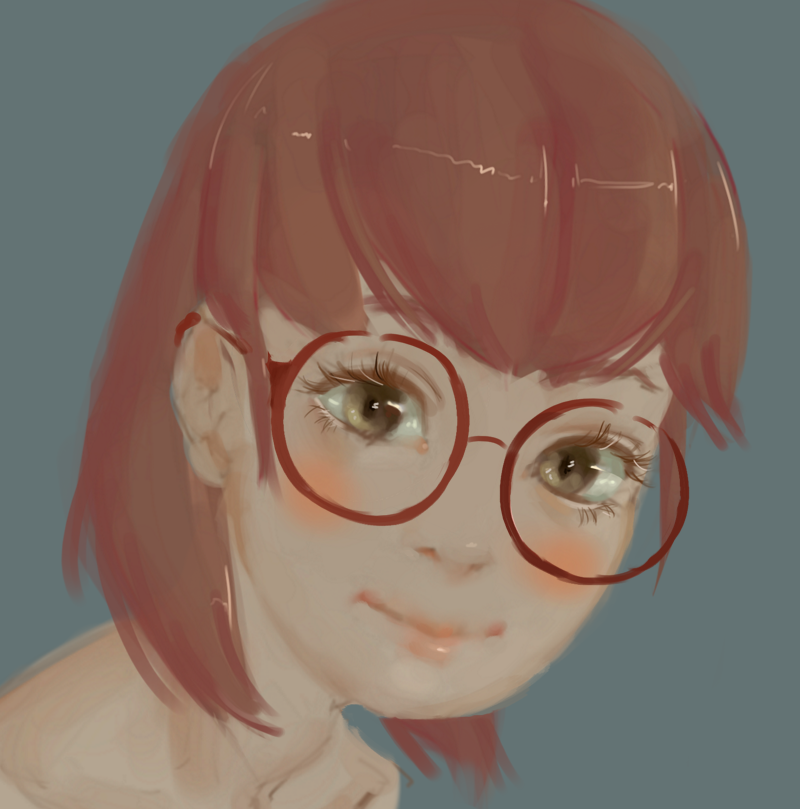
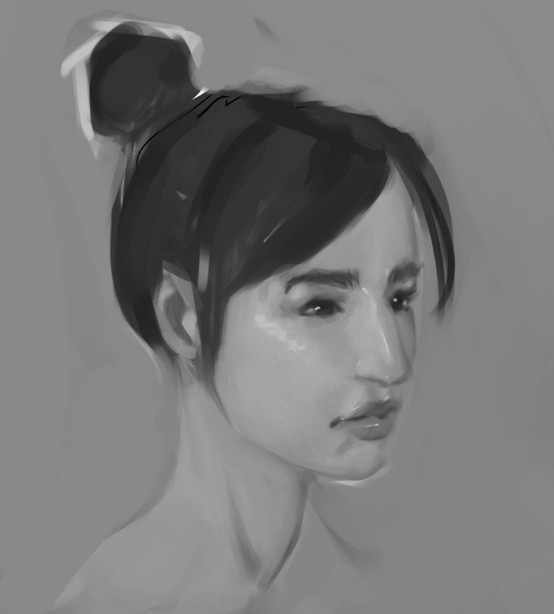
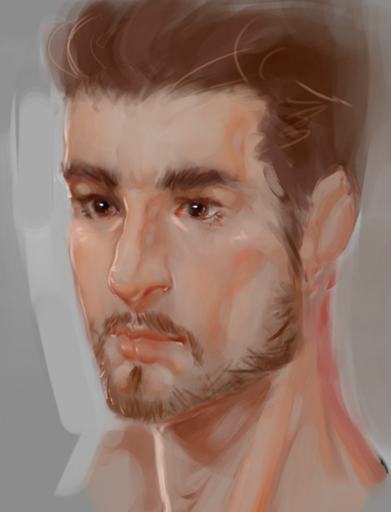
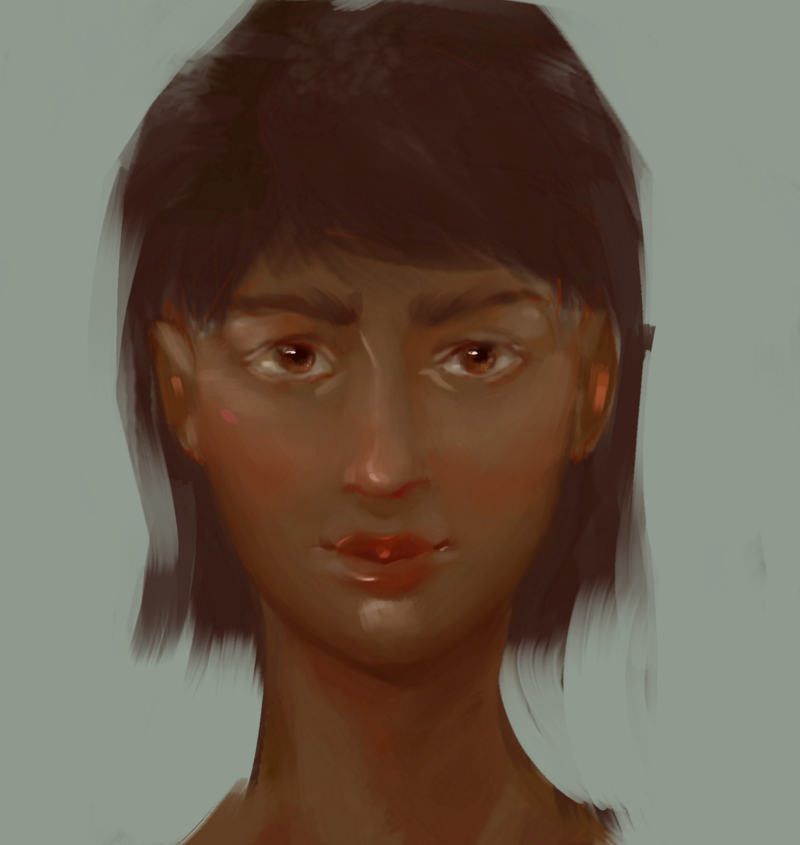
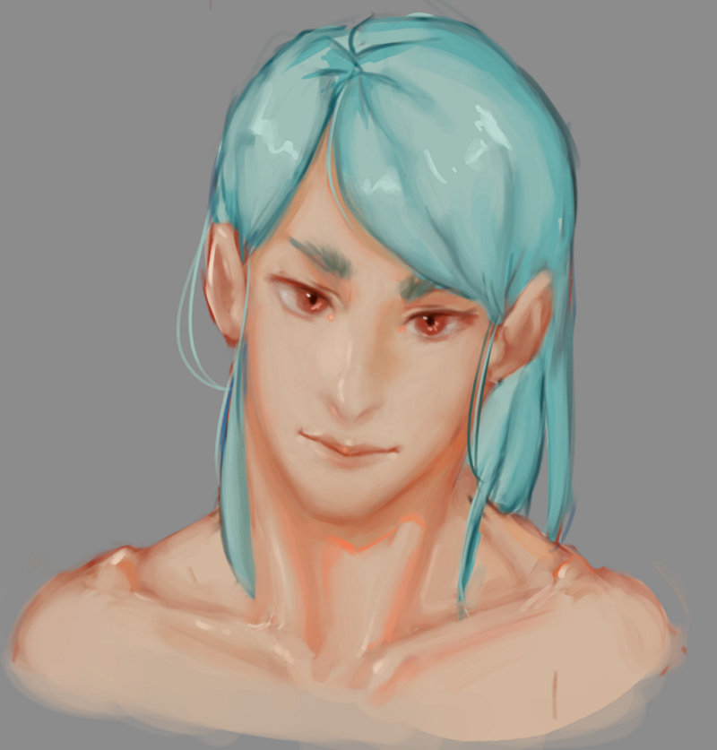
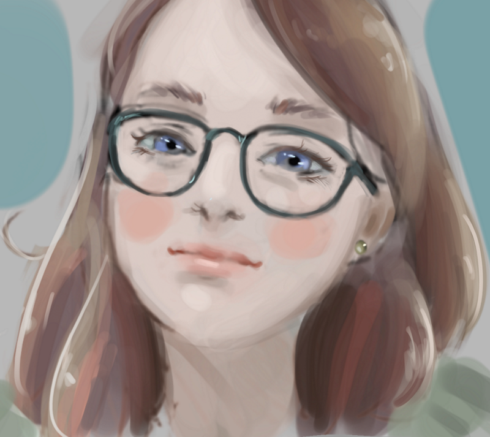

### Could you tell us something about yourself?

My name is Alejandro Montes Bascuñan, I'm 25 years old, and I'm a digital artist from Chile.

### Do you paint professionally, as a hobby artist, or both?

I'm just a hobby artist at the moment like I’ve been since I started years ago, although I wish to make this my job someday.

### What genre(s) do you work in?

I paint mainly portraits, that's what I like the most. I like drawing people of different ages, races, cultures, etcetera.

### Whose work inspires you most -- who are your role models as an artist?

My biggest inspiration is definitely [Ayami Kojima](https://www.creativeuncut.com/profile_kojima.html). Her art is a wonderful mix of beauty and horror that I simply love. My other biggest inspiration is also a Japanese artist, [Yoshitaka Amano](http://www.elevenland.com/amano/amano.php3). His use of color, shapes and lively brushstrokes are just wonderful.

### How and when did you get to try digital painting for the first time?

Roughly 4 years ago, when I was still drawing on paper, my brother bought a little Wacom tablet that he was planning to use but ended up never using it, so I tried using it myself and although it was really hard to get used to it at first, I loved it in the end and abandoned paper forever.

### What makes you choose digital over traditional painting?

It’s cleaner and faster especially when it comes to posting artwork online, it can be done in just a few minutes after finishing a piece instead of having to digitize a drawing/painting which can take a while depending on the piece.

### How did you find out about Krita?

I found out about it when I was specifically looking for drawing and painting software that could run on Linux because I was about to make the change from Windows 10 to Linux but the only thing holding me back was the program that I would use to draw. Then I stumbled upon Krita and gave it a try and well, the rest is history.

### 

### What was your first impression?

I was amazed by the amount of tools and cool features it had: the liquify tool, all the different blending modes, the brush engine and even animation!

### What do you love about Krita?

I don't know what to say, other than that its a solid program. It has every tool a 2d artist needs and more! Also it gets updated and new features are added all the time, that's amazing! And the fact that it’s free makes it easy for me to recommend it to other people.

### 

### What do you think needs improvement in Krita? Is there anything that really annoys you?

There's nothing big that annoys me but a few small things, mainly minor bugs and little graphical glitches that happen here and there, although they are small and far between they are definitely noticeable when you use the program several hours a day like I do, but other than that I think Krita is great.

### What sets Krita apart from the other tools that you use?

Out of all the tools I've used I've found the brush engine in Krita is the best. It's so customizable with so many different options and easy to understand, anyone can start using it right away.

### If you had to pick one favorite of all your work done in Krita so far, what would it be, and why?

The one with the man with blue hair (I don't name my paintings). I really like how it turned out, I like the colors, the blending and obviously the man himself, the ambiguous look in his eyes and smile, that you don't really know what he is thinking, I love that.

### What techniques and brushes did you use in it?

Nothing fancy really, first I did a small sketch with the pencil tool, once I was happy with it I blew it up to a bigger size I added flat colors on a layer below and then blended all together on a layer above the sketch with a round hard edge brush, that's what I use most of the time, 2 tools, pencil and round hard brush.

### Where can people see more of your work?

My [Instagram account](https://www.instagram.com/ale.bascu.art/), and my [Twitter account](https://twitter.com/alembascu) that I created a few weeks ago.

### Anything else you'd like to share?

I want to thank you, the Krita Foundation and all its contributors, for creating this amazing program, Krita is a great example of the wonders that free/open source software can accomplish and I wish Krita keeps reaching more people so we can see more people create amazing artwork done with it.
