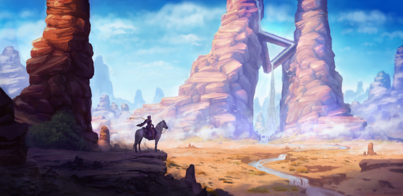
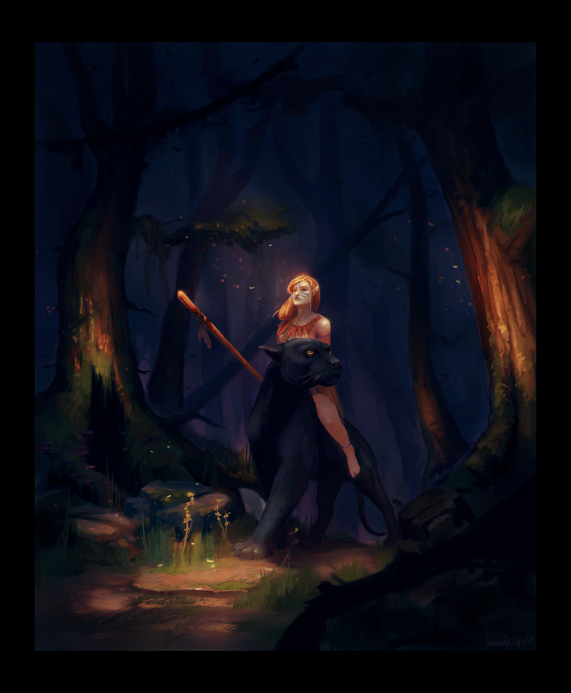
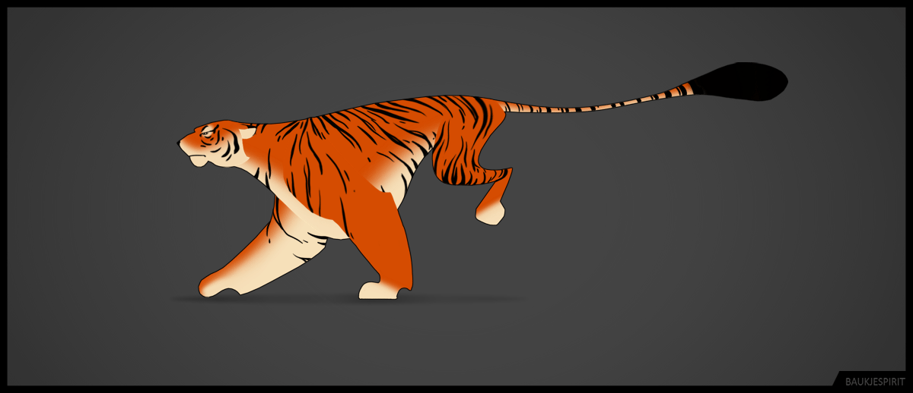

### Could you tell us something about yourself?

Hey! My name Is Baukje Jagersma, I’m 22 years old and live in the Netherlands. I studied game design and recently started doing freelance, to try and make a living out of something I enjoy doing!

### Do you paint professionally, as a hobby artist, or both?

Both: I’ve always enjoyed creating my own stories and worlds with drawing and recently started doing freelance work as well.

### What genre(s) do you work in?

Most if not all of my work has something to do with fantasy. To me that’s the best part of drawing, you can create things that don’t exist and make them look believable. Besides that I mostly work as an illustrator and concept artist.

### Whose work inspires you most -- who are your role models as an artist?

There are a lot of sources where I get inspiration from, art in games for example, movies or art sites.

A few artists that are really worth mentioning would be Grzegorz Rutkowski, Ruan Jia and Piotr Jablonski.

### How and when did you get to try digital painting for the first time?

Probably when I first discovered Deviantart. I was already familiar with GIMP, which I used to create photo-manipulations with. But seeing all the amazingly talented artists on there made me want to try out digital painting for myself.

### What makes you choose digital over traditional painting?

I feel like traditional has more limitations and can get messy. In digital you can easily pick any color you like, or undo something that doesn’t work. For me it just works a lot faster.

### How did you find out about Krita?

Somewhere around 2013-2014 when an artist posted his Krita art on a GIMP forum.

### What was your first impression?

I really didn’t know where to start, haha! There were just so many more options than I was used to in GIMP, especially with all the individual brush engines. It really took me a while to get comfortable with the program.

### What do you love about Krita?

Now I’ve just grown to love the multiple brush engines! The wrap-around mode, animation tool, brush smoothing options, symmetry options, assistant tool and the different layer and mask options are probably the key features that I love about it. It’s a program that just has so much to offer which makes it a lot of fun to explore with!

### What do you think needs improvement in Krita? Is there anything that really annoys you?

Probably the only thing that really bugs me is the text tool, which seems to have a few weird issues right now. I’d also love to see the possibility to import and use vector layers and an alternative to the pattern brush option to make it work less repetitive (something similar to Photoshop’s dual brush perhaps).

### What sets Krita apart from the other tools that you use?

Kinda mentioned it earlier already, it has a lot to offer which makes it fun to explore with! Besides that it’s available to everyone and works just as well as any other ‘professional’ digital painting program.

### If you had to pick one favourite of all your work done in Krita so far, what would it be, and why?

Probably one of my few non-illustrative works. I really wanted to try out the animation tool so I decided to try out a run cycle. I had little knowledge of animating beforehand- but I like how the animation and design turned out in the end.

### What techniques and brushes did you use in it?

I made a few different style concepts beforehand, where I chose a design from and later on used as a reference. I first made a sketch version of the animation which I then refined and colored. I actually made a little video about it which I posted on youtube.

### Where can people see more of your work?

Deviantart: [https://baukjespirit.deviantart.com/](https://baukjespirit.deviantart.com/) Artstation: [https://www.artstation.com/baukjespirit](https://www.artstation.com/baukjespirit) Instagram: [https://www.instagram.com/baukjespirit/](https://www.instagram.com/baukjespirit/) Twitter: [https://twitter.com/BaukjeJagersma](https://twitter.com/BaukjeJagersma) Youtube: [https://www.youtube.com/user/baukjespirit](https://www.youtube.com/user/baukjespirit)

### Anything else you'd like to share?

I’d like to thank the Krita team for developing this amazing program and making it available to everyone! I'm very excited to see how Krita will further develop in the future!
