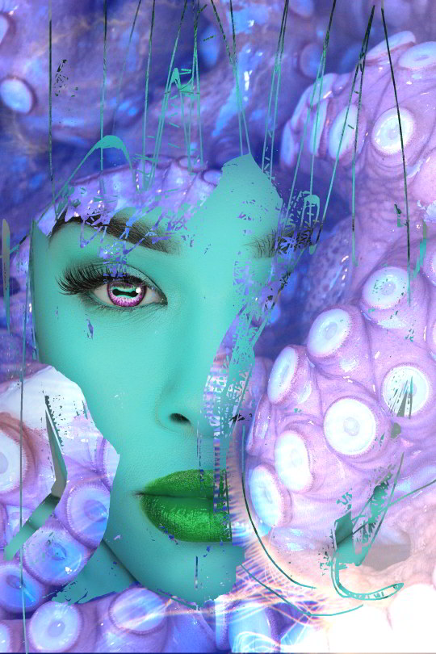
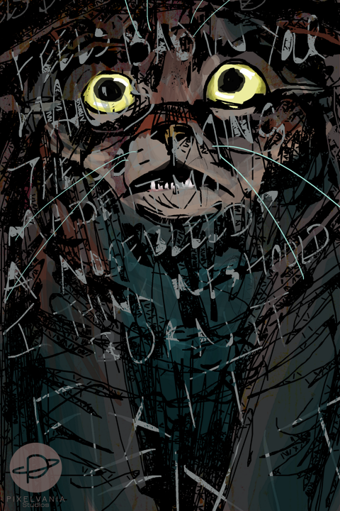
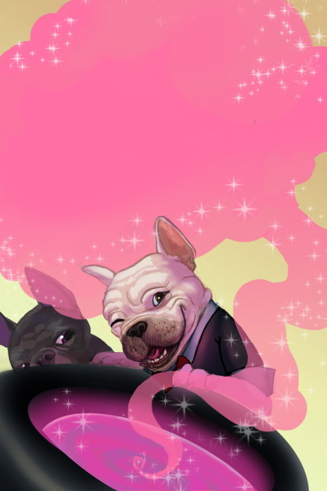
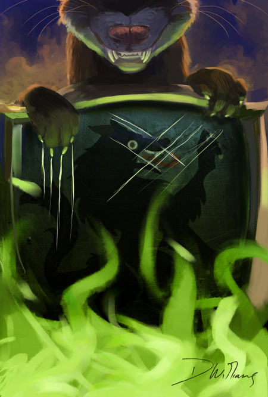
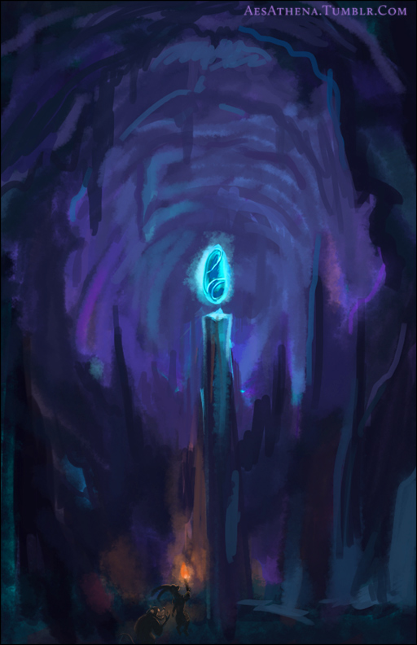

### Could you tell us something about yourself?

My name is Danielle Williams. I’m a writer, an illustrator, and a fan of Krita.

### Do you paint professionally, as a hobby artist, or both?

I’ve been paid for my work before and I use my art as covers for my ebooks, so technically I guess I am a professional…but I often feel like a hobby artist in my heart because of my desire to improve my skill.

### What genre(s) do you work in?

I’m prone to figurative work—portraiture, animals, monsters, that sort of thing—in many styles, but I’m trying to improve and incorporate backgrounds into my art for greater impact. Drawing also helps me visualize my story characters and worlds.

### Whose work inspires you most -- who are your role models as an artist?

Between an online youth spent browsing Yerf, DeviantArt, Side7, and Elfwood, my love of animation art, and my visual arts degree, I’ve been exposed to a tsunami of creative folks! On the fine arts side: John Singer Sargent, Norman Rockwell, and Cecelia Beaux. I’m discovering more fine artists as I follow James Gurney’s blog ([GurneyJourney.blogspot.com](https://GurneyJourney.blogspot.com)).

On the animation art side: I admire the artists behind Earthworm Jim, Oddworld Inhabitants, Glen Keane, Marc Davis, and the other Nine Old Men of Disney Animation.

On the ‘net side: Ursula Vernon, Makani, TheMinttu, Don Seegmiller, NibbledPencil.com, Dirk Grundy (StringTheoryComic.com), DimeSpin, Michelle Czajkowski ([AvasDemon.com](https://AvasDemon.com)), Enayla.

... I’m forgetting lotsa folks, ha. No single one is my idol, though. I’m like a magpie—I pick out shinies wherever I see ‘em!

### 

### How and when did you get to try digital painting for the first time?

Oh, back when I was…maybe 12 or so? We got a scanner that came with "Micrografx Picture Publisher", a sort of imitation Photoshop. Around that time I saved my money and bought a Wacom Bamboo. Through online tutorials I taught myself how to use it and my program.

The lesson I learned from using this off-brand product for so long was that it wasn’t the tool that made your art good, but your own practice and use of solid artistic principles. That’s what makes the difference.

### What makes you choose digital over traditional painting?

A: I’m cheap. B: I don’t feel like I have any place to safely make a mess. I had fun taking watercolor classes in college and even did an oils class…but it’s different working with staining liquid paints over concrete in a designated area vs. the corner of the apartment you’re renting or at the table in your mom’s Better-Homes-And-Garden-worthy kitchen.

Other people’ve found workarounds, I know, but I’m still not comfortable with it.

Oh, and C: space considerations. Art supplies take up space!

### 

### How did you find out about Krita?

Some fifteen years after buying Photoshop CS2, it was finally glitching and refusing to open files on Windows 7, no matter how many trick reinstalls I did. I had to go looking for alternatives, and I just didn’t like the dated interface of the GIMP (though I know artists like DimeSpin can make that program sit up and do flips). I dunno where I got the Krita link, but I’m sure glad I found it!

### What was your first impression?

"Oo, pretty interface. Wait, why won’t this brush make a mark?!"

### What do you love about Krita?

The cost (see above), the quality, the interface, the compatibility—and the ability to open a window of your painting in LUT mode and watch it update in real time while you paint on the file in color. MAN that is helpful for values! (Thanks to [https://www.youtube.com/watch?v=F0LBVjJPb9o](https://www.youtube.com/watch?v=F0LBVjJPb9o))

### What do you think needs improvement in Krita? is there anything that really annoys you?

Annoys me? I refuse to be annoyed with free software. I have nothing to complain about. There are two things I miss that my old CS2 used to do, however.

First: I haven’t tried Krita’s text tool since before the last big update, but it wasn’t much use to me in making book covers. I’ve since added Inkscape to my workflow to do my title text, but it still requires some wrangling. I look forward to the day when Krita’s text tools are as good as CS2’s were. Or better!

Second: I miss Photoshop Actions. Actions + photos = a very quick way to make differently-mooded book covers.

Finally, I’m like, ack!!, knowing that I’m only scratching the surface of what Krita can do! I just learned about Liquefy this morning. I wish the documentation was more clearly written.

I also wish there were more step-by-step text-with-picture tutorials (like David Revoy’s Getting Started with Krita) about the different features—so you don’t just know that the features exist, but have some idea of what they’re good for.

I don’t like video tutorials as much; I’m definitely a read-the-manual, follow-the-pictures, scroll-back-up-when-you-make-a-mistake sorta gal.

### What sets Krita apart from the other tools that you use?

That’s easy! The beautiful modern interface, and the COMMUNITY. The community around Krita is unlike any I’ve ever experienced around an art program! David Revoy, in particular, is a treasure.

### If you had to pick one favourite of all your work done in Krita so far, what would it be, and why?

Ooh, that’s a toughie. I’ll pick the cover for my Armello fanfic The Heroes of Houndsmouth. It’s just so dang dramatic, even in greyscale, and I tackled a lot of different things in it, especially textures: teeth, fire, metal scratches, fur.

### What techniques and brushes did you use in it?

It’s been a couple years so I’m not exactly sure. I remember using a brush like the current "Ink 1 Precision" or "Ink 2 Fineliner" to do the whiskers and keep the fur texture sharper. I also laid a free metal texture on a layer over the shield, then used a transparency layer (applied to the metal texture layer) to erase the metal where I didn’t want it (such as in the flames). Transparency layers are your friends!

Oh, and I used the LUT management trick (see video link above) while painting in color to make the values \*smoochy finger-kiss thing\* MWAH! I really love that trick.

### Where can people see more of your work?

[PixelvaniaStudios.com](https://PixelvaniaStudios.com). My ebook cover paintings are in use at my author homepage, [PixelvaniaPublishing.com](https://PixelvaniaPublishing.com).

### Anything else you'd like to share?

I can play a piano, but never in a million years could I build one. Similarly, while I can use Krita fairly well, it’s the fine folks working their code sorcery behind the scenes that make Krita—and the art I create with it—possible. I salute them!
