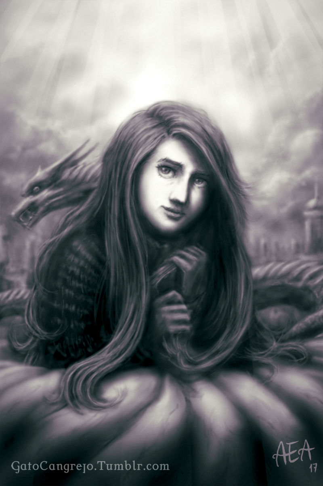
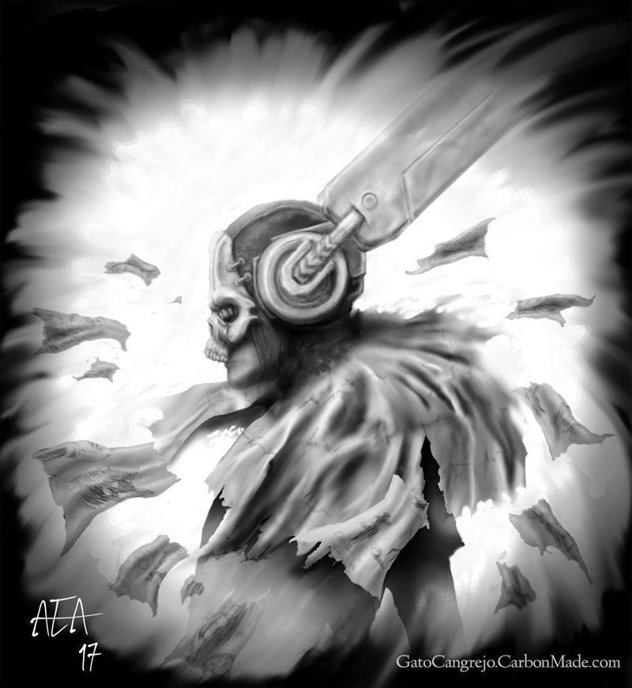
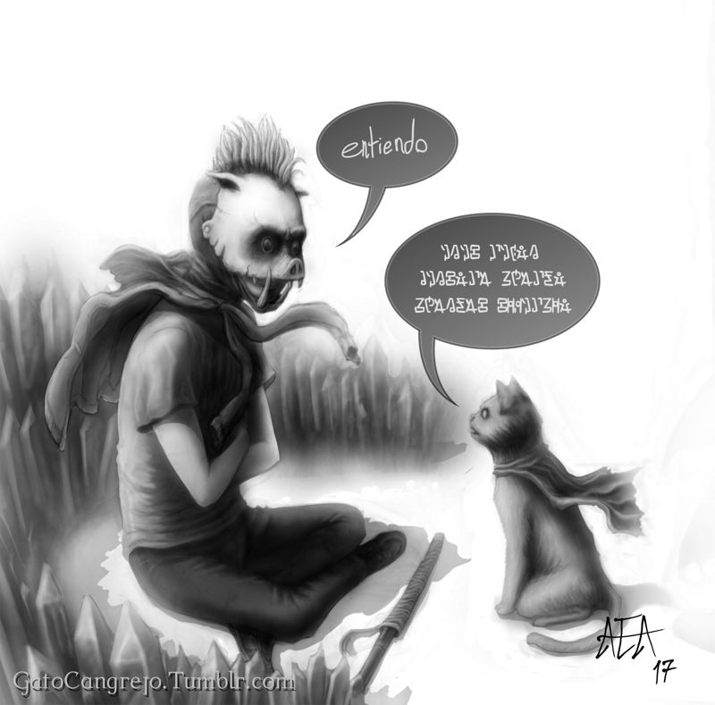
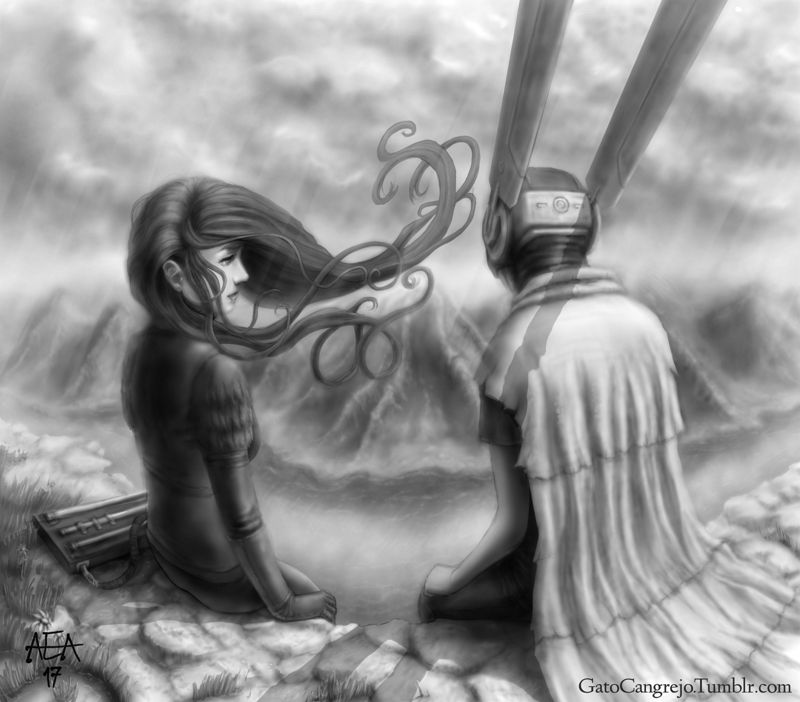
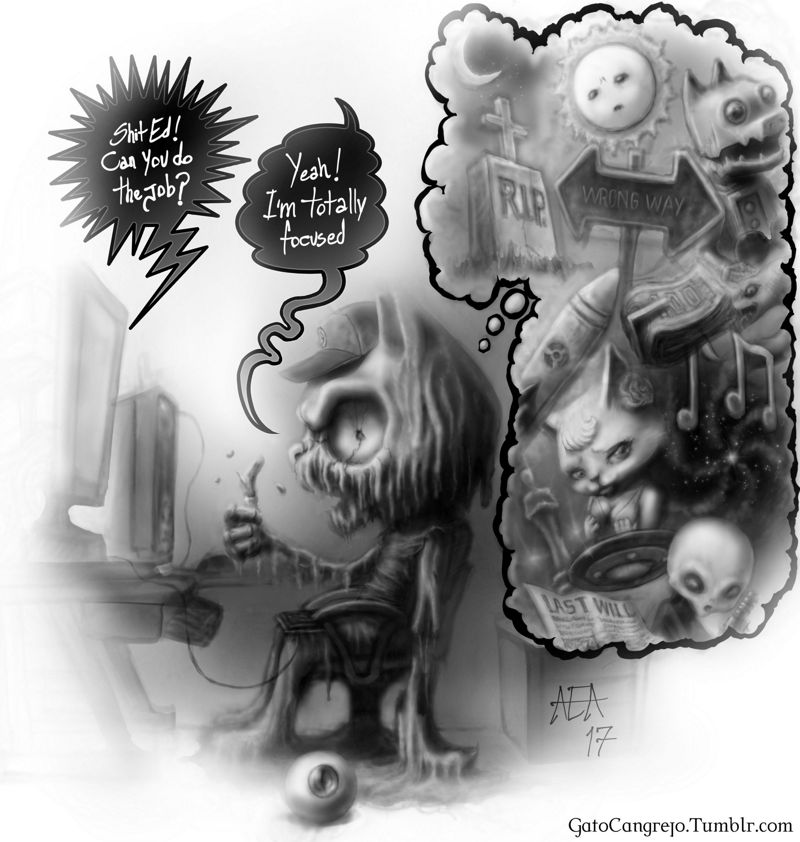

### 

### Could you tell us something about yourself?

Well, I think I am a human shaped thing also known as Aedouard A. and also as El Gato Cangrejo, who loves making drawings and listening to music.

### Do you paint professionally, as a hobby artist, or both?

I'm really trying to make it professionally, "very hard thing" but also I try to keep the fun in it so I would have to say both.

### What genre(s) do you work in?

I like to let my hand and my pen go to wherever they want to go, and then I begin to think about those traces and it leads me to different shapes, themes and genres. I can build an script for a comic or for a short film, an illustration or even sounds based on a web of random traces on a digital canvas or on a piece of paper.

### Whose work inspires you most -- who are your role models as an artist?

I love the paintings, illustrations, designs and movies from these people: William Boguereau, Alphonse Mucha, Albrecht Durer, Jules Lefebvre, William Waterhouse, Masamune Shirow, Haruhiko Mikimoto, Shoji Kawamori, Mamoru Oshii, Quentin Tarantino, Hideaki Anno, Hayao Miyasaki, Ralph Bakshi, Guillermo del Toro... (not mentioning musicians, they are such an endless source of inspiration, I only can work while listening to music)

### How and when did you get to try digital painting for the first time?

I tried digital painting for the first time like 12 years ago, I bought my first PC and I tried with a software called Image Ready from Photoshop, I did a couple of landscapes with the mouse and then I tried scanning my drawings and retrace them in Corel Draw, also with the mouse.

### What makes you choose digital over traditional painting?

The production time, everything is like 10 times faster, expensive materials and the super powerful Ctrl-Z.

### How did you find out about Krita?

I like to search for new tools and I try to use libre software. I can't remember when I tried Krita for first time but I think it was like 7 years ago and it ran very very badly on my old PC.

### What was your first impression?

I hated Krita at the time, now I love it!

### What do you love about Krita?

The shortcuts are essential, the brushes, the animation tools, "insert meme here" it's free!

### What do you think needs improvement in Krita? Is there anything that really annoys you?

The performance in Linux, I recently changed my OS from Windows 7 to Linux Mint and I have noticed a significant difference in performance between the systems. I noticed a difference in performance between working in grayscale and working in color too, and and also I'm waiting for some layer FX's as the ones in photoshop, specifically the trace effect, which I used a lot when I worked with photoshop.

### What sets Krita apart from the other tools that you use?

As I said earlier, the shortcuts are essential, the animation tools combined with those awesome brushes makes a powerful tool for animation, and I love the fact that Krita has been made for professional use but you can also have tons of fun with it.

### If you had to pick one favourite of all your work done in Krita so far, what would it be, and why?

I would choose Distant.

### What techniques and brushes did you use in it?

I like the "Airbrush\_Linear" a lot. I set it to a big size and the opacity to 10 percent, then I use the "Eraser\_Circle" the hard shaped one, to define shapes, also I use a lot the "Smudge\_Soft" I like to play with it taking the paint from one side to another. When I grabbed Krita again it reminded me of my old times drawing with pencil and paper I just loved.

### Where can people see more of your work?

https://gatocangrejo.deviantart.com/gallery/

### Anything else you'd like to share?

If you are the pretty invisible friend, thanks and I'll see you in a parallel universe. If you are the Sorceress, I really sorry about the silence, I had a couple of good reasons... If I owe you money, I'm trying to pay it. If you are the extraterrestrial, stop it man. If you are the C.I.A. stop sending stuff to my invisible friends and to the extraterrestrial. If you like my drawings, keep your eyes peeled, I'm going to start a patreon/kickstarter campaign that involves comic, animation, Krita, Blender and other libre software. If you are from Krita staff, thanks for Krita and thanks for the interview. If you don't know Krita, just give it a try, it is awesome. You don't need to be an artist, you just need to have fun.
