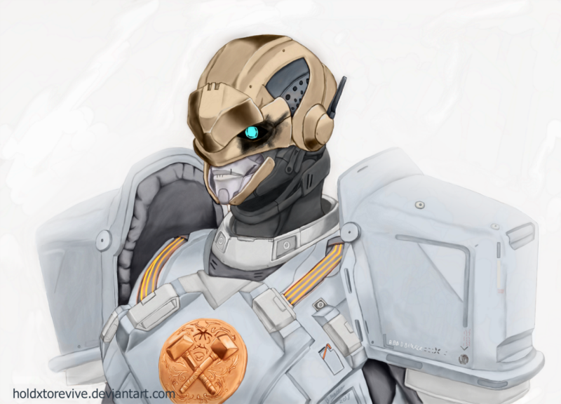
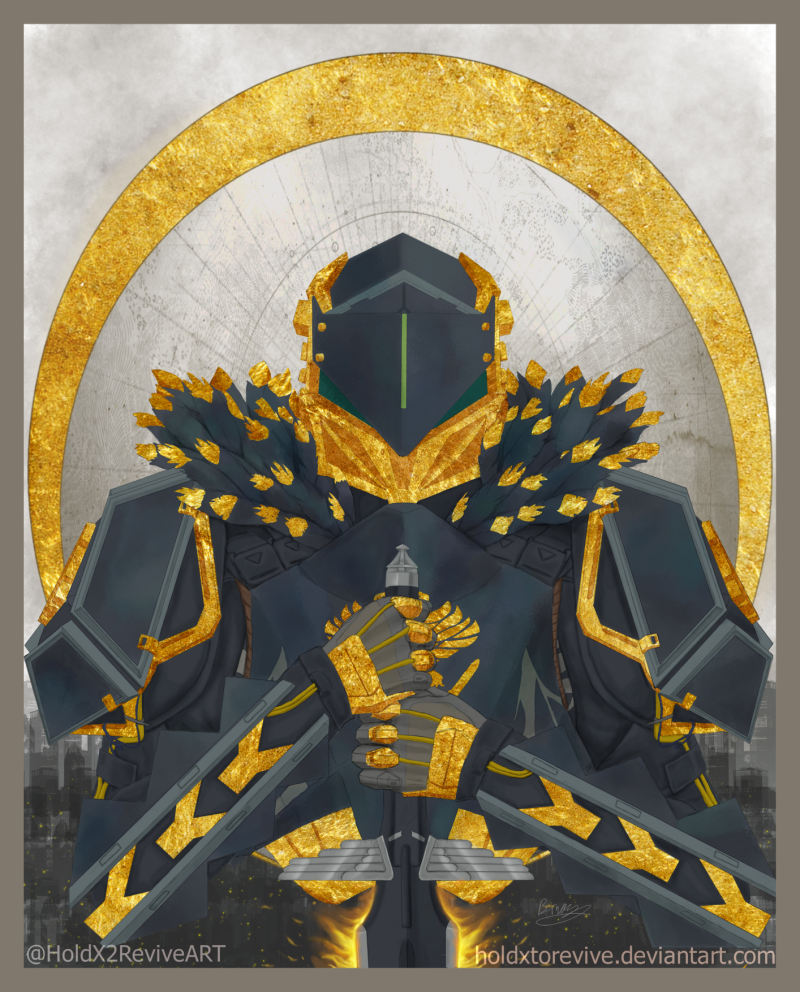
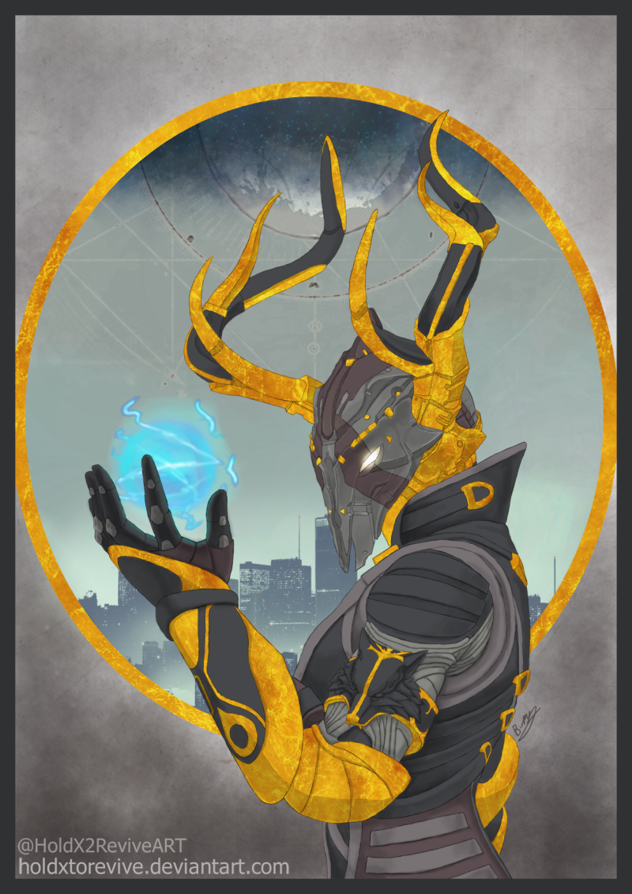
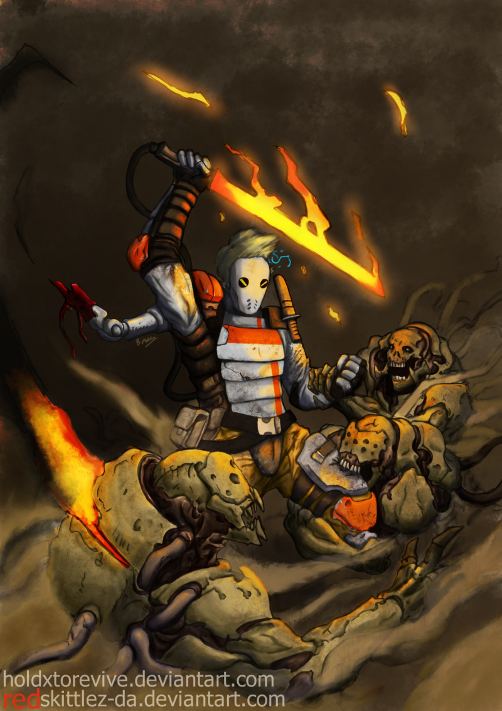

### 

### Could you tell us something about yourself?

I’m Brigette, but I go mainly go by my online handle of HoldXtoRevive. I’m from the UK and mostly known as a fanartist.

### Do you paint professionally, as a hobby artist, or both?

I have had a few commissions but outside that I would call myself a hobbyist. I would love to work professionally at some point.

### What genre(s) do you work in?

I do semi-realistic sci-fi art. I most recently I have been drawing character portraits inspired from the Art Nouveau style, the majority of it has been fanart of a few different Sci-fi games.

### Whose work inspires you most -- who are your role models as an artist?

It’s hard to list them all really. Top of the list would be my other half, RedSkittlez, who is an amazing concept and character artist, also my friends Blazbaros, SilverBones and many more that would cause this to go on for too long.

Outside of my friends I would say Charles Walton, Pete Mohrbacher and Valentina Remenar to name a few.

### How and when did you get to try digital painting for the first time?

About 4 years ago I downloaded GIMP as I wanted to get back into art after not drawing for about 15 years. I got a simple drawing tablet soon after and things just progressed from there.

### What makes you choose digital over traditional painting?

The flexibility and practicality of it. Whilst I would love to try traditional acquiring, maintaining and storing supplies is not easy for me.

### How did you find out about Krita?

My partner was looking at alternatives to photoshop and came across it via a youtube video. He recommended me to try it out.

### What was your first impression?

How clean the UI is and how all of the tools where easy to find, and the fun I had messing with the brushes.

### What do you love about Krita?

The fact it was really easy to get to grips with, yet I can tell there is more I can get from it. Also the autosave.

### What do you think needs improvement in Krita? Is there anything that really annoys you?

I would like a brightness/contrast slider alongside the curve for ease of use. It would also be nice if the adjustment windows would not close when the autosave kicks in.

### What sets Krita apart from the other tools that you use?

I have not used many programs before I can across Krita. But the thing that jumped out at me was the ease of use and it had everything I wanted in an art program, I know that if I want to try animation I do not need to go and find another program.

### If you had to pick one favourite of all your work done in Krita so far, what would it be, and why?

That is hard to say, but in a pinch I would say the one titled “Saladin’s White Wolf”. I was really happy how the background came out, it was also the one to be picked out and promoted by Bungie on their twitter.

### What techniques and brushes did you use in it?

For the most part I use a multiply layer over flats for shading. My main brushes are just the basic tip (gaussian), basic wet soft and the soft smudge brush.

### Where can people see more of your work?

Over on my DeviantArt page: [https://www.deviantart.com/holdxtorevive](https://www.deviantart.com/holdxtorevive) And my twitter: [https://twitter.com/HoldX2ReviveART](https://twitter.com/HoldX2ReviveART)

### Anything else you'd like to share?

I’m bad with words but I want to show appreciation to the Krita crew for making this wonderful program and to everyone who has supported and encouraged me.
