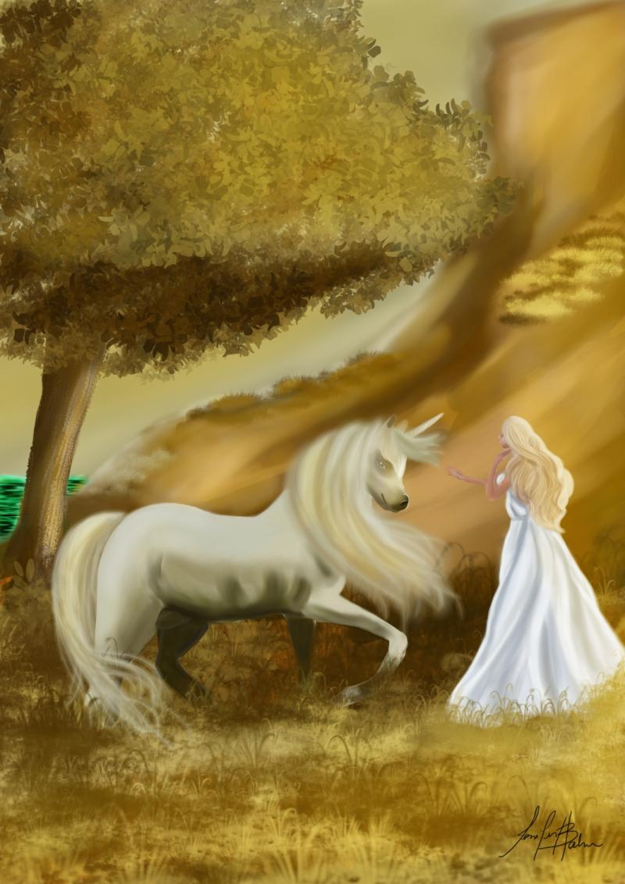
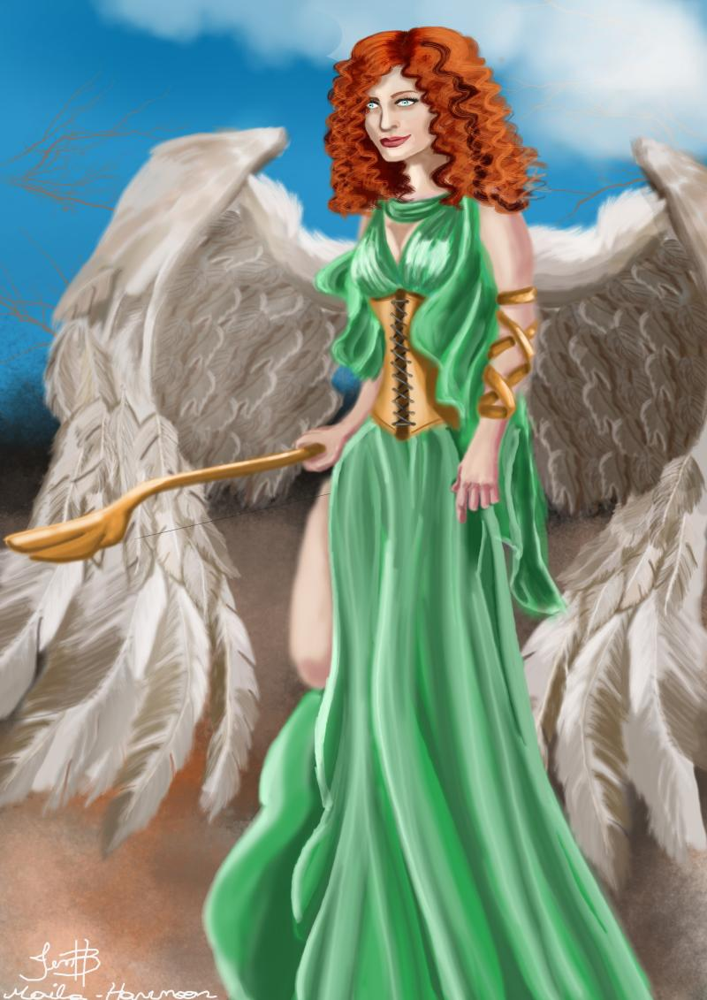
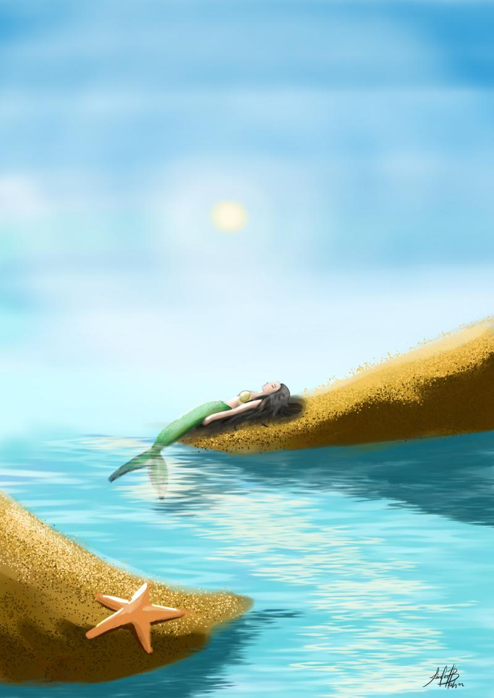
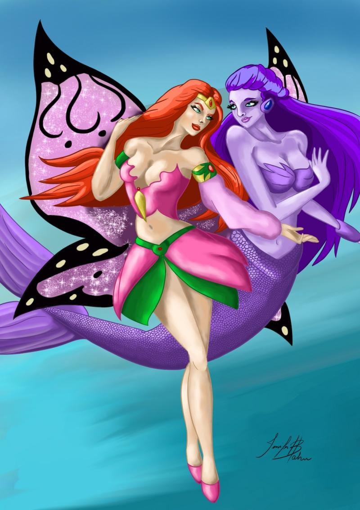

### 

### Could you tell us something about yourself?

I'm almost 35 years old, from a city called Passo Fundo, state of Rio Grande do Sul, Brazil. I like cats, cartoons and rock and roll. 1994 was the year when I started to have some interest in drawing. I looked for learning how to draw just for fun and sometimes to let my soul talk. But I can say that the digital art that I started practicing last year has helped me get rid of a recent depression.

### Do you paint professionally, as a hobby artist, or both?

As a hobby. At least for now.

### What genre(s) do you work in?

I usually draw cartoons. But I also like painting nature and fantasy elements.

### Whose work inspires you most -- who are your role models as an artist?

Most times when I draw, I don't look up to a specific artist. I search random images on internet or the painting comes from my own mind. I think any kind of art should come from the artist's inner soul.

### How and when did you get to try digital painting for the first time?

It occurred last year, in May, I guess. I had no job but I had a nasty depression. Then my husband said he would like to learn how to draw and start work with that. It was when I started to draw again. Yes, I had stopped drawing, limiting myself to draw just when I had nothing more to do. Then we got an online course from Ivan Quirino and here I am, less than an year later, doing all kinds of digital painting.

### What makes you choose digital over traditional painting?

The practicality. It is really hard when you do something wrong drawing at the traditional way. In digital painting, you can redo as many times as necessary.

### How did you find out about Krita?

At Youtube or at some blog. I can't tell for sure.

### What was your first impression?

When I used Krita for the first time I already knew most of the tools, so it was easy to use. But I needed to learn more, then I watched a video that explained the basic tools and method to paint. I thought then that Krita was a good tool for painting. Today I can tell it's a great tool for digital artists. My personal opinion: Krita is the best and I really can't use a different program.

### What do you love about Krita?

The quick access to the tools I need. The ease to work with it. I like so much of that function that allows you to paint just the line art. It's awesome.

### What do you think needs improvement in Krita? Is there anything that really annoys you?

Nothing! As I said before: I really enjoy work with Krita and I recommend it to anyone who is choosing this path of digital art.

### What sets Krita apart from the other tools that you use?

The brushes, the way Krita works with layers (for example: if you have a line on the top layer and you paint a background on the layer below, you won't paint over what is drawn on the top layer). I don't know about the functionality of all painting software, but I think this is pretty cool.

### If you had to pick one favourite of all your work done in Krita so far, what would it be, and why?

I like my latest work. At the time I made the work, I hadn't thought about a name yet. But looking at it now, I could call it "The peace of the mermaid". I think it fits well.

### What techniques and brushes did you use in it?

Well, I'm not good with names of techniques, but I used the default brushes and some of those by David Revoy (airbrush, fill brush, wet brushes, some ink for the little details, some customized brush "LJF water brush 3"). I also used effect layers. So I started with the water base, just filling the area with blue and white tones. Then I painted the sky, mixing tones of blue with white. The sun was made with an airbrush, mixing yellow and white. After that, I used the customized brush to do the details of the water. Always mixing the colors to get the vision that I was looking for. Then I painted the blocks of sand, leaving the details, done with "splat\_texture - Marcas", for the end. At this point, I could start drawing the mermaid. Started by doing a shadow mermaid. After that, I put the colors, lights and shadows and the details. The effect layers were used to get more luminance on a specific element (In Portuguese: Luz viva - used on the mermaid and the starfish -, Luz suave - used to get the luminance on the full scene - , Desvio linear - to get the effect on the water light).

### Where can people see more of your work?

For the moment I have: Blog: [https://jbh-digitalart.blogspot.com.br/](https://jbh-digitalart.blogspot.com.br/) Facebook page: [https://www.facebook.com/JBHdigitalart/?ref=bookmarks](https://www.facebook.com/JBHdigitalart/?ref=bookmarks)

### 

### Anything else you'd like to share?

I just wanted to thank the people that work to improve Krita, an amazing box of tools for digital painting!
