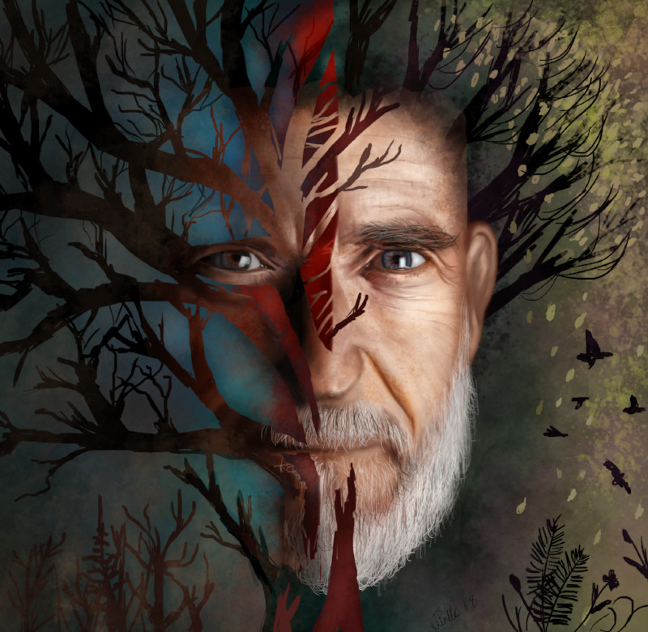
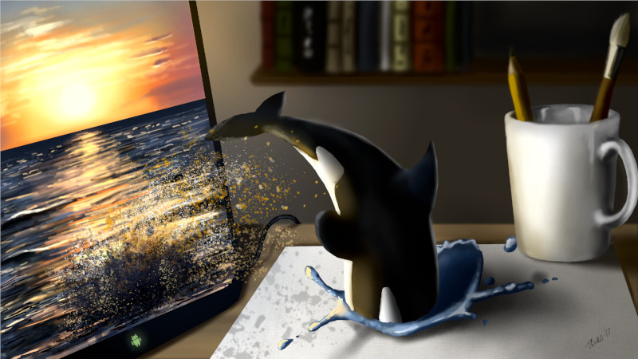
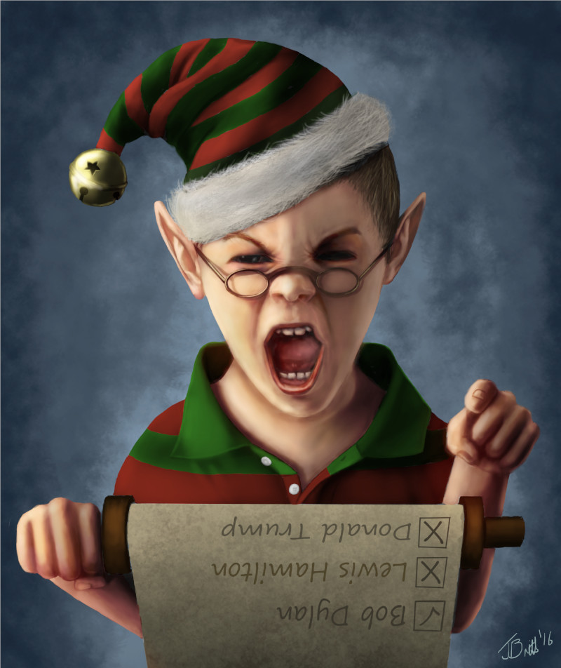
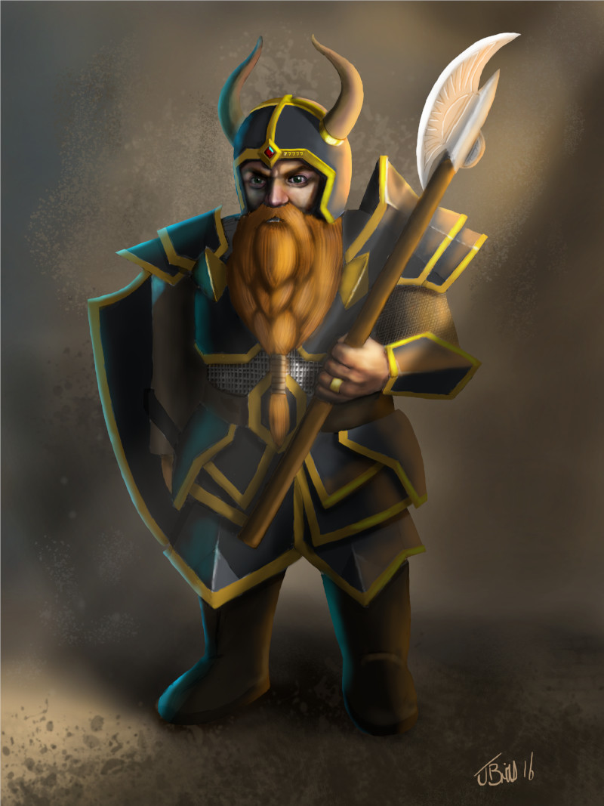
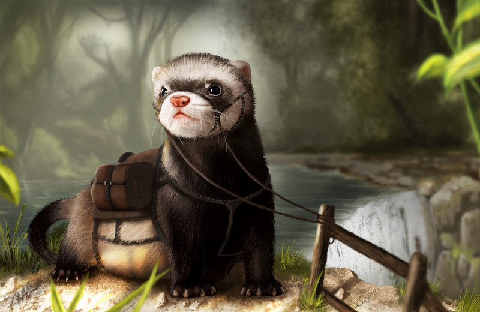

### Could you tell us something about yourself?

I’m from South Africa. I’ve been drawing my whole life, mostly with graphite pencil but when I discovered digital drawing I was hooked. I started out just using a standard desktop mouse and GIMP and got kind of good at it. Since then I have improve a lot and plan to keep improving and creating new art for as long as I can.

### Do you paint professionally, as a hobby artist, or both?

I paint as a hobby, but I sometimes use the skills I’ve learned from painting in a professional capacity when I need to edit or create images.

### What genre(s) do you work in?

I don’t really have a specific genre besides perhaps drawing in a more realistic style. I like to challenge myself to draw new things. I usually paint something with life in it like creatures or people.

### Whose work inspires you most -- who are your role models as an artist?

Jazza from the YouTube channel Draw with Jazza. Although he mostly does traditional art his ability to draw amazing things from random prompts really inspire me. There are also amazing artists on ArtStation.com and I only need to scroll through a few images before I feel the urge to draw something myself.

### How and when did you get to try digital painting for the first time?

I found GIMP on a Linux computer in college and I played around with some of the filters. I was amazed at what was possible with a few simple steps. After browsing around on YouTube I saw some artists drawing pictures from scratch in Photoshop. Because I already knew how to draw with pencil I wanted to give it a try using free software and quickly fell in love with it.

### What makes you choose digital over traditional painting?

So many things. The ease of changing things when you are already far into the drawing, the fact that you can undo mistakes and best of all it’s not as messy. I also love computers so drawing digitally is like having best of both worlds.

### How did you find out about Krita?

A friend told me about it after trying it with his Wacom tablet. I am a software developer so any new software is like a new toy for me. I checked out the website and what other people had created using it and I was intrigued.

### What was your first impression?

The interface was so much more modern than GIMP, and I’m a firm believer that the interface makes a big difference in first impressions. I played around with it a bit and quickly saw that it had all the features I use with GIMP and more.

### What do you love about Krita?

I love the interface. I also like the fact that you can do animations with it. I have only started dabbling in animation but so far I am fascinated by it. I also love how responsive Krita is and the fact that it supports my tablet, which GIMP did not. And finally I love that it is still being improved upon by the developers. It means any issues I might encounter can still be solved.

### What do you think needs improvement in Krita? Is there anything that really annoys you?

Having spent many hours drawing in Krita I can honestly say there is nothing that is really annoying. There is the occasional odd thing that happens as with any drawing software but nothing I haven’t been able to find a workaround for.

### What sets Krita apart from the other tools that you use?

The amount of things you can do with it, all neatly wrapped up in a beautiful design. Also the fact that it is free but still has the quality of paid software.

### If you had to pick one favourite of all your work done in Krita so far, what would it be, and why?

Usually my newest drawing is my favourite but the Ferret mount I drew really stands out for me. I tried to push myself to create a sense of depth and a scene that I haven’t been able to achieve in any of my previous drawings. I learned a lot from drawing it and it was a lot of fun to do.

### What techniques and brushes did you use in it?

Some of the techniques I used is to blur the foreground and background and add a bright light source to create the impression of depth. I used the default brushes that come with Krita to create everything from the fur to the texture of the dirt.

### Where can people see more of your work?

YouTube: [https://www.youtube.com/johanjbrits](https://www.youtube.com/johanjbrits) Facebook: [https://www.facebook.com/JohanBritsArt/](https://www.facebook.com/JohanBritsArt/) ArtStation: [https://www.artstation.com/britsie\_1](https://www.artstation.com/britsie_1) Instagram: [https://www.instagram.com/britsie\_1](https://www.instagram.com/britsie_1) DeviantArt: [http://britsie1.deviantart.com/](http://britsie1.deviantart.com/) Twitter: [https://twitter.com/britsie\_1](https://twitter.com/britsie_1)

### Anything else you'd like to share?

I would just like to thank the team working on Krita for the amazing job they’ve done in creating a truly awesome drawing application.
