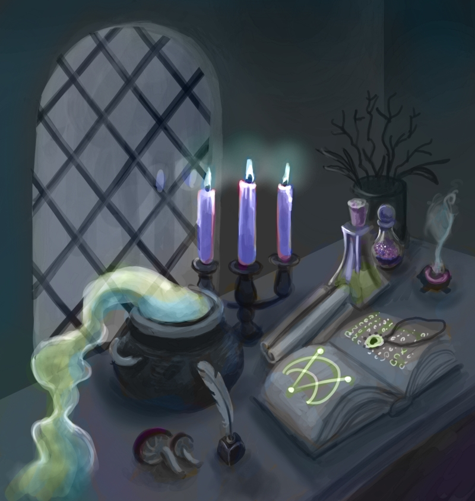
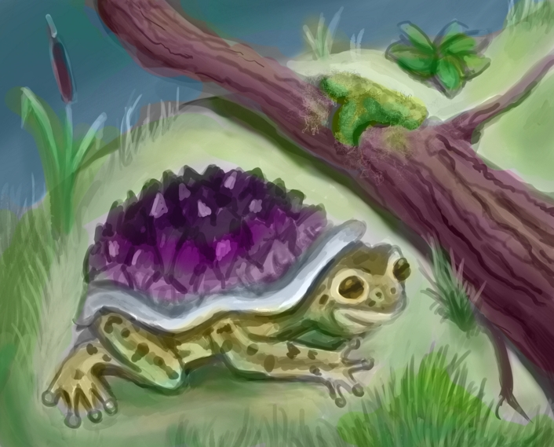
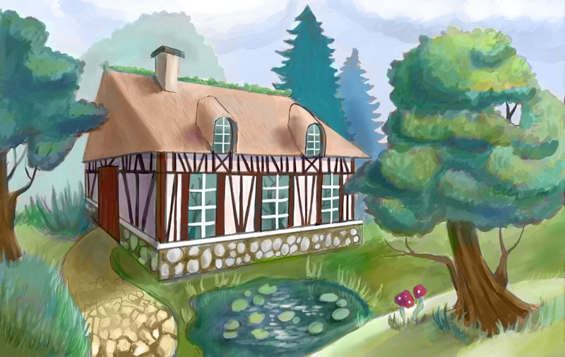

### Could you tell us something about yourself?

Hello! My name is Margarita Gadrat, I was born in Russia and live in France. Drawing is my favourite activity since my childhood. After some years working as a graphic designer in different companies, I decided to follow my dream and now I'm a freelance illustrator and graphic designer.

### Do you paint professionally, as a hobby artist, or both?

Both. Personal paintings for experimenting and improving my technique. Professionally, I'm open to new interesting projects. There are still a lot to learn and this is so much fun!

### What genre(s) do you work in?

I like painting nature inspired subjects, like landscapes, cute animals. And mysterious, dark atmospheres.

### Whose work inspires you most -- who are your role models as an artist?

Ketka, Ruan Jia, Hellstern, Pete Mohrbacher... I couldn't put all of them :)

I love the works of classical masters too - Sargent, Turner, Ivan Shishkin, Diego Velasquez, Bosch. Aivazovsky's sea is stunning! And the Pre-Raphaelites art has a magical aura.

### How and when did you get to try digital painting for the first time?

10 years ago my husband offered me a Wacom tablet. After trying this tool on Photoshop, I was impressed.

### What makes you choose digital over traditional painting?

The creative possibilities you have without buying oils, watercolor. No need to clean your table and material after! Also, you can easily correct details with filters and doing the Ctrl-Z ;) Working fast too, thanks to useful tools: selections, transforming tools...

### How did you find out about Krita?

My husband, who is into FOSS, told me about Krita.

### What was your first impression?

Whoa, it's so fluid and comfortable! Coming from Photoshop, I wasn't lost with the general concepts (layers, filters, blending, masks...), but had to take time to understand how it was organized in Krita.

### What do you love about Krita?

All those features to help in a work process: drawing assistants for perspective, the new reference tool where you can easily arrange your references and put it to your canvas, the freedom of the brush presets. And working with layers in the non destructive way I love so much. The animation section is great too.

### What do you think needs improvement in Krita? Is there anything that really annoys you?

Nothing that really annoys me. Krita is awesome and complete software! Maybe a couple of little things, but I don't really use them. Like text tool, which is now getting better and better. And I'd like to be able to move the selection form not while selecting, but after it is selected.

### What sets Krita apart from the other tools that you use?

Krita is really rich software. You can imitate the traditional materials, but also experimenting with blending to create original results. It permits a fast and quality workflow.

### If you had to pick one favourite of all your work done in Krita so far, what would it be, and why?

\[caption id="attachment\_7821" align="aligncenter" width="800"\] "Lake house"\[/caption\]

This work combines architecture and nature, it was a nice challenge working on the design of the house and the composition.

### What techniques and brushes did you use in it?

I painted in Krita with grey scale values, mostly with the default round brush. Default blending brushes make smooth values. After that, I colorized it with color layers and adjusted levels with the filter layer.

### Where can people see more of your work?

DeviantArt: [https://www.deviantart.com/darkmagou/gallery/](https://www.deviantart.com/darkmagou/gallery/) My personal site with the illustration and graphic design works (in French): [https://www.margarita-gadrat.xyz/book](http://www.margarita-gadrat.xyz/book) Dribble: [https://dribbble.com/mgadrat](https://dribbble.com/mgadrat) Behance: [https://www.behance.net/mgadrat](https://www.behance.net/mgadrat)

### Anything else you'd like to share?

Thank you for Krita, it's a wonderful program, working on all the platforms, free, open source and constantly including new features!
