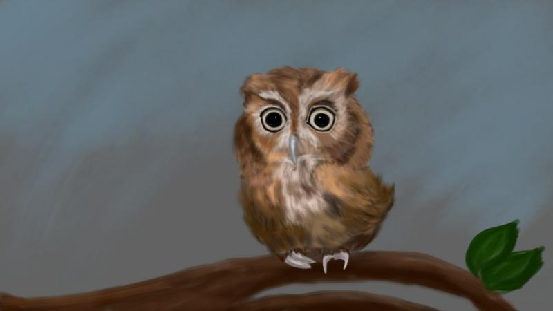
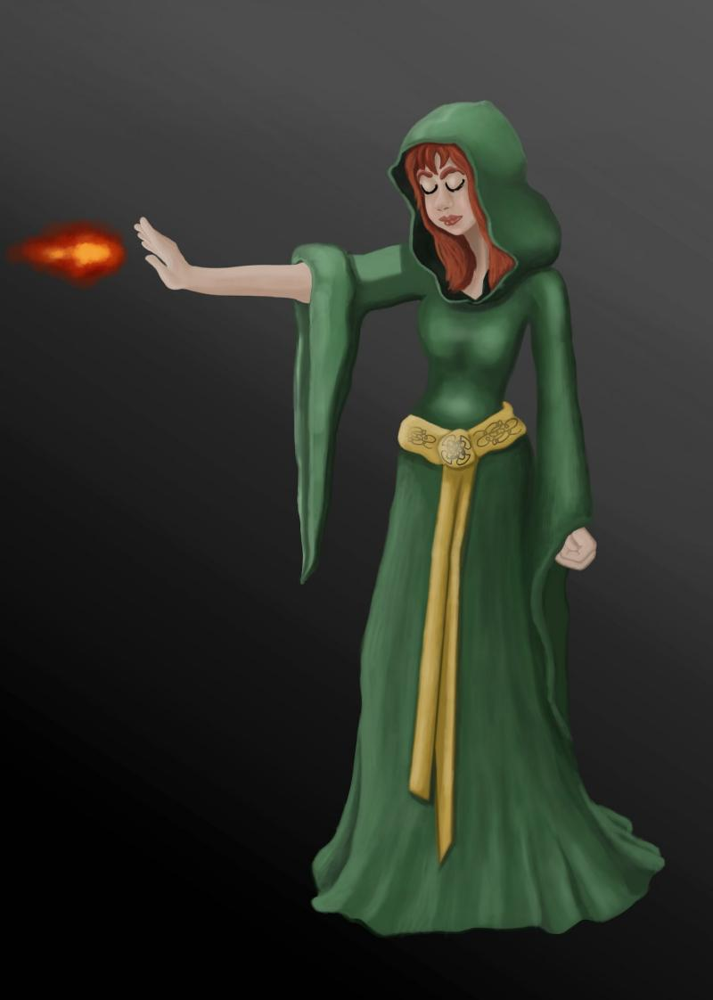
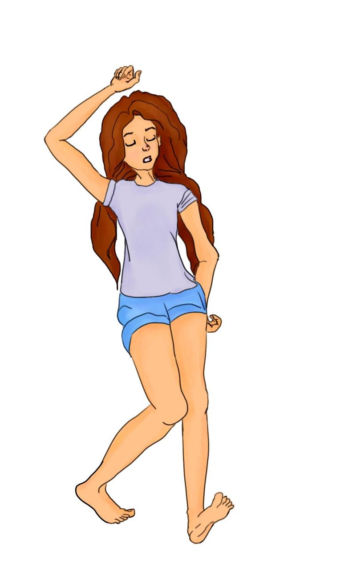

 

### 

### Could you tell us something about yourself?

Hello. I’m Maria, more often I use my nickname: Owly Owlet. I have a youtube channel, where I make video tutorials (in Russian) about how to use art software, mostly Krita.

### Do you paint professionally, as a hobby artist, or both?

Art is my hobby, but I wish I could become a professional artist someday. For now there is much to be learned.

### What genre(s) do you work in?

My art usually is more cartoony-like. I like fantasy world, fairy tales with medieval clothes, castles and magical creatures.

### Whose work inspires you most -- who are your role models as an artist?

There are so many incredible artists, whose art makes me want to learn and practice drawing more and more, it’s immensely hard to pick just a single one. But for now I really found of [Andreas Rocha](https://www.artstation.com/andreasrocha)’s work. I also love the art style of [David Revoy](https://davidrevoy.com/).

### How and when did you get to try digital painting for the first time?

I’ve been drawing digitally since March 2017, so almost a year now. My husband gave me a tablet as a present for my birthday. Before that I drew with vector tools and a mouse a bit.

### What makes you choose digital over traditional painting?

The freedom you have with digital art. With traditional painting you have to learn not only the basics of how to draw: perspective, light, color… You also have to learn how to work with different tools: pencils, markers, watercolor, acrylic paint, oil paint and so on. And it’s harder to fix your mistakes when you are just learning. And when you draw digitally, you have the magic of "Ctrl+Z" and layers. And besides that you can change the color scheme, mirror your image which makes way easier to identify and fix your proportion and color mistakes. You just have to find the software you are comfortable to paint with and you are good to go.

### How did you find out about Krita?

It was Age of Asparagus' ["Krita meets Bob Ross" tutorials](https://www.youtube.com/channel/UCkKFLSJjYtKNdFy3P7Q-CAA). They are awesome and really helped me to learn how to use Krita and not to be afraid of it. (https://www.youtube.com/channel/UCkKFLSJjYtKNdFy3P7Q-CAA)

### What was your first impression?

Before Krita I used FireAlpaca a bit, which is fine software too, especially for a beginner. So, switching to Krita after FireAlpaca was a bit scary, you know that "so many buttons" kind of thing.

### What do you love about Krita?

My favourite is the Assistant Tool, vanishing point and perspective. And I also love the dynamic brush and the quality of mixing brushes.

### What do you think needs improvement in Krita? Is there anything that really annoys you?

That would be nice if Krita had not only Brightness/Contrast curve, but also contrast sliders, like those in Photoshop.

### What sets Krita apart from the other tools that you use?

It has so many cool features and tools, so flexible when it comes to brush settings and working with color, and yet it’s free. Isn’t that amazing?

### If you had to pick one favourite of all your work done in Krita so far, what would it be, and why?

 I think this was the first one decent enough. When I drew it, I thought that I was finally getting somewhere.

### What techniques and brushes did you use in it?

Most of the time for cartoony characters I use basic Krita brushes, just edit settings a bit. Airbrush\_pressure for sketching and shading, Fill\_circle for colouring, ink\_ballpen for lineart, Basic\_wet\_soft for blending.

### Where can people see more of your work?

My drawings on Deviantart: [https://owlyowlet.deviantart.com/](https://owlyowlet.deviantart.com/) My Krita tutorials (in Russian): [https://www.youtube.com/c/СтудияСовятня](https://www.youtube.com/c/СтудияСовятня)

### Anything else you'd like to share?

I wanted to say that I admire people who created Krita, who work on it, the developers, artists, translators, test engineers and other good people who make it possible for everyone to learn digital art with Krita. Thank you for all your hard work.
