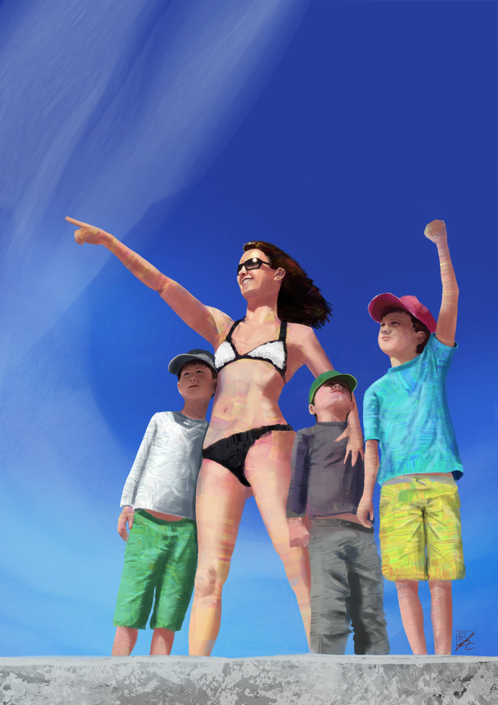
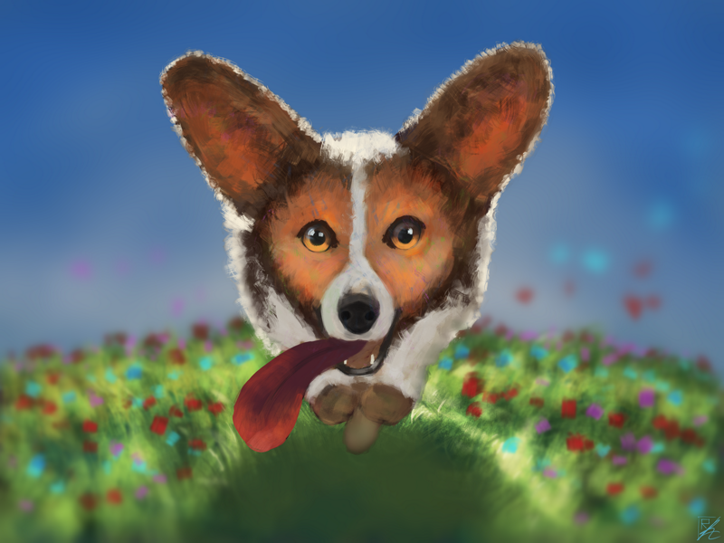
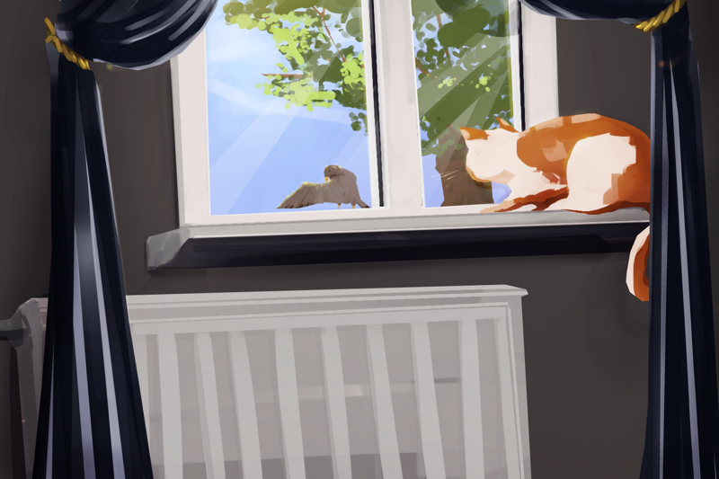
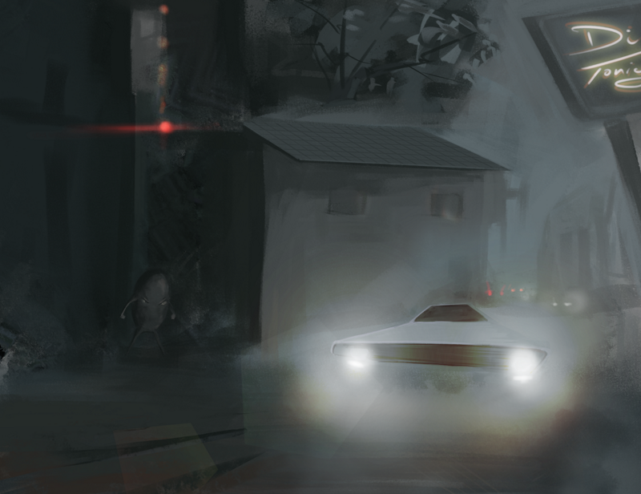
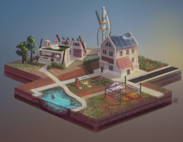
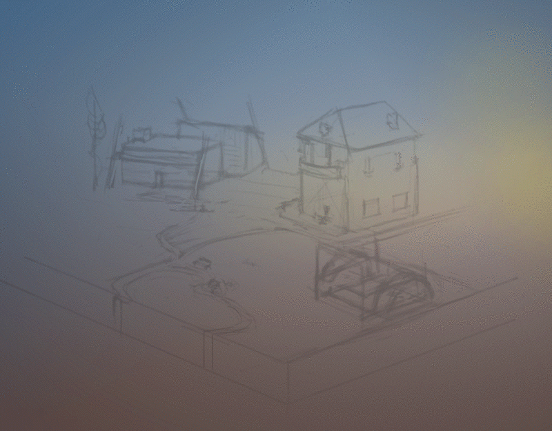
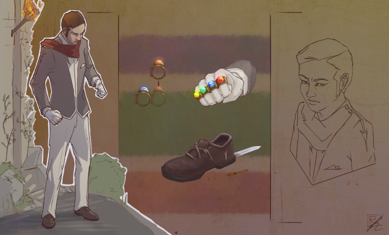
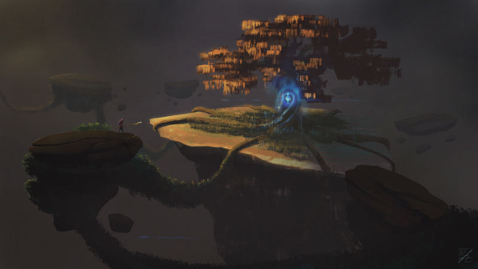
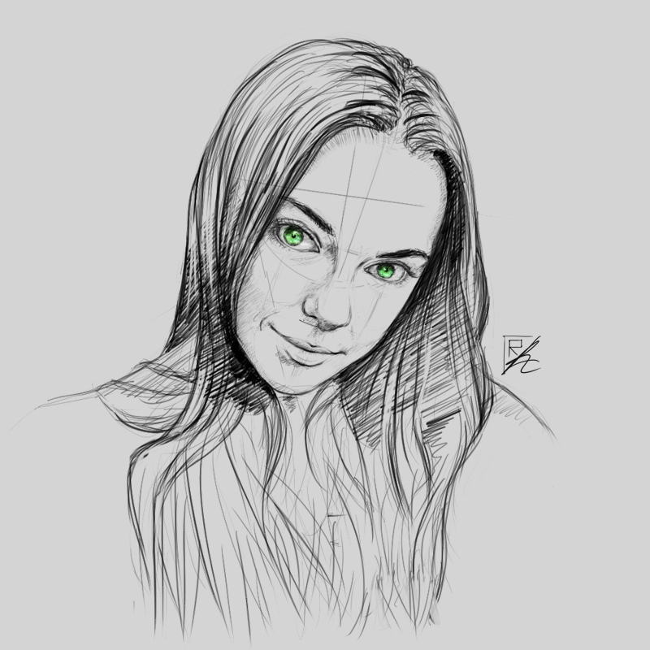
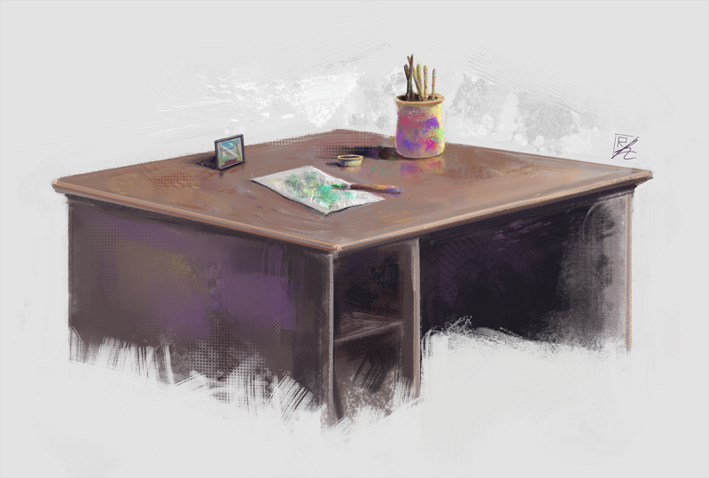

### Could you tell us something about yourself?

Hi! My name's Răzvan Rădulescu, I'm from Romania. I've had an interest in drawing since I was little. Unfortunately Romania is one of those countries that can crush creativity at a very early stage. At the time I was also interested in computers and started learning programming by myself, finally ended up doing physics in college and about three years ago I started playing with the idea of digital drawing and painting. The first two years have been painting on and off different things to get the hang of it, but about a year ago I decided to think about this path as more than just a hobby.

### Do you paint professionally, as a hobby artist, or both?

I guess the answer is I'm in-between, I'm finally in a position to start working on arts projects, I will elaborate a bit more on it later.

### What genre(s) do you work in?

I'm interested in everything and do a lot of experimentation, as you see in my artwork it's pretty much "all over the place".

### Whose work inspires you most -- who are your role models as an artist?

Since I started very late in my life with digital painting, I am not influenced by well known masters, but being attracted to concept art/freelance type of work I have my selection of modern artists which I look up to: [Sparth](https://sparth.artstation.com/), [Piotr Jabłoński](https://nicponim.artstation.com/), [Sergey Kolesov](https://peleng.artstation.com/), [Sinix](https://www.youtube.com/channel/UCUQTqWAaSzhAKRanOpes1nA), [Simon Stålenhag](http://www.simonstalenhag.se/), [Viktor Bykov](http://linesandcolors.com/2012/01/05/viktor-bykov/), to name a few. They all have very different painting styles and techniques so that explains why my own art is "all over the place", I've been trying to understand their work process and integrate it in my own.

### How and when did you get to try digital painting for the first time?

It must have been about 12 years ago, when I first played with Photoshop, but I didn't pursue it at the time, it was a very short experiment, a couple of months, no more.

### What makes you choose digital over traditional painting?

The usual suspects: cleanliness over messiness, power of layers, easy adjustments and modifications, FX and so on and so forth.

### How did you find out about Krita?

I think it was by mistake, I was searching for GIMP related stuff and someone must have mentioned Krita in a forum or something like that.

### What was your first impression?

At the time I tried it, I was coming from GIMP Paint Studio, not having touched Photoshop in years and I honestly believed that GIMP Paint Studio is as best as it can be. I was pleasantly surprised to find Krita, for painting I thought it was awesome. I was really impressed by the tools and the "hidden" gems, I'm the type of guy that tries everything, looks at every detail so I quickly found the G'MIC plugin, the assistant tools, clone layers etcetera, and I'm barely scratching the surface still. For what I've seen people really don't know about these features or they don't really use them, but I like touching every corner of it even if I don't end up using the features, I still keep them in mind just in case. With the addition of Python scripting, the feature list for Krita as a FOSS alternative is simply amazing.

<table><tbody><tr><td></td><td></td></tr></tbody></table>

### What do you love about Krita?

I like the fact that it's a real alternative for "industry" standard software like Photoshop, Corel Paint and so on. I am a huge fan of FOSS philosophy and initiative so Krita is very important to me and I think to the world in general. Krita is quickly becoming the Blender of 2D art world, people are slow to adopt these alternatives because of familiar workflows and for historical reasons, but people just starting off have no reason not to at least try them and I believe with time they will in become a core part of the of the professional artist. A year ago there was almost no mention of Krita, but with the release of v4 I think people are finally starting to get notice of it. I can see this in the LevelUp Facebook group (a very well known and important group for concept artists all over the world - [https://www.facebook.com/groups/levelup.livestream](https://www.facebook.com/groups/levelup.livestream)) where I'm a moderator that now and then there's the occasional mention of Krita so I know for a fact that more people are watching the development with anticipation.

### What do you think needs improvement in Krita? Is there anything that really annoys you?

Hm, it's tough to say without experimenting with other software to have as a reference. If there's one thing that annoys me it's that there are some lingering bugs since for ever - I'm looking at you "random transform crash" & "color sliders bug". In terms of improvement, I think the tag/brush menu system needs an update but I know it's on the roadmap so it will be taken care of eventually. I would probably have a better response if I knew other painting software.

### What sets Krita apart from the other tools that you use?

As far as digital painting, I don't use other tools so there's nothing much to say here. Generally speaking Krita is apart due to it being the only real FOSS alternative that can push a shift in mindset.

### If you had to pick one favourite of all your work done in Krita so far, what would it be, and why?

It has to be this one, it's my favourite because it's the first successful one and it all started with a rock study, trying to understand how Piotr Jabłoński applies color and atmosphere in his work. It's nothing special in terms of design but I I like the overall feel of it.

### What techniques and brushes did you use in it?

Ah memories... I made it after starting to work on my RZV Krita Brushpack (which can be downloaded for free at my website - [https://razcore.art/)](https://razcore.art/). I didn't like the fuzziness and quality of the patterns of the default set so that prompted me to work on my own set. Having said that, I've tried the latest nightly build of Krita v4 and the new default set is simply awesome. I know this stuff can be pretty subjective, but from my point of view the latest brush set, thanks to David Revoy, is now years ahead of the default set in v3. It forced me to rethink my own brush set for which I'll be releasing an update after Krita v4 official release. I think it will be quite a nice addition, I've only kept the really different brushes that make a difference.

As for the technique, for this painting it was quite the natural approach, I used more of a traditional style technique, with few layers, I've only really used layers for overlaps so that I don't have to worry about moving things, like the floating rocks in front of the central island. One final set of layers was used for placing the lights, like you see on the tree, and that's pretty much it.

### Where can people see more of your work?

Some of my paintings can be found at [https://razvanc-r.deviantart.com](https://razvanc-r.deviantart.com), but I plan to move my more advanced and successful ones to [https://razcore.artstation.com/](https://razcore.artstation.com/) (which is empty for now) and my own site [https://razcore.art/](https://razcore.art/).

Other places people can find me at:

\- YouTube: [https://www.youtube.com/channel/UC6iuu2ajEK2GiMc2TFWkEqw](https://www.youtube.com/channel/UC6iuu2ajEK2GiMc2TFWkEqw) - I started this channel just a couple of months ago so it's still very unpopular and it's quite experimental. I'm trying to get back to it and create mini-courses of sorts using free online resources I know of. There are quite a few good places to learn digital art for free but it takes a very long time to find them because they're scattered all over the place. One of my objectives is to explore them together with the viewers so all suggestions and comments are welcome. I had to take a bit of a break from the LLT (Let's Learn Together) playlist project but once things settle down I'll try to pick it up again.

\- Mastodon: [https://mastodon.art/@razcore](https://mastodon.art/@razcore)

\- Twitter: [https://twitter.com/razcore\_art](https://twitter.com/razcore_art)

\- Instagram: [https://www.instagram.com/razcore.art](https://www.instagram.com/razcore.art)

### Anything else you'd like to share?

I think this is a good place to elaborate on the project I mentioned at the beginning. I'm currently in a collaboration with the CEO of [Boot.AI](https://boot.ai) and we're interested in exploring the idea for a future society through design illustrations and podcasts to engage people to think and share opinions on these subjects. It's still at a very early stage of development, but one thing we'd like to work on is a sort of design and illustration course tackling these subjects with the help of FOSS projects such as Krita, Blender, Natron, to name a few. For these we're preparing the project at [https://boot.ai/seed](https://boot.ai/seed) - an illustrated experimental city society.
