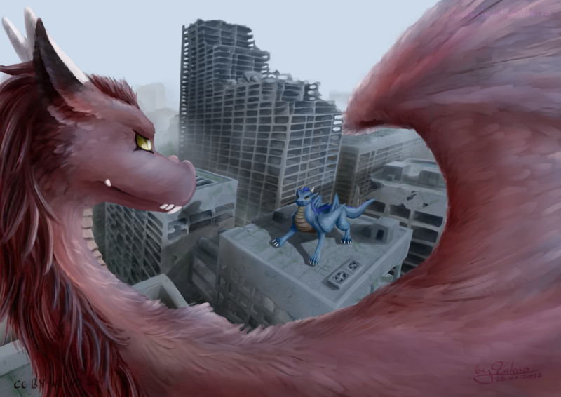
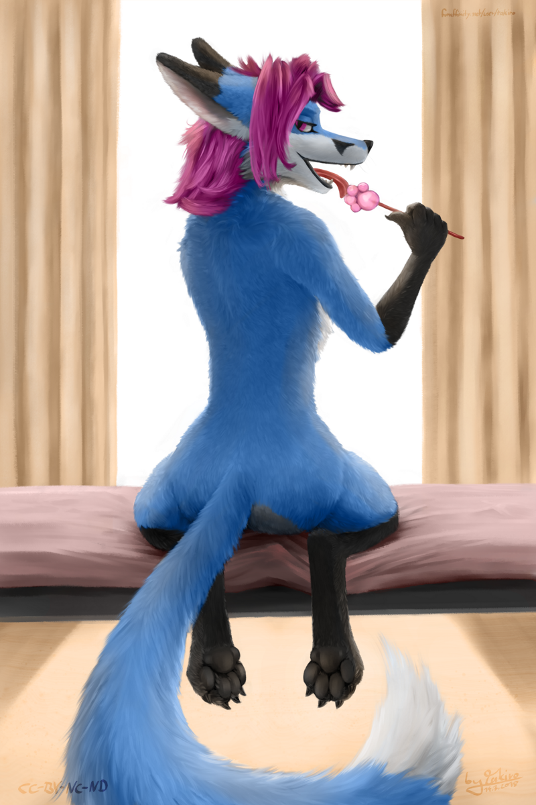
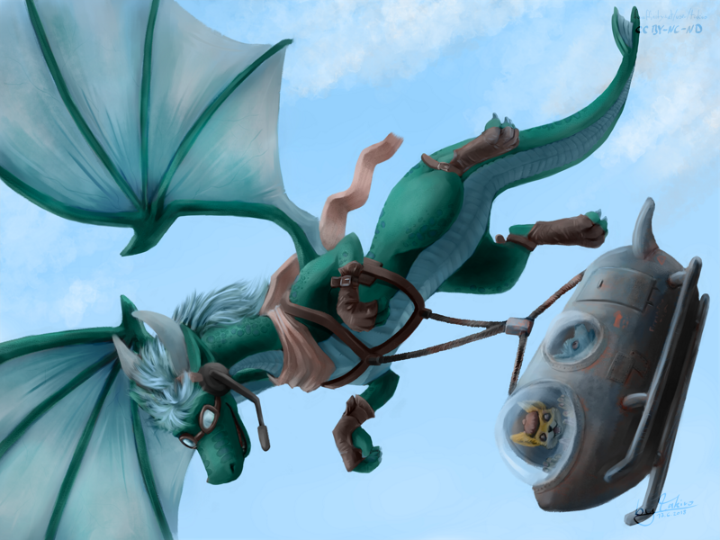
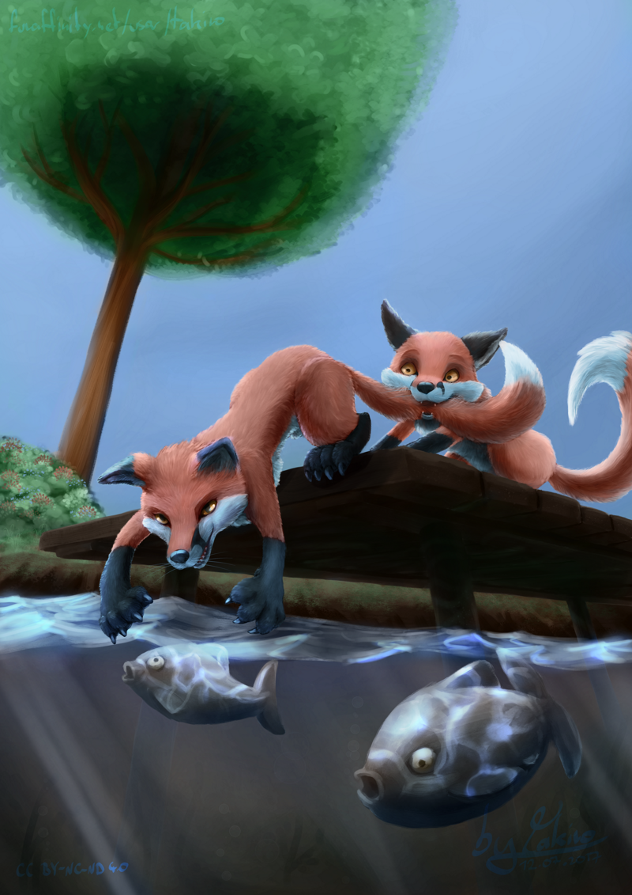
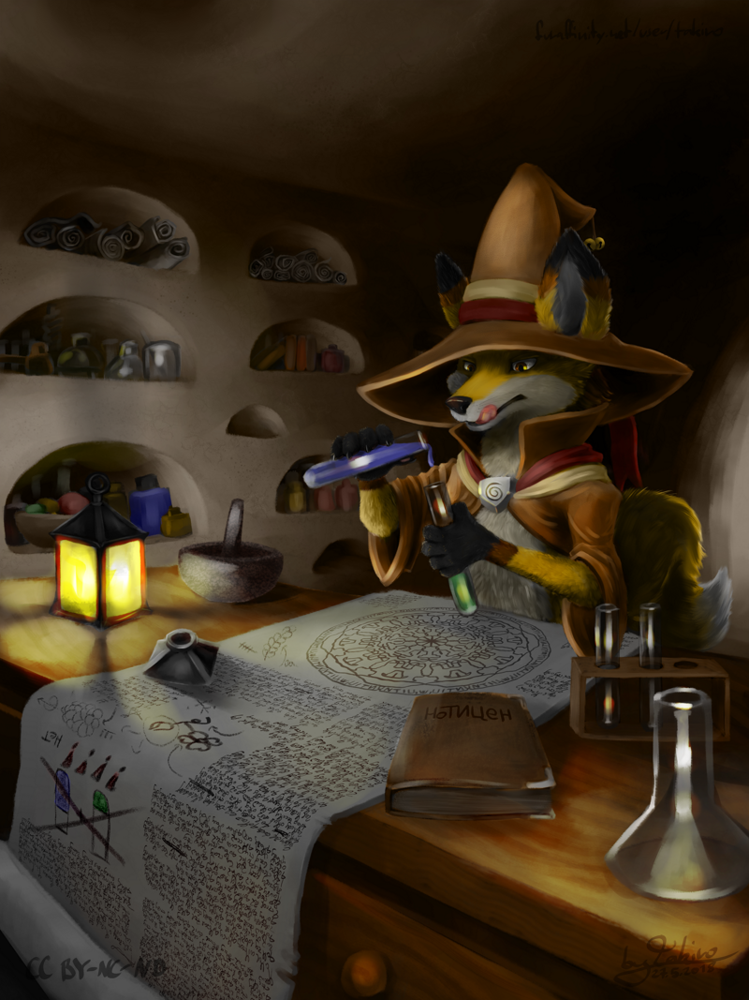

### 

### Could you tell us something about yourself?

Well, I'm not really sure what to tell about myself. My name is Takiro, I'm from Germany and I've liked drawing since I was a little kid although it wasn't very easy because I never had decent paper and pens. Art wasn't seen as an actual thing in my family, I guess. I started to take art more serious as a teenager, when I was 14 or 15, with traditional art. Everyone was into Mangas and Anime back then and so was I. I started out with poorly drawn fanarts of my favorite anthropomorphic characters before doing my own thing, and my style was typical Manga style until just a few years ago, when I transitioned to a more painterly style, trying to emulate the look of traditional paintings. I still do fanarts sometimes but nowadays I mostly paint anthropomorphic and feral animals often in magical fantasy settings inspired by video games and books.

### Do you paint professionally, as a hobby artist, or both?

At the moment I'm more of a hobby artist, I sometimes do commissions for private clients but that rarely happens. I'd love to be a professional artist some day but I'm still not sure if I have what it takes because there is more to being a professional than just being good at art.

[_Timelapse of this painting_](https://youtu.be/tjTwyvMEPs0)

### What genre(s) do you work in?

I love drawing pretty much anything animal and fantasy related. When I was a child I read a lot of books about Reynard the Fox and the other animals from the German fables. This influence lasts on and today I almost exclusively draw paintings of two-legged and four-legged anthropomorphic animals with foxes being my most recurring characters.

### Whose work inspires you most -- who are your role models as an artist?

To be honest, I never really thought about that. Definitely not one of the old masters. I had a pretty bad art education (maybe this is a German thing) and probably couldn't tell a Picasso from a Da Vinci if my life depends on it. I think, when it comes to style, the artist who inspired me most in the early days was [Michaela Frech](http://michaela-frech.de) with her realistic paintings.

Later, when I discovered that there is a whole community around anthropomorphic animals, I also found [Tess Garman](http://tessgarman.tumblr.com/), who is part of [Blotch](http://www.screwbald.com/?page_id=16), and [Yee Chong](https://www.instagram.com/art_of_silverfox/), to just name a few. All of which had big influence on my style how it is now.

I had the amazing opportunity to meet Michaela Frech at an Art Show we both attended a year ago and later become friends with her. She helped me a lot with her professional advice and critique and enabled me to reach the skill level I now have.

As for my ideas, I get them mostly from fantasy movies and series, the novels and fables I read in my childhood and from video games. I often like to switch the characters with animals and think about how their animal behavior and characteristics could influences the plot.

[_Timelapse of this painting_](https://youtu.be/1add1PDIQR0)

### How and when did you get to try digital painting for the first time?

Gosh, I think it was when I was in vocational school, 16 or so years ago. We had a class in PaintShop Pro, where we learned basic photo editing. Drawing and painting wasn't really part of the class but shortly after a few lessons I discovered that it is fun, bought my very fist graphics tablet and made some baby steps in digital drawing and painting.

### What makes you choose digital over traditional painting?

There are a few things. But I think what I like most about working digital is that it's very forgiving. You can just throw some paint onto the digital canvas and look what sticks, then work with it and improve on it. For a long time my work flow was more like when you do a traditional painting, now I work more like a sculptor who adds or takes some clay and approximate the final result.

Another thing that made me choose digital over traditional is that you don't need much space. As a teenager, I had only a small room and no real desk for a long time. Also didn't had much space to store all my painting stuff.

And colors. I love the bright colors you usually only can have on a screen, which unfortunately is also a drawback when you print a painting.

### How did you find out about Krita?

I just checked and it looks like I started using Krita in 2013. I'm not exactly sure how it happened but I remember that I was frustrated about all the other tools I tried by then, PaintShop, Corel, Photoshop, SAI, you name it. I already was almost completely transitioned to Linux, except for the painting part and then I remembered that my computer science teacher once mentioned a tool for Linux that was not gimp. Unfortunately I couldn't remember the name so I typed "good painting tool for Linux -gimp" into a search engine and BAM! Krita.

### What was your first impression?

I vaguely remember that it was like: "OMG, I can just draw. And brushes, it has nice brushes by default. And the example artworks are not shit." Seriously, I looked into some other open source tools and the artworks they used to advertise the software often looked like they where made by someone who never held a pen and I thought: "That doesn't look like you can do amazing stuff in that program." But Krita made an amazing first impression.

### What do you love about Krita?

I loved and still love that you can just pick it up and start painting. It's default brushes already did a great job when I started to use it. I later found David Revoy's brush pack which was awesome and I love what he did with the 4.0 brushes (although I had to bring two old friends back from 3.0). I think one of the greatest strengths of Krita today is the good choice of brushes that come with it. I still remember that it took me hours to configure some brushes in all the other tools I tried, before I could even start properly.

### What do you think needs improvement in Krita? Is there anything that really annoys you?

If you have asked me back when I started using it, with version 2.7 I would have given you a page long list. There is an occasional crash now and then but now most of the major bugs are fixed and often, when I find a bug and want to report it, it's already marked as resolved and I just have to wait for the next release.

The palette docker still has some issues and is a bit doggy. One of my favorite tools is the assistant tools, especially the vanishing points. I would like to group them and deactivate/move/hide whole groups. It can be very tricky if you have a lot of vanishing points in a picture.

### What sets Krita apart from the other tools that you use?

For me it is the feeling that Krita is made with the artist in mind. Often when I use a tool I think: "Yeah that's a cool tool with nice features but how am I supposed to use that?" This is a thing that I often find in a lot of Open Source software. Programmers put a lot of amazing know-how in the software that often can do awesome stuff but then the UI is terrible and the whole feel is off. And then an otherwise cool piece of software is unnecessary hard to use. I still find a few unpolished corners like that in Krita sometimes but other than that I felt comfortable from the start. It gives you just what you need.

### If you had to pick one favourite of all your work done in Krita so far, what would it be, and why?

Hm, I have a few but I think my latest is "About to Fail", an artwork I just finished recently. It shows my character in a typical situation where he is careless and about to mess up an experiment. I like it because, not only is it a typical artwork that includes a lot of things i like (fantasy, magic, animals) but also because it was a milestone in my personal development as an artist.

### What techniques and brushes did you use in it?

First I did a rough sketch with the "Charcoal Rock Soft" brush, slowly working out the details until I have a grayscale image, then I keep refining details with the "Bristles Wet", a brush that is originally from the Krita 3.0 default brush pack. After that I use "Wet Bristles Rough" to add the fluffyness of the fur. The smear brushes are my favorites and I use them mostly like you would in traditional painting. I love how they mix colors directly on the canvas. After the whole grayscale image was done I added textures, like the wood of the desk or the cracks in the wall. I used the default texture brushes for that. I try to use the default brushes as much as I can to concentrate on drawing and not wasting to much time on creating a brush that I maybe never use after that. Sometimes I tweak them a little of course. At last I add color with some layers set to Color blending mode, more rendering after that because some colored areas have to overlap and than it's usually done. I have some recordings that illustrate pretty well how I work, unfortunately not for this particular artwork.

### Where can people see more of your work?

I have a [website](http://gelbfuchs.com) but it's pretty much a work in progress and just a pet project I rarely find time for, but I plan to make it fully functional in the future. I also have other galleries, for example on [FurAffinity,](https://www.furaffinity.net/gallery/takiro/) which unfortunately does not allow high resolution uploads - and on [InkBunny](https://inkbunny.net/gallery/Takiro). I only post my finished works to my galleries. For sketches, WIPs and other stuff I use my twitter [@Takiro\_Ryo](https://twitter.com/Takiro_Ryo). On my [YouTube channel](https://www.youtube.com/user/TakiroRyo) I upload timelapsed recordings of my paintings, and some day maybe tutorials but I haven't decided yet.

### Anything else you'd like to share?

Krita is already an amazing Program and I sense a bright future for it in my twitchy tail. If you're just starting out with digital painting, you should definitely start with Krita. Save the 300 bucks Photoshop would cost you and invest it in a decent tablet instead. Once you spend some time in Krita, you probably don't want to switch to something else. Whereas Photoshop crushes you under a pile of functionality you never need as a painter, Krita will give you everything you need, and just that without wanting anything in return.

I also want to thank the Krita team for being amazing and for this interview opportunity, which is my first interview as an artist ever. Keep on the good work. I definitely will keep spreading the word about Krita.

At last I want to thank Michaela Frech for her help and also my boyfriend who had to bear a lot of my art related frustrations over the years.
