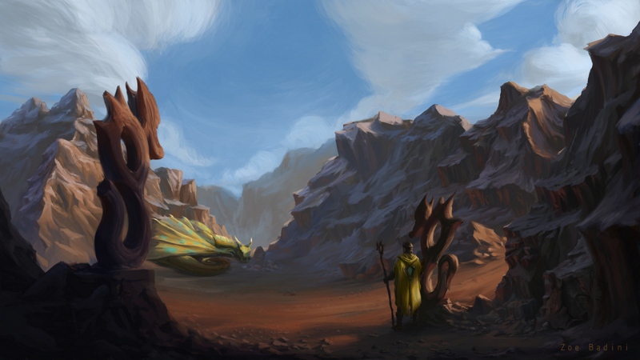
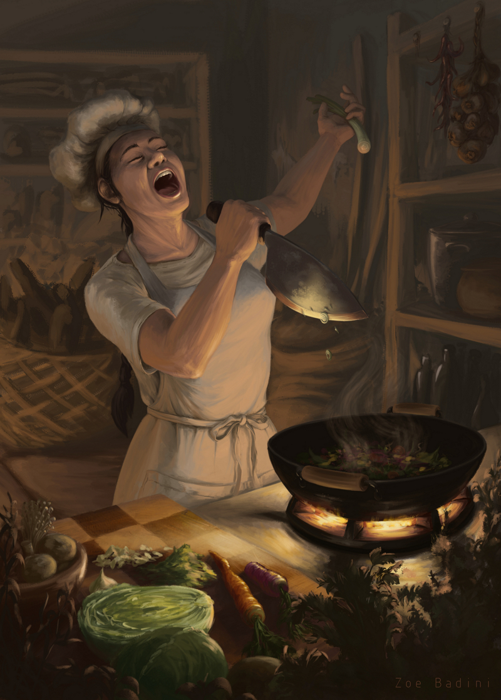
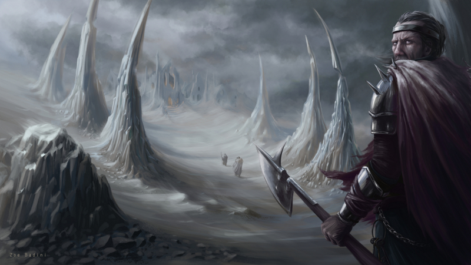
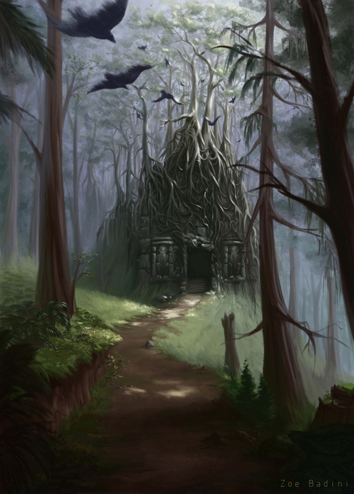
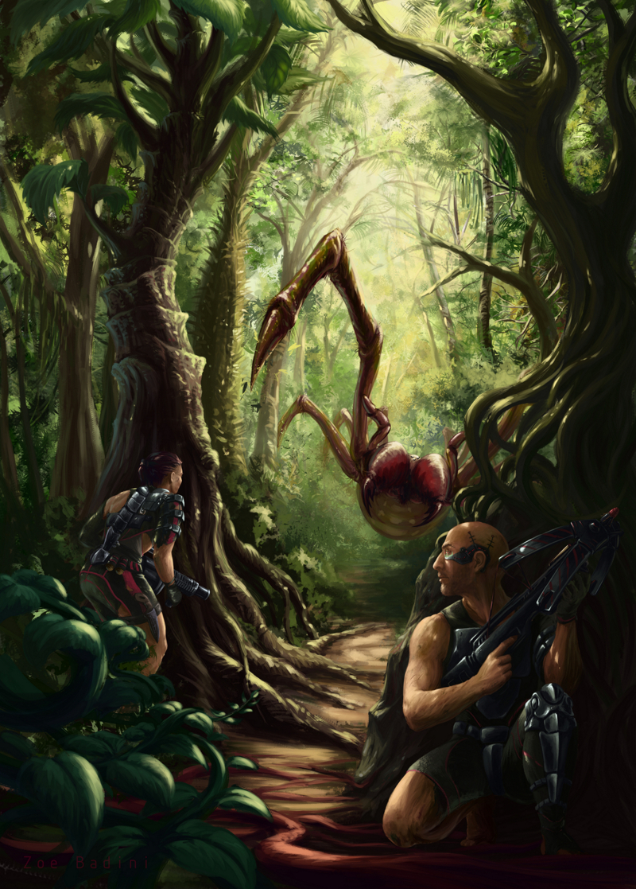

### Could you tell us something about yourself?

Hi, I'm Zoe and I live in Italy. Aside from painting I love cooking and spending my time outdoors, preferably snorkeling in the sea.

### Do you paint professionally, as a hobby artist, or both?

I'm just now starting to take my first steps professionally after many years of painting as a hobby.

### What genre(s) do you work in?

I love to imagine worlds and stories for my paintings, so most of what I've done is related to fantasy illustration and some concept art. I also do portraiture occasionally.

### Whose work inspires you most -- who are your role models as an artist?

There are way too many to mention, I try to learn as much as I can from other artists, so there are a lot of people I look up to. There are a few I often watch on Youtube, Twitch, or other platforms, I learned a lot from their videos: Clint Cearley, Marco Bucci, Suzanne Helmigh, David Revoy.

### How and when did you get to try digital painting for the first time?

I was used to traditional drawing, then a few years ago I saw some beautiful digital illustrations and was curious to try my hand at it, there was this old graphic tablet at my parents' house, so I tried it. What I made was atrocious, but it didn't discourage me!

### What makes you choose digital over traditional painting?

Working digitally I feel like a wizard, with a touch of my wand I have a huge array of tools at my disposal: different techniques, effects, trying out ideas and discarding them freely if they don't work out. It's also a big space saver!

### How did you find out about Krita?

I had heard it mentioned a couple of times, then I posted a painting on reddit and a user recommended Krita to me, I was a bit uncertain because I was used to my setup, my brushes and so on... But the seed was planted, in the span of a few months I was using Krita exclusively and I never went back.

### What was your first impression?

I was understandably a bit lost and watched a few tutorials, but I found the program intuitive and easy to navigate.

### What do you love about Krita?

Its accessibility and completeness: there's everything I may need to paint at a professional level and it's easy to find and figure out. Krita also comes with a very nice selection of brushes right out of the box.

### What do you think needs improvement in Krita? Is there anything that really annoys you?

Nothing really annoys me, as for improvements I wanted to say the text tool, but I know you're working on it and it was already improved in 4.0.

### What sets Krita apart from the other tools that you use?

As I said it's professional and easy to use, I feel like it's made for me. It's also free, which is great for people just starting out.

### If you had to pick one favourite of all your work done in Krita so far, what would it be, and why?

My favourite is always one of the latest I did, just because I get better over time. In this case it's "Big Game Hunt".

### What techniques and brushes did you use in it?

Nothing particular in terms of technique, my brushes come from the Krita presets, my own experiments and a lot of bundles I gathered from the internet over time.

### Where can people see more of your work?

Artstation: [https://www.artstation.com/zoebadini](https://www.artstation.com/zoebadini) Twitter: [https://twitter.com/ZoeBadini](https://twitter.com/ZoeBadini)

### Anything else you'd like to share?

I want to thank the Krita team for making a great software and I encourage people to try it, you won't be disappointed. If you use it and like it, consider donating to help fund the project!
