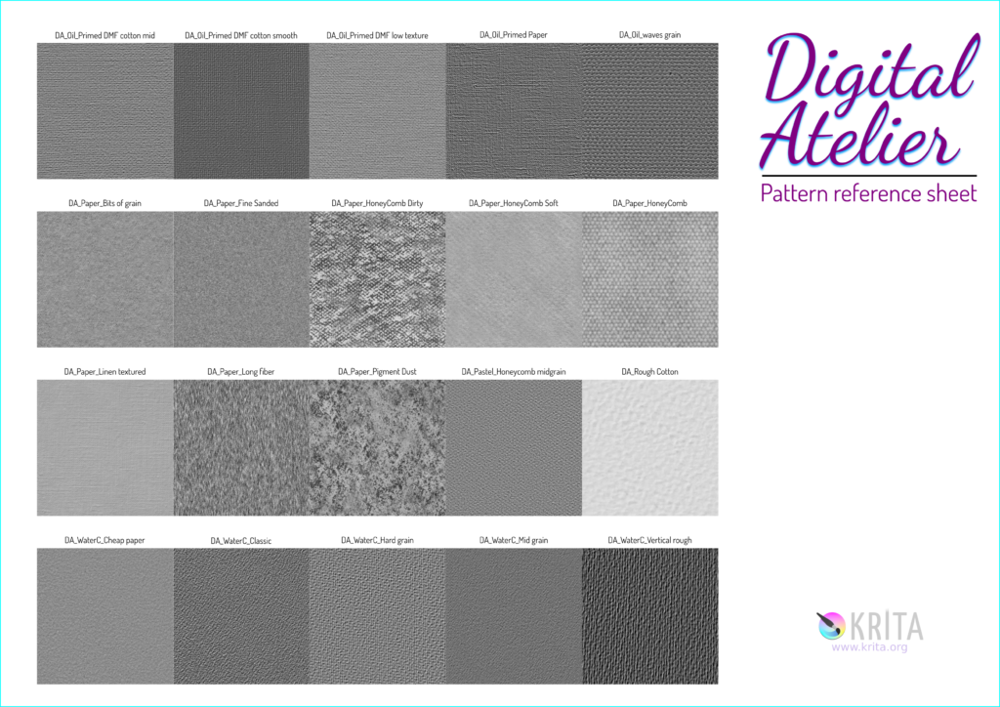
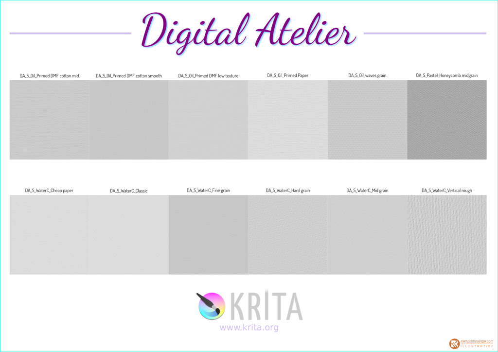

Over the past months, Ramon Miranda, known for [his wonderful introduction to digital painting, Muses](https://gum.co/SZZDI?wanted=true), has worked on creating a complete new brush preset bundle: Digital Atelier. Not only does this contain over **fifty** new brush presets, more than **thirty** new brush tips and **twenty** patterns and surfaces.

There is almost **two** **hours** of in-depth video tutorial, working you through the process of creating new brush presets.

Ramon has gone deep here! The goal was to create painterly brushes: achieving the look and feel of oil paint, pastel or water colors. Ramon did a lot of research and experimentation and it has paid off handsomely:

https://youtu.be/oMyorAEgBfE

### When?

On Saturday, Krita's 2018 **Squash the Bugs** fundraiser will start. Anyone who supports Krita with €50 or more will get a free download! On October 16th, we'll put Digital Atelier in the Krita shop for €39.95.

### What?

Brush pack:

- Fifty-one new brush presets -- [check out the reference sheet](https://files.kde.org/krita/marketing/digital_atelier_reference_sheet.pdf)!
- Twenty-four oil paint brush presets, of which four are _very_ experimental.
- Thirteen Pastel brush presets.
- Fourteen Watercolor brush presets.
- Thirty-four new PNG and five new SVG brush tips.
- Twenty 512x512 paper surfaces and patterns. 

Tutorial Videos:

- Introduction: Knowing our tools
- Oil painting
- Pastel painting
- Water Color painting
- Creating your own Patterns
- Creating your own Brush tips.

The music is by Kevin MacLeod. The language used in the videos is English.
