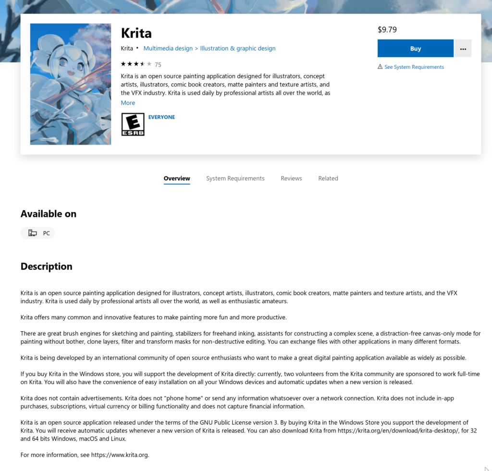
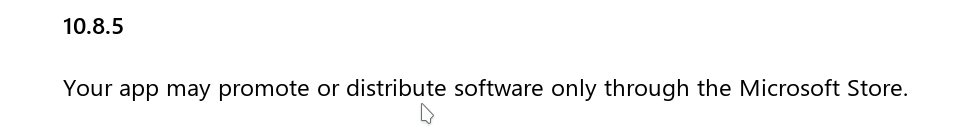
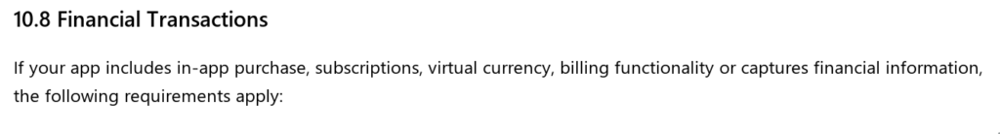
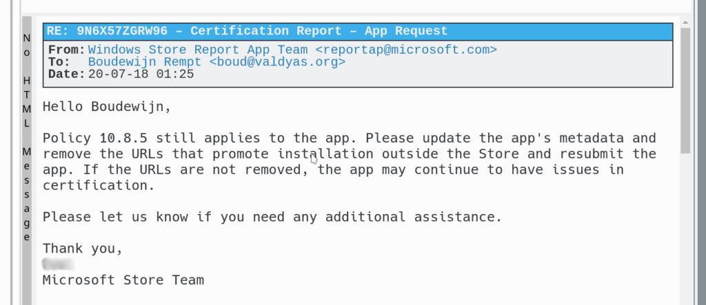

We've been publishing Krita in the Windows store for quite some time now. Not quite a year, but we've updated our Store listing almost twenty times. By far the majority of users get Krita from this website: about 30,000 downloads a week. Store downloads are only about 125 a week. Still, the income generated makes it possible for the Krita maintainer to work on Krita full-time, which would not have been possible otherwise.

That's good, because combining a day job and working on Krita is a sure recipe for a burn-out. (Donations fund Dmitry's work, but there aren't enough donations to fund two people at the same time: we have about 2000 euros per month in donations.)

What's not so good is that having an app in a Store basically means you're a [sharecropper](https://en.wikipedia.org/wiki/Sharecropping). You do the work, and the Store allows you whatever it wants to allow you. You're absolutely powerless. All the rules are made by the Store. And if there's one particular rule that gets interpreted by the Store curators in a way that's incompatible with the English language, well, we'll have to submit to it and be obedient.

Originally, we would mention in the Store listing that people could also get Krita for free from krita.org, and where you'd be able to get Krita's source code:

 

This, Microsoft contends falls foul of its [policy](https://docs.microsoft.com/en-us/legal/windows/agreements/store-policies#108-financial-transactions) 10.8.5:

However, this is part of Policy 10.8:

Sounds clear, right? If your app includes those things, 10.8.5 applies. So, if your app doesn't do that, it shouldn't apply. At least, that was our naive interpretation. However, Microsoft disagrees. In a mail to the Krita maintainer they say:

And, of course, apart from 10.8 not being the case, so the "if" clause doesn't apply, it's not the Krita application that "promotes or distributes software" outside the Microsoft Store but the Store listing, and 10.8.5 doesn't say anything about _that_.

Now Microsoft was certainly aware that Krita is open source software published in the GNU Public License, and Krita would be distributed outside the Windows Store. They actually helped us get Krita in the Windows Store to begin with, because, well, the Windows Store still is rather bare and doesn't have that much good quality content.

In any case, since we're absolutely powerless, we've had to change the Store listing...
