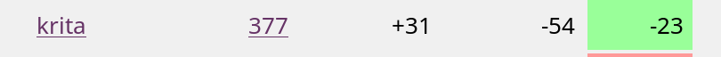
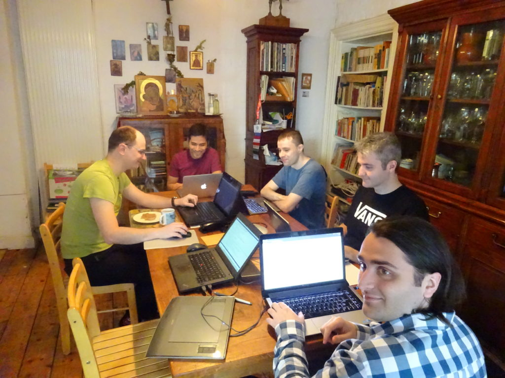

On Saturday, the first people started to arrive for this autumn's Krita development sprint. It's also the last week of the fundraiser: we're almost at 5 months of bug fixing funded! All in all, 8 people are here: Boudewijn, the maintainer, Dmitry, whose work is being sponsored by the Krita Foundation through this fundraiser, Wolthera, who works on the manual, videos, code, scripting, Ivan, who did the brush vectorization Google Summer of Code project this year, Jouni, who implemented the animation plugin, session management and the reference images tool, Emmet and Eoin who started hacking on Krita a short while ago, and who have worked on the blending color picker and kinetic scrolling.

We already did a ton of work! Wolthera finished up the last few problems in Michael Zhou's Google Summer of Code rewrite of the palette docker: that's merged to master, so it's in the nightly builds for [Windows](https://binary-factory.kde.org/job/Krita_Nightly_Windows_Build/) and [Linux](https://binary-factory.kde.org/job/Krita_Nightly_Appimage_Build/). We did some pair programming so the text tool now creates new text with the currenly selected color.

Jouni got a long way with the implementation of animation clones and cycles: that is, a set of frames can now be "cloned" to appear in several places in your animation:

\[video width="1250" height="774" mp4="https://krita.org/wp-content/uploads/2018/10/demo.mp4"\]\[/video\]

Then we sat down and distributed bugs to the hackers present, and we got rid of a lot of bugs already (total bugs, new reports, closed, balance):

### Streaming

We're going to continue to fix bugs for the rest of the week, of course! And we did some experimentation with stream to twitch, so tomorrow afternoon, CEST, we'll do a live streaming of bug fixing on [https://www.twitch.tv/artwithkrita!](https://www.twitch.tv/artwithkrita) We'll also be answering questions, so if you want to discuss a particular bug with us, join in!

## Voting

We've also got the the updated vote tally for you:

<table border="0" cellspacing="0"><colgroup width="366"></colgroup><colgroup width="79"></colgroup><tbody><tr><td align="left" height="26">1 – Papercuts</td><td align="right">164</td></tr><tr><td align="left" height="26">2 - Brush Engine</td><td align="right">103</td></tr><tr><td align="left" height="26">3 – Animation</td><td align="right">88</td></tr><tr><td align="left" height="26">6 - Vector Objects and Tools</td><td align="right">56</td></tr><tr><td align="left" height="26">5 – Layers</td><td align="right">51</td></tr><tr><td align="left" height="26">7 – Text</td><td align="right">36</td></tr><tr><td align="left" height="26">10 - Photoshop layer styles</td><td align="right">28</td></tr><tr><td align="left" height="26">4 - Color Management</td><td align="right">21</td></tr><tr><td align="left" height="26">9 - Resource Management and Tagging</td><td align="right">18</td></tr><tr><td align="left" height="26">8 - Shortcuts and Canvas Input</td><td align="right">12</td></tr></tbody></table>

The only real change is that Resource Management now has dropped below Color Management, for the rest, the order is pretty stable.

### And a bonus video

In case you missed it, Wolthera made a cool video showing off gamut masks and the new palette docker, create by two new Krita contributors:

https://www.youtube.com/watch?v=d3\_HL9OoHs4

### And...

And it's great to be together, of course! We've got people from the US, from Mexico, Russia, Finland and the Netherlands. For three of us, it's the first Krita sprint they've attended. Here are the early birds who were already happily hacking on Sunday morning, without even waiting until after breakfast!

