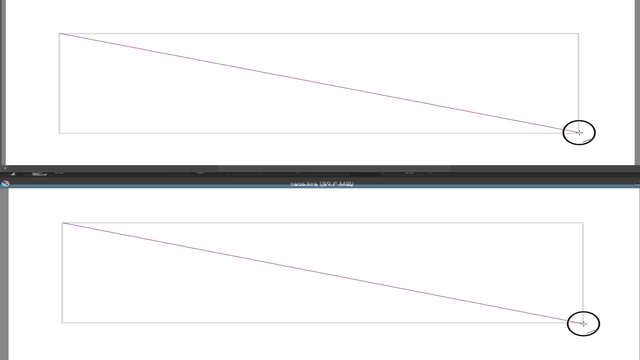
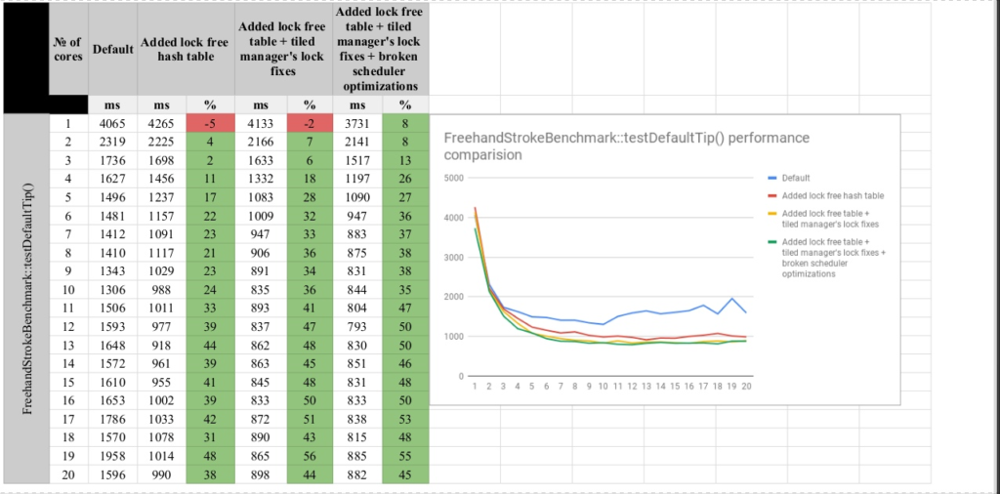
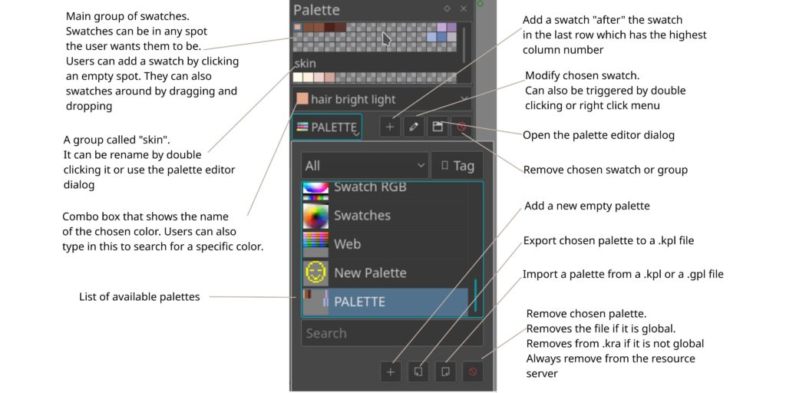
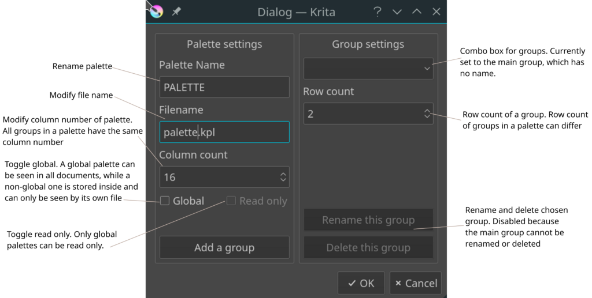

This year, we participated in Google Summer of Code with three students: [Ivan](https://colorathis.wordpress.com/), [Andrey](https://lieroz.github.io/) and [Michael](https://simeir.github.io/). Some of the code these awesome students produced is already in Krita 4.1.1, and most of the rest has been merged already, so you can give it a whirl in the latest nightly builds for [Windows](https://binary-factory.kde.org/job/Krita_Nightly_Windows_Build/) or [Linux](https://binary-factory.kde.org/job/Krita_Nightly_Appimage_Build/). So, let's go through what's been achieved this year!

**Ivan's** project was all about making brushes faster using vectorization. If that sounds technical, it's because it is! Basically, your CPU is powerful enough to do a lot of calculations at the same time, as long as it's the same calculation, but with different numbers. You could feed more than 200 numbers to the CPU, tell it to multiply them all, and it would do that just as fast as multiplying one number. And it just happens that calculating the way a brush looks is more or less just that sort of thing. Of course, there are complications, and Ivan is still busy figuring out how to apply the same logic to the predefined brushes. But here's a nice image from his [blog](https://colorathis.wordpress.com/):

Above, how it was, underneath, what the performance is now.

If Ivan's project was all about performance, well, so was **Andrey**'s project. Andrey has been working on something just as technical and head-achey. Modern CPU's have many cores -- some have four, and fake having eight, others have ten and fake having 20 -- or even more. And unused silicon is a waste of good sand! Krita has been able to use multiple cores for a long time: it started with Dmitry Kazakov's [summer of code project,](http://dimula73.blogspot.com/2009/08/gsoc-krita-tile-engine-wrap-up.html) back in 2009, which was all about the tile engine. Nine years later, Dmitry mentored Andrey's work on the tile engine. The tile engine is used to break up the image into smaller tiles, so every tile can be worked on independently.

So when Dmitry, last year, worked on a project to let Krita use more cores and simultaneously found some places where Krita would force cores to wait on each other, he made a note: something needed to be done about that. It's called locking, and the solution is to get rid of those locks.

So Andrey's project was all about making the list of tiles function without locks. And that work is done. There are still a few bugs -- this stuff is amazingly complicated and tricky, so real testing is really needed. It will all be in Krita 4.2, which should be released by the end of this year. And some of it was already merged to Krita 4.1.1, too. He managed to get some really nice gains:

**Michael** has been working on something completely different: palette support in Krita. A palette or colorset is a set of colors -- what we call a resource. Palette editing was one of the things we shared with the rest of Calligra, back then, or KOffice, even earlier on. The code is complicated and tangled and spread out. Michael's first task was to bring order to the chaos, and that part has already been merged to Krita 4.1.1.

His next project was to work on the palette docker. His work is detailed in [this Phabricator post](https://phabricator.kde.org/D14815). There's still work in progress, but everything that was planned for the Summer of Code project has been done!

And this is the editor:

