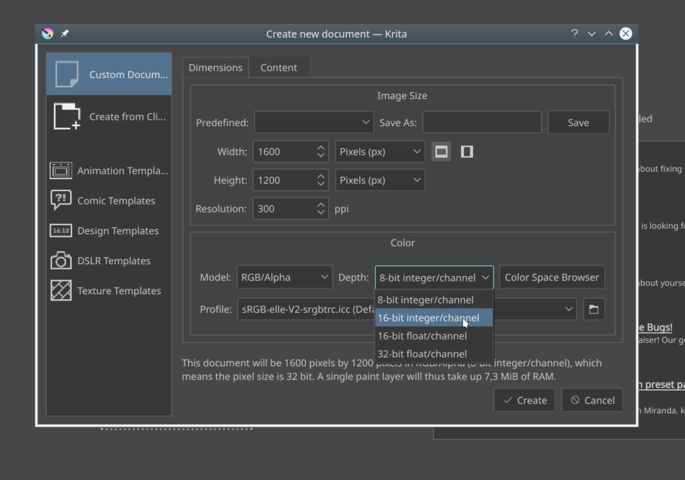

**[We're about a week into the campaign](https://www.krita.org)**, and almost **9000** euros along the path to bug fixing. So we decided to do some preliminary vote tallying! And share the results with you all, of course!

On top is **Papercuts**, with **84** votes. Is that because it's the default choice? Or because you are telling us that Krita is fine, it just needs to be that little bit smoother that makes all the difference? If the latter, we won't disagree, and yesterday Boudewijn fixed one of the things that must have annoyed everyone who wanted to create a custom image: [now the channel depths are finally shown in a logical order](https://phabricator.kde.org/R37:b0b55278363391eeb96784fddba5a763ac09c05a)!

Next, and that's a  bit of a surprise, is **Animation** with **41** votes. When we first added animation to Krita, we were surprised  by the enthusiasm with which it was welcomed. We've actually seen, with our own eyes, at a Krita Sprint, work done in Krita for a _very_ promising animated television series!

Coming third, there's the **Brush Engine** bugs, with **39** votes. Until we decided that it was time to spend time on stability and polish, we thought that in 2018, we'd work on adding some cool new stuff for brushes. Well, with [Digital Atelier](https://krita.org/en/item/introducing-digital-atelier-a-painterly-brush-preset-pack-by-ramon-miranda-with-tutorial-videos/), it's clear that there is a lot more possible with brushes in Krita than we thought -- but as you're telling us, there's also a lot that should be fixed. The brush engine code dates back to a rewrite in 2006, 2007, with a huge leap made when Lukáš Tvrdý wrote his thesis on Krita's brush engines. Maybe we'll have to do some deep work, maybe it really is all just surface bugs. We will find out!

Fourth, bugs with **Layer** handling. **23** votes. For instance, flickering when layers get updated. Well, Dmitry fixed [one bug there on Wednesday already!](https://phabricator.kde.org/R37:58b982cbb7bfa133bbb0bab5b163c24a9bb83d61)

**Vector Objects and Tools**: with **20** votes, **Text** with 15 votes and **Layer** **Styles**, with 13 votes (4 less than there are bug reports for Layer Styles...): enough to show people are very much interested in these topics, but it looks like the priority is not that high.

The remaining topics, **Color Management**, **Shortcuts and Canvas Input**, **Resource Management and Tagging**, all get **8** votes. We did fix [a shortcuts bug, though](https://krita.org/en/item/lets-take-this-bug-for-example/)... Well, that fix fixed [three of them](https://phabricator.kde.org/R37:36861ec3b2608893a5c624560e5d3302bda19c31)! And resource management is being rewritten in any case -- maybe that's why people don't need to vote for it!
