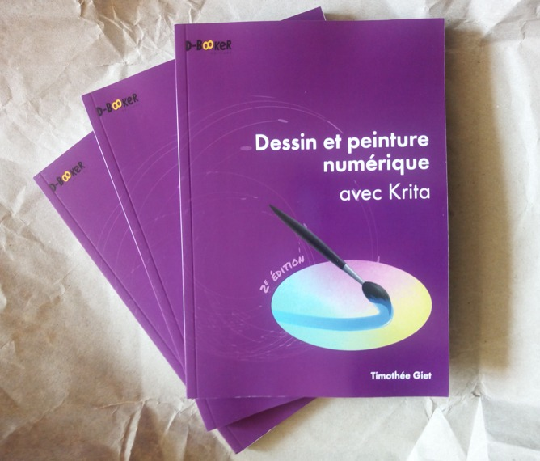

Last month French publisher D-Booker released the 2nd edition of Timothée Giet's book "Dessin et peinture numérique avec Krita".

The first edition was written for Krita 2.9.11, almost three years ago. A lot of things have changed since then! So Timothée has completely updated this new edition for Krita version 4.1. There are also a number of  notes about the new features in Krita 4.

And more-over, D-Booker worked again on updating and improving the French translation of Krita! Thanks again to D-Booker edition for their contribution.

You can order this book directly [from the publisher's website](https://www.d-booker.fr/krita-2e/570-dessin-et-peinture-numerique-avec-krita-2e.html). There is both a digital edition (pdf or epub) as well as a paper edition.
