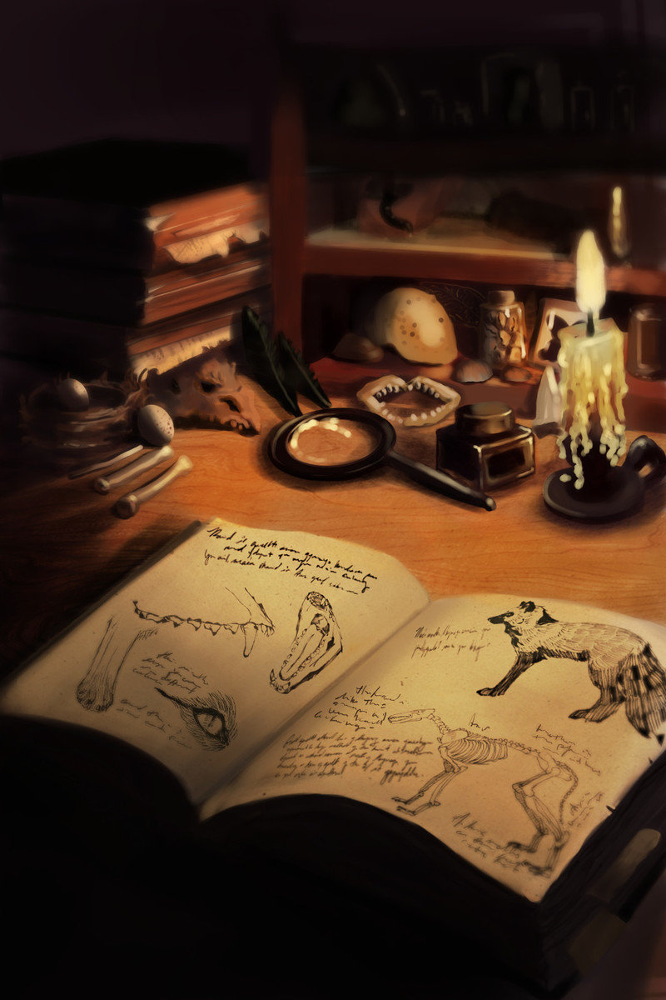
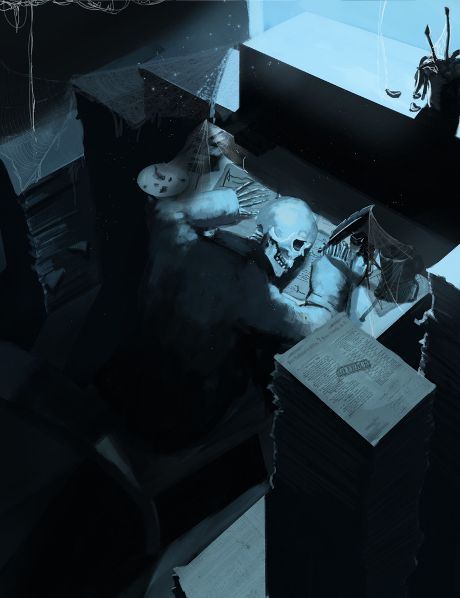
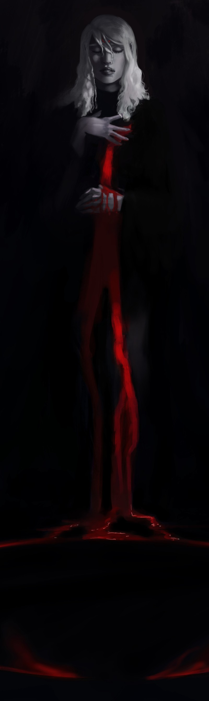
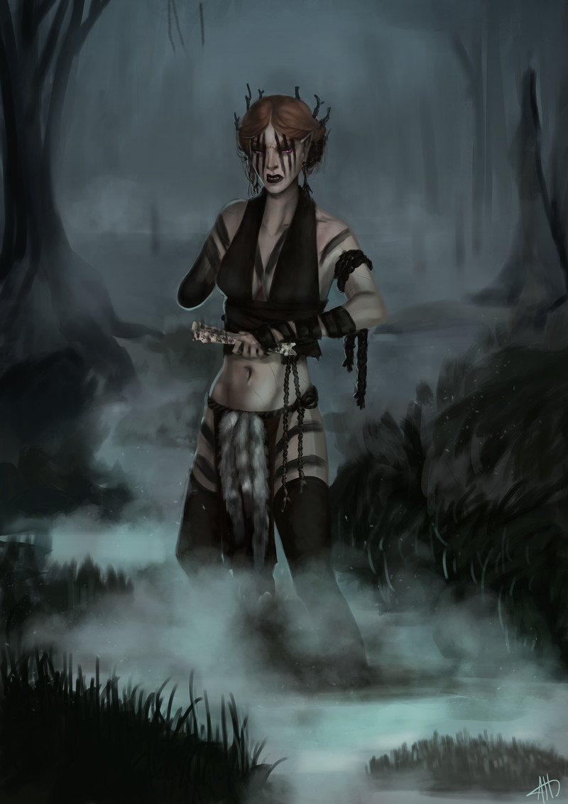
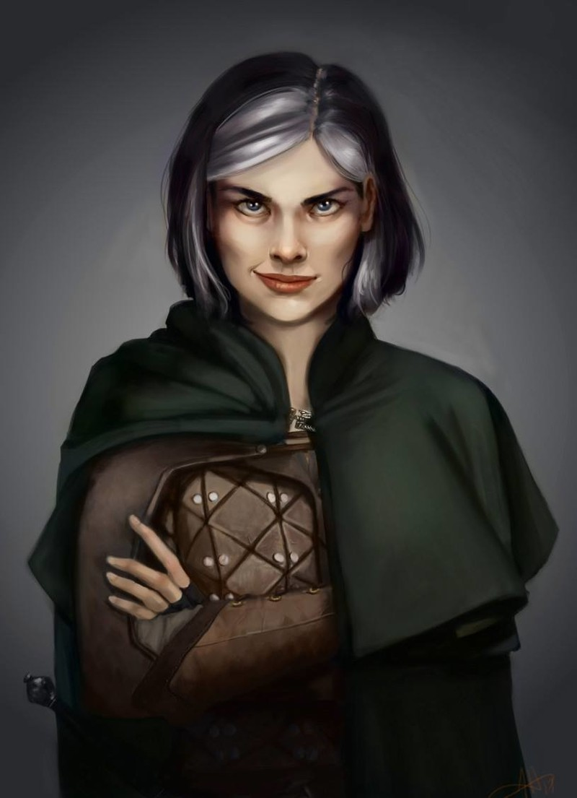

### 

### Could you tell us something about yourself?

I am a happily married cat mom living in the states, more specifically the beautiful Pacific Northwest. I have played Dungeons and Dragons and other TTRPGs for over a decade and maintain a weekly play schedule to see this day; tabletop games are my passion!

### Do you paint professionally, as a hobby artist, or both? What genre(s) do you work in?

I would say both, though more a hobby than professional. I currently lend my talents to Worldbuilding Magazine, an online and community driven magazine whose mission really resonated with me! I stay working within the realm of fantasy, especially dark or horror fantasy.

### Whose work inspires you most -- who are your role models as an artist?

My longtime role model has been [Donato Giancola](https://donatoarts.com), ever since I saw his work in my teens on the cover of the Lord of the Rings trilogy book I'd been reading at the time. I also greatly admire [Karla Ortiz](https://www.karlaortizart.com/) for her  strength of will and personality - she inspires me all the time to treat others with respect and work my butt off!

### How and when did you get to try digital painting for the first time?

I was in a junior high photography class in which we were able to use old model Wacom tablets for our work. Of course I started drawing with it instead and my professor loved what I did so much he GAVE me his own tablet so I could continue practicing at home. I had that Wacom until I started college years after and upgraded to an Intuos.

### What makes you choose digital over traditional painting?

I really don't like messes!! I feel silly about it but it's true.

### How did you find out about Krita?

It was about three years ago when my main computer quit on me, and I didn't have the cash to buy the updated Windows 10 OS for my new hard drive. I opted for trying Linux Mint, and tested Krita as my Photoshop replacement. Love at first sight! I currently run Manjaro KDE and it continues to be my only painting software (even on my Microsoft surface).

### What was your first impression?

It was a very familiar interface coming from Photoshop. I enjoyed the intuitive UI and the ease of adjusting it to my specifications.

### What do you love about Krita?

I love the way it looks, I LOVE the brush engine and how much control you have over your brush settings. Also the reference tool??? The best thing I've ever seen and I use it constantly.

### What do you think needs improvement in Krita?

I'd like a more user friendly text tool but I know that's in the works and gets improved upon often.

### 

### Is there anything that really annoys you?

Not being able to move my selection outlines across the canvas to use the same shape on another area.

### What sets Krita apart from the other tools that you use?

It's open source! I donate often but imagine a digital artist just starting out? I know I couldn't have afforded Photoshop without my student discount at the time. I also really love the brush engine.

### If you had to pick one favourite of all your work done in Krita so far, what would it be, and why?

I think it would have to be my piece "Dana" because it was the first painting I'd finished in a long time, and it was the first time I felt like I finally understood what I was doing! The lighting came together well, and I actually found myself really loving doing the leather texture on her clothes.

### What techniques and brushes did you use in it?

I tried to use a minimal amount of brushes, mostly using the round brush set to pen pressure opacity and a custom brush that is the same but with a little texture. This piece I specifically strove to paint in the textures, yes even the leather on her gauntlets and padded armor.

### Where can people see more of your work?

I have a website at annahannon.com and I also post sometimes on Twitter: [@jedejane](https://twitter.com/jedejane)

### Anything else you'd like to share?

I have been using Krita as my primary replacement for Photoshop. It has been a rare thing for me to 'wish for Photoshop'. The brushes work great, even on my huge canvas sizes. I really enjoy this software and spread the word everywhere I go. I think the collaborators on this project are doing fantastic work for the community and I support them fully.

Thank you for taking this time to interview me! Love yourself and others, and take care. 
