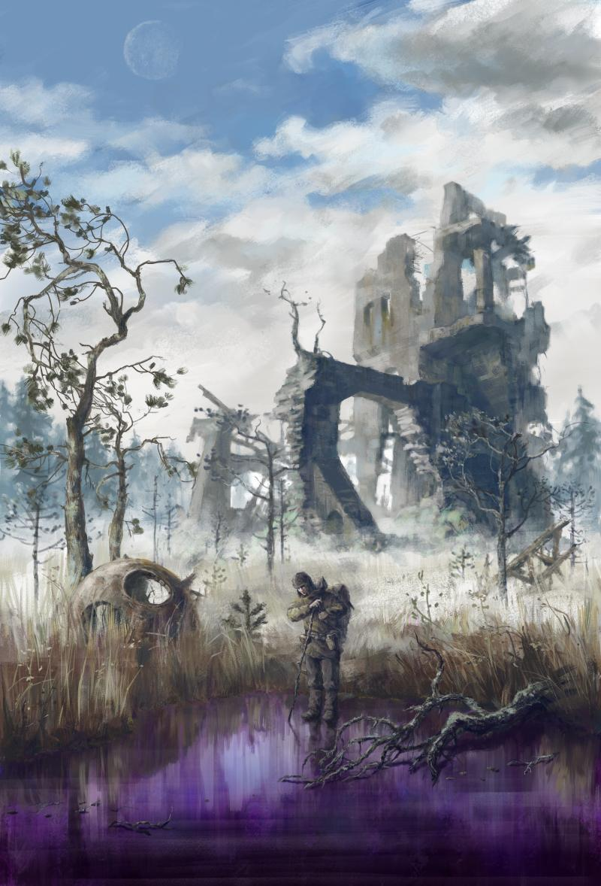
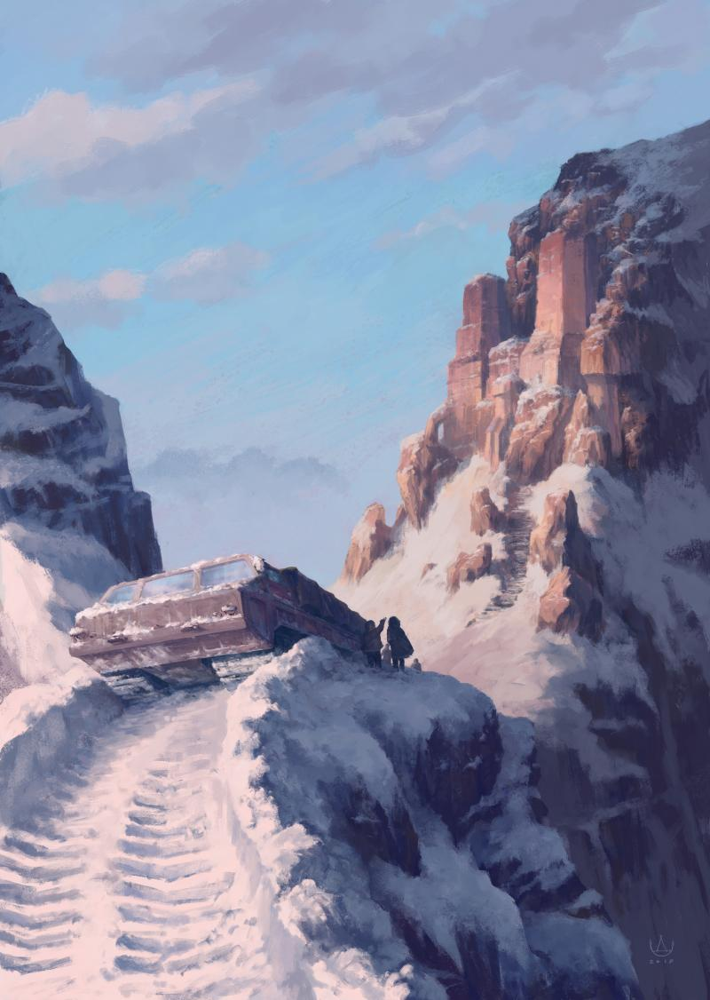
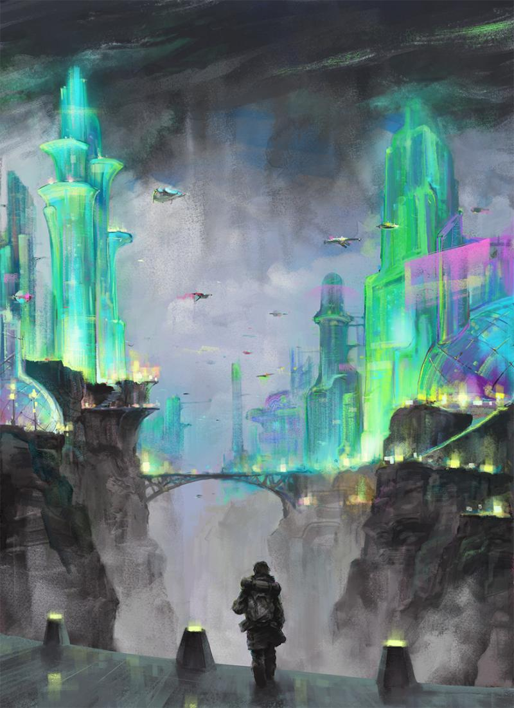

### Could you tell us something about yourself?

I live in Russia, Sochi. Graduated from art school and University with a degree in design. I've drawn since early childhood. I remember that it was my favorite pastime.

### Do you paint professionally, as a hobby artist, or both?

I professionally create logos, and covers for music albums to order. Digital painting on my topics I do not for commerce, but for the soul. Rather, I consider it my real calling, the opportunity to tell something to the world. In this respect I was very inspired by the experience of the French artist David Revoy.

### What genre(s) do you work in?

I work in different genres, but I am most attracted to sci-fi and fantasy. Mainly in a realistic presentation.

### Whose work inspires you most -- who are your role models as an artist?

As artists in digital art [Theo Prins](http://www.theoprins.com/), [Jakub Rebelka](http://shzrebelka.tumblr.com/) and [Simon Stålenhag](https://simonstalenhag.se/) inspire me.

### How and when did you get to try digital painting for the first time?

I first tried digital painting at school, 17 years ago. I really liked one of the covers of the game Heroes of Might and Magic III. I was was only for drawing). I did not have a graphics tablet, I drew with the mouse, but tried very hard.

### What makes you choose digital over traditional painting?

I am equally respectful of traditional and digital painting. Although earlier I underestimated digital painting, considering that traditional is more "real" and alive. Now I've changed my mind. They simply cannot be compared. But technically I am more comfortable with digital painting, it opens up more opportunities in manipulations with the finished image, it allows you to fully draw in a variety of conditions and places. And most importantly, it allows you to better convey it to the viewer, with help of the network and open licenses.

### How did you find out about Krita?

By accident! I have not been engaged in digital painting for a long time and a few months ago I decided to return to it. At the same time, I became interested in free software. I started searching the Internet and Krita was one of the first things I found. Decided to try out of curiosity and did not regret it.

### What was your first impression?

I was absolutely ecstatic! Krita brought back my desire to draw in digital painting! First, I bribed the screen saver with a picture of an anime character. Then I started to understand the interface and realized that it was absolutely familiar and understandable to me. Soon I felt that this program was made by artists for artists (I think so).

### What do you love about Krita?

Interface. It's very comfortable to navigate the program. I like the basic sets of brushes. Also a great opportunity to edit the picture in color and tone. It is also possible to make animation.

### What do you think needs improvement in Krita? Is there anything that really annoys you?

I do not have more extended features of transformation of the elements of the layers. This is not always necessary, so it's a small problem.

### What sets Krita apart from the other tools that you use?

Simplicity combined with great features. And versatility.

### If you had to pick one favourite of all your work done in Krita so far, what would it be, and why?

This is my first work in Krita, "City of Illusions". Simply because it is the first. Also because I had an idea and a sketch for this work for a long time, but I couldn't find the tools and programs to implement them. I think it turned out well in Krita.

### What techniques and brushes did you use in it?

I tried many different techniques and brushes, because in this work I mastered the possibilities of the program. Most often I used Chalks, Pencils, Dry Bristles, Dry Brushes and Adjust Color.

### Where can people see more of your work?

Some of my work can be seen on [Instagram](https://www.instagram.com/sivakov_d/) and [Behance](https://www.behance.net/dolmensoch278b).

### Anything else you'd like to share?

I plan to open a studio, where I will teach people to work in digital painting with Krita, as well as jointly create art projects with my students and like-minded people, to help promote this program.
