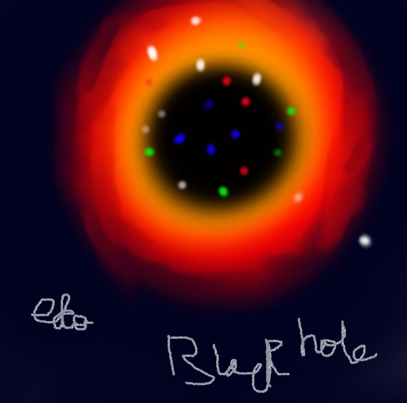
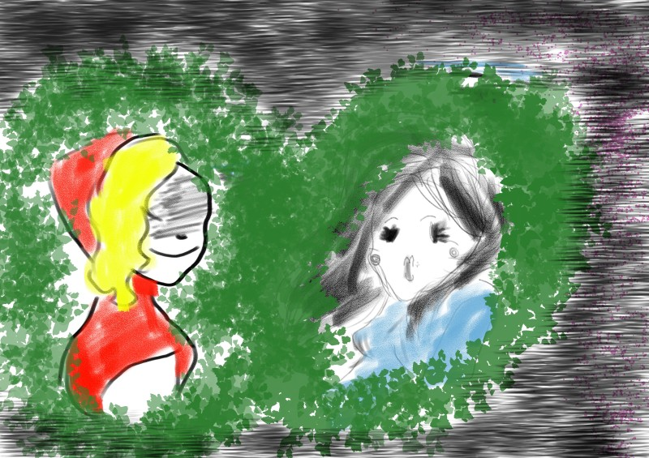
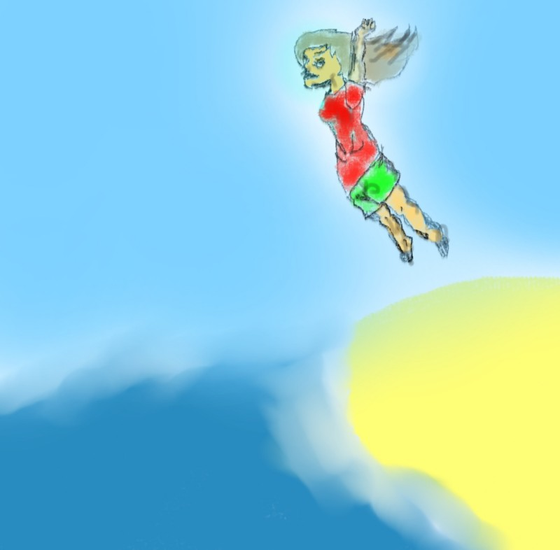
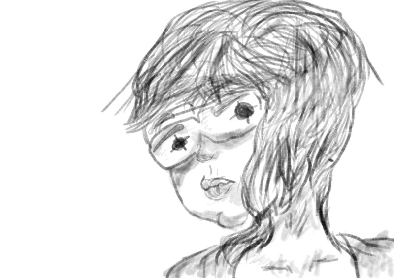
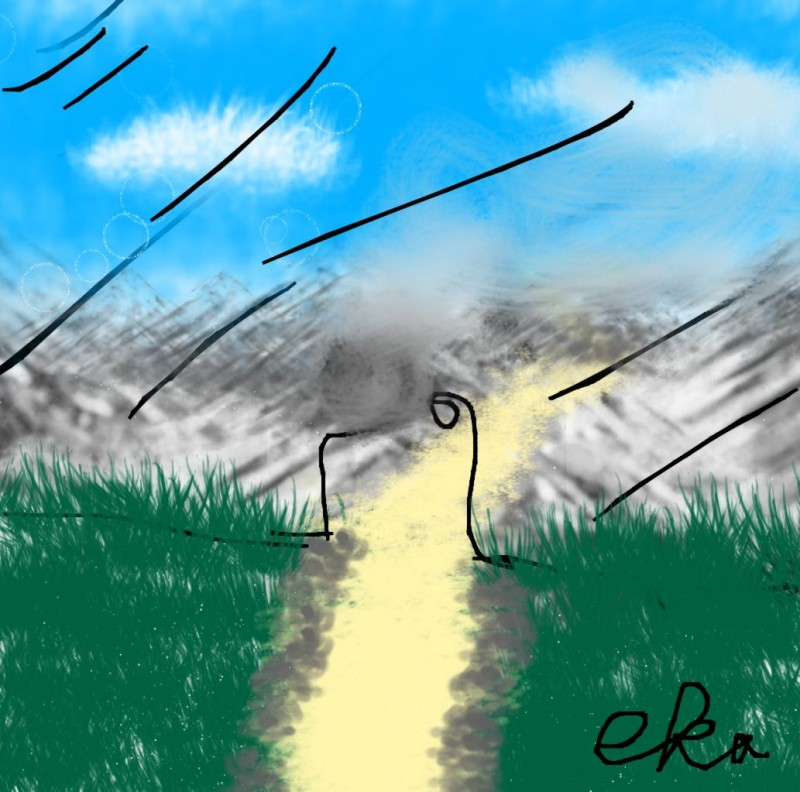
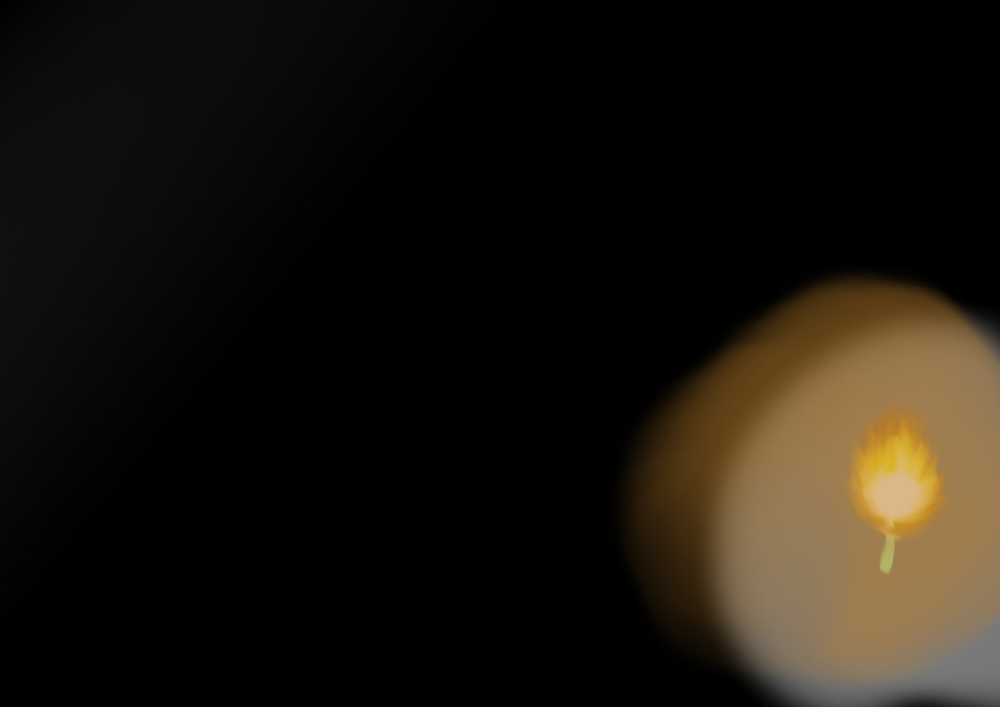

### Could you tell us something about yourself?

I have a HUGE problem in picking favorites, copy others' styles when I'm lazy (hehe):-D, ABSOLUTELY LOVE TO DRAW, play Minecraft, BlockstarPlanet, extra extra, horrible at controller, all my friends have a TV or TVs and I dont :(, hate Roblox but can still play it in Roblox banned countries and I basically love dark and creepy AND I'm not girly or boyish.

Birthday on November 30th so now I'm 12.

I have a lot of books (I love reading).

I also hate putting the signature after I draw cause it seems annoying in  my bad handwriting.

### 

### How did you find out about Krita?

I found out about Krita when I was browsing in the Ubuntu store cause for my laptop R.I.P Windows it's broken, and I found THIS AMAZING drawing software Krita in front of my eyes.

### Do you draw on paper too, and which is more fun, paper or computer?

I do some doodles and random stuff on paper and walls (erased :(() and floors sometimes and tables (hoho).

### What kinds of pictures do you draw?

I draw mostly humans and creepy creatures.

### What is easy to do with Krita? What is difficult to do?

Everything is easy to do with Krita.

### What is the best thing about Krita?

Best thing is basically everything.

### Is there anything in Krita that you'd like to be different?

Everything is fine in Krita.

### What is your favourite picture that you made with Krita?

I don't know but I sent a bunch.

### What brushes and techniques did you use to make it?

Brushes are sometimes the David Revoy brushes, sometimes the Krita brushes.

### Is there somewhere we can see more of your work?

See more of my art at [eka icydust (youtube)](https://www.youtube.com/channel/UC78klZaKT1POrD35y9zkIWQ)

### Is there anything else you'd like to tell us?

I need subscribers boohoo.

