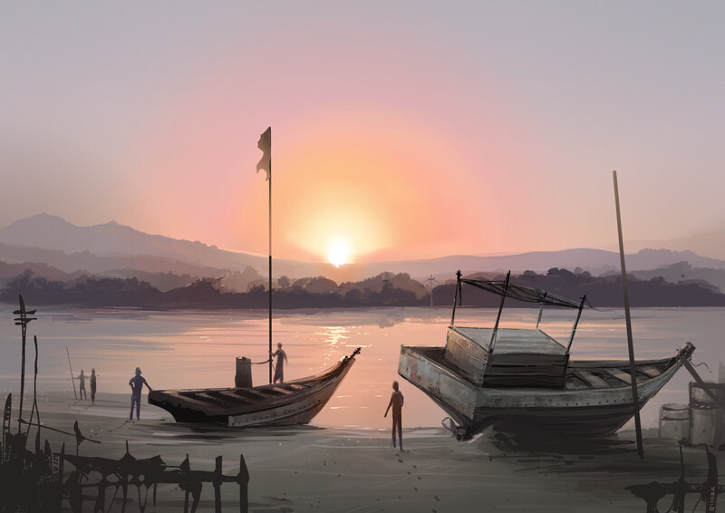
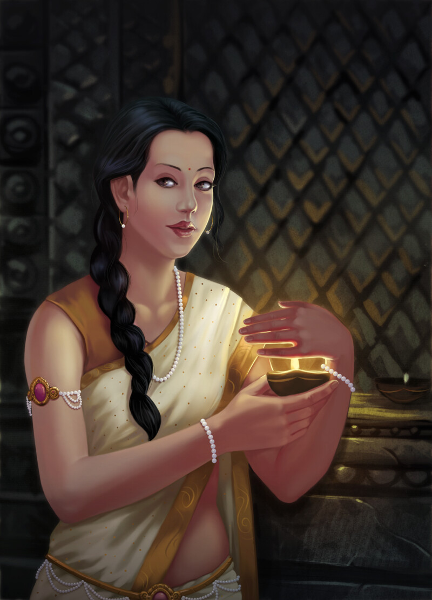
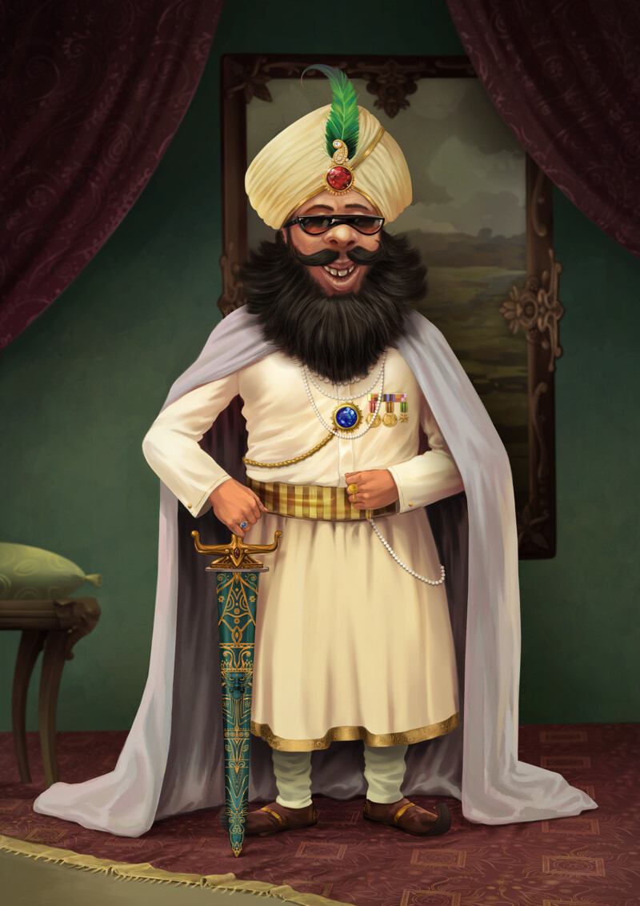
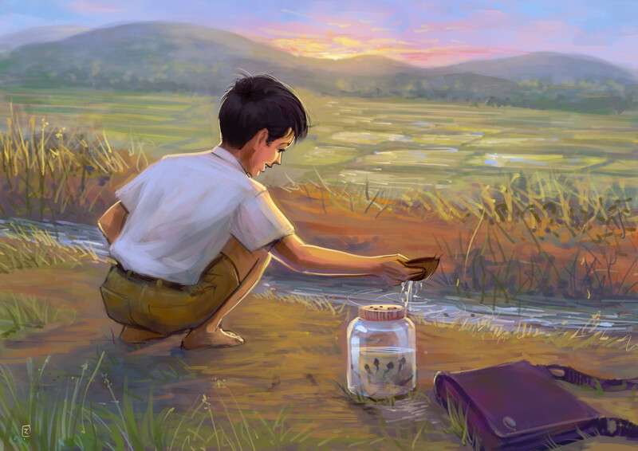

### Could you tell us something about yourself?

My name is Raghavendra Kamath (raghukamath on the internet), I am a freelance illustrator from Mumbai India, I have been painting and creating digital illustrations for some well-known brands in India since past 10 years. I have also worked in the comic industry here collaborating with publishers and storytellers. I am also a Free and Open-source Software enthusiast, I use only free software to create my artwork and I try to contribute back to community in whatever way I can.

### Do you paint professionally, as a hobby artist, or both?

I am very delighted to say that my hobby is my profession, I think that goes for all artists. I paint for my clients as a professional and I paint for myself as a hobby artist.

### What genre(s) do you work in?

I mostly work with Advertising Illustrations, children's book and comic books, some times I take projects which also involve a bit of designing like book covers etc. For my personal projects I choose to work in the adventure and fantasy genre.

### 

### Whose work inspires you most -- who are your role models as an artist?

The earliest inspiration for me was my father. He used to paint big signboards and stage backdrops etcetera. He thought me how to hold a brush at an early age. I didn't have my own computer until I was in my last-but-one year of graduation, at that time we had slow and inconsistent internet, and the moment I got to browse it I was amazed by many artists like Boris Vallejo, Frank Frazetta, Adam Hughes, Alex Ross and others. Ialso seek inspiration from manga artists like Takehiko Inoue, some other illustrators like Sam Weber, and many more. For a long time I was a data hoarder, I used to save anything that I found interesting on the internet :)

### How and when did you get to try digital painting for the first time?

I tried digital painting for the first time when I was in the third year of my undergraduate studies, I think it was in 2007. I painted using a mouse initially. It was mostly for college assignments. Prior to that I had done some vector graphics illustrations while I was learning computers in high school.

### What makes you choose digital over traditional painting?

For a quick answer, I would say the power to immensely control your output. Other reason would be that it didn't require costly canvas or paper, our house was also very small so there were space constraints. Painting on computer seemed convenient at that time.

### How did you find out about Krita?

I had a bad experience from other software and the service I received was not worth the energy and money I was putting in it. I started to search for alternatives and stumbled upon Krita, this was around 2014. It piqued my curiosity and by reading all the blog posts written by David Revoy I was convinced to make the switch to Krita.

### What was your first impression?

I was very surprised and excited as if someone had unexpectedly found a treasure hidden in their farm. I didn't find it hard to use, and I was comfortable using it in my professional workflow in no time. I was very happy to see that the tools were made with artists as target audience.

### What do you love about Krita?

In terms of features there are many things to list :), but the core part that I love about it is the passion and love that goes into making it. I love how every feature is thoughtfully designed to suit our workflow. I love to play and experiment with brush engines, creating new brush is always fun and I happily lose many hours playing with various sorts of settings and textures etc.

### What do you think needs improvement in Krita? Is there anything that really annoys you?

I don't find anything particularly annoying. If there are some problems I try to report them to the developers, I urge other users to do so too. The things which are hindrances are already being worked on by the developers so no complaints. In terms of improvement like everyone I would say stability and speed needs more love.

### What sets Krita apart from the other tools that you use?

Simplicity while also being powerful enough to handle most of the digital painters' need. Really clear vision and goal as a project which is targeted towards digital artists. Friendly community and developers.

### If you had to pick one favourite of all your work done in Krita so far, what would it be, and why?

I don't get attached to my paintings that much. My favourite would be my latest painting of a young boy catching tadpoles.

### What techniques and brushes did you use in it?

I mostly used the default brushes in Krita called Basic 2 opacity to make the initial sketch and Dry Roller to paint. I have also used some of the textured brushes from my own [brush kit](https://raghukamath.com/journal/brush-pack-for-krita-v20), which I think needs to be updated now :)

### Where can people see more of your work?

On my website [raghukamath.com](https://raghukamath.com) and other portfolio sites and galleries. I post with “raghukamath” as my username.

### Anything else you'd like to share?

I would like to tell new artists to enjoy painting, contribute to the community, share your artworks on the internet and discuss the process in a collaborative way. Share your resources and knowledge, it will help you improve yourself too.

You can ping me on #freenode IRC: my nick is raghukamath. On mastodon I am [raghukamath@mastodon.art](https://mastodon.art/@raghukamath); you can also find me on [Twitter](https://twitter.com/raghukamath/). I occasionally put some tutorials on my [website](https://raghukamath.com/tutorials/) and [YouTube](https://www.youtube.com/user/Raghvendrakamath/).
