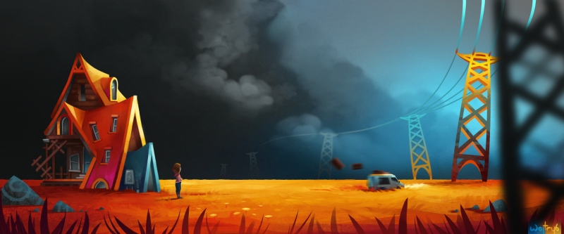
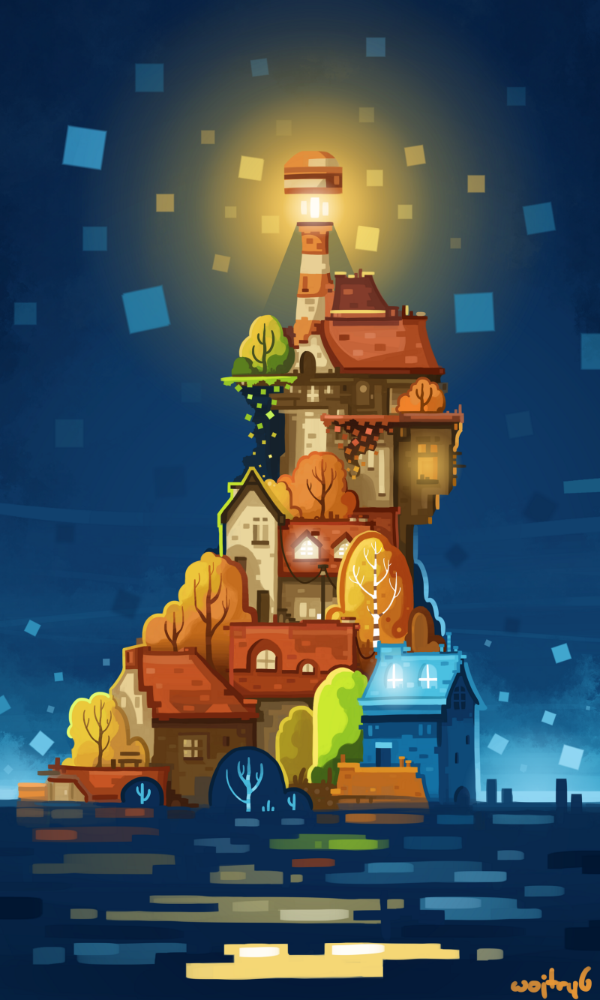
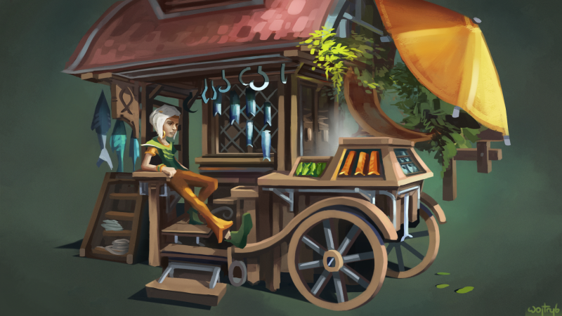
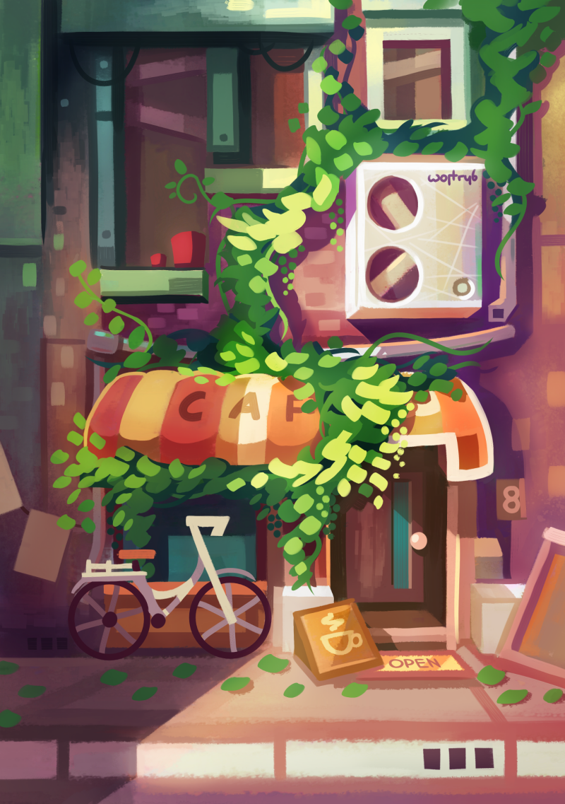
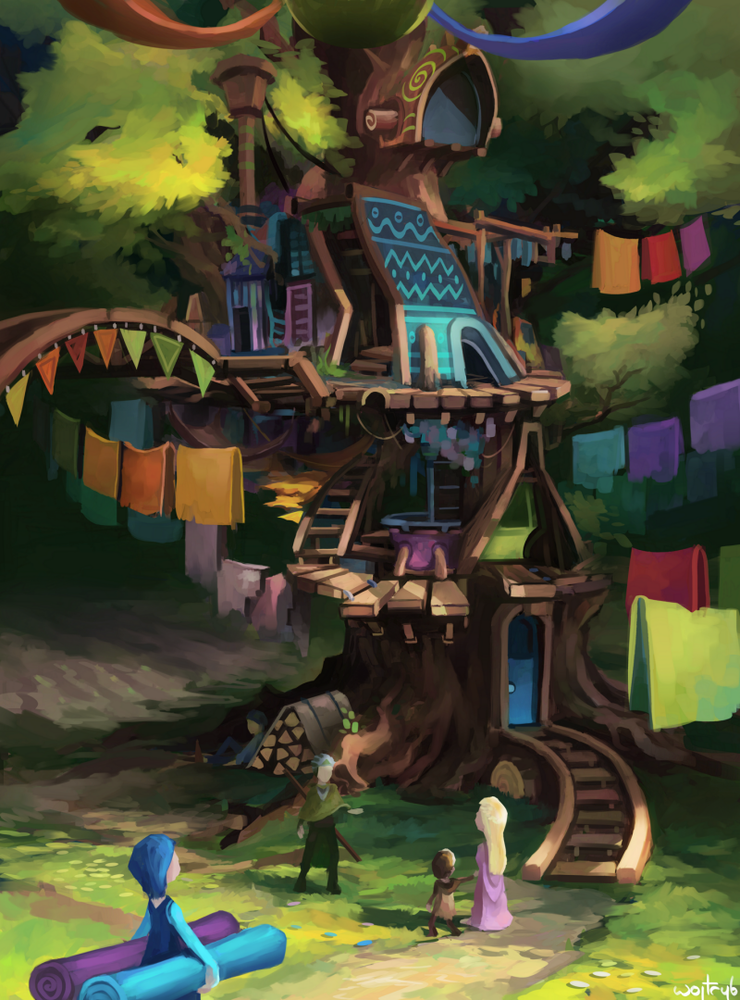

### Could you tell us something about yourself?

My name is Wojtek Trybus and I publish artworks as wojtryb. I'm in the last year of Computer Science studies in Poland. I'm also a pianist since 6, and happen to be a hobbyist and self-taught illustrator for something like 8 years now.

### Do you paint professionally, as a hobby artist, or both?

Drawing was always something that, despite being quite hard to learn, was making me happy and fulfilled. I guess this counts as a hobby then. I don't make any money from it right now and I still haven't decided if I will be more of a programmer or a graphic designer in the nearest future.

### What genre(s) do you work in?

My artistic journey started with some simple and minimalistic illustrations - by keeping them so simple, I never got discouraged, as most beginners do, jumping straight into complex artworks. As my knowledge and experience grew, it all became more and more complicated, though the need to keep this feeling of simplicity in my artworks still remains.

### Whose work inspires you most -- who are your role models as an artist?

Vlad Gerasimov, founder of [Vladstudio](https://vlad.studio), was my first great inspiration - my minimalistic illustrations originated from his way of seeing the world. I think it is still a bit visible in my artworks, even though our ways parted long time ago, as I switched to a much different approach. Currently, I guess I'm more into [David Revoy](https://www.davidrevoy.com/) - his open source ideology - and [Nathan Fowkes](http://www.nathanfowkesart.com/) http://www.nathanfowkesart.com/, whose work, especially for the "How to train your dragon" movie, is for me the absolute level cap that an artist can achieve. [Julia Blattman](https://juliablattman.com/illustrations/) is also worth mentioning, as her artworks full of imagination remind me of what I felt looking at those Vladstudio illustrations long time ago.

### How and when did you get to try digital painting for the first time?

As a kid, as many other kids, I used to love computer games - when I grew up a bit, I noticed that it was not the games I liked that much, but the worlds they took me to. When in 2011 I found out how you can use GIMP and a digital tablet to create something similar, it all began.

### What makes you choose digital over traditional painting?

Making a lot of mess was always something that bothered me. I still remember how I hated art classes in primary school with kids covering every single thing in the room with paint. In digital painting you can always elegantly save and quit with your hands clean. While I still really enjoy sketching with pencil and pen, I'm afraid I will have a tough job to convince myself to use real paint again (as I know traditional media can give you a lot).

### How did you find out about Krita?

It was 2015, I guess, when I read about it on David Revoy's blog for the first time - I suppose many artists switched from GIMP to Krita somewhere in that time because of his support to the program.

### What was your first impression?

Insanely laggy :D It took me one year to accidentally switch something in settings, that suddenly made it work normally. Luckily, with each update, it's less likely for someone to have such a problem again. After I made my first artwork in 2016, Krita happened to exceed GIMP in any way possible. I fell in love instantly.

### What do you love about Krita?

I love how Krita makes it possible for everyone to learn how to draw, while not wanting anything in exchange. It kind of restores my faith in humanity every time I think about it. It's even harder to believe that developers manage to constantly update and improve it, while their budget and human resources are hard to compare with those that other art programs have.

### What do you think needs improvement in Krita? Is there anything that really annoys you?

I don't think there are too many flaws right now in the program itself. All the bugs I noticed in 2016 have been fixed by now. It also seems really stable on Kubuntu - the crashes are happening less often than in the past. Developers did a gorgeous job again and I guess, and with this whole "squash the bugs" campaign they really meant it.

The thing that bothers me though, is how Krita is sometimes perceived across the internet - some people think it is still laggy or full of bugs - maybe it used to be that way, but in my opinion changed a lot in recent years. Some others may underappreciate it, as Photoshop is still the standard required in the industry.

I'm really grateful for each and every artist who already helps to promote the program on social media and art-related websites, but I believe it still deserves more - more recognition, professional users, more mind-blowing, "Made in Krita" artworks that would inspire beginners, finally maybe even more donations for further development.

I try to promote it the best I can and it even encourages me to practice and improve as an artist, but I still think we lack some PR - come on guys. Let's show what we can do with Krita :)

### What sets Krita apart from the other tools that you use?

Actually I don't use any other drawing application as I simply don't need one. I think that says a lot about it. Krita still allows me to constantly develop, and I'm sure that the only thing now that limits me is my current lack of skills. But I'm constantly working on that.

### If you had to pick one favourite of all your work done in Krita so far, what would it be, and why?

One of my most recent illustrations is "festival preparation" - it indicates the direction I want to go with my art - to improve in art foundations, while keeping it fun and full of imagination. A lot of things I studied recently were used here, and it seems it all went particularly well.

### What techniques and brushes did you use in it?

By coincidence, this artwork was actually a final test of brushes I use, that recently had some serious modifications to them. As I like things simple, they don't mess that much with brush tips and textures as most of presets available on the internet do, but are quite tricky in terms of dynamics - they can randomize rotation and colors to differentiate the strokes. You can actually check them out, as I made them available to use freely some time ago: \[[Link to brushes](https://www.dropbox.com/sh/tbpkifi2ogou65j/AADniEBp-kBAAqlU4svq4RxWa?dl=0&fbclid=IwAR0waTTBtap3bZPZTljXrUDFNMXDns-8rw4EKbU6k4U4-tPMF_Hs4z9AX1Y)\]

### Where can people see more of your work?

I use artstation as my more refined portfolio and facebook for loose updates. Some of my older artworks can still be found on deviantArt.

[https://www.facebook.com/trybus.wojciech](https://www.facebook.com/trybus.wojciech) [https://www.artstation.com/wojtryb](https://www.artstation.com/wojtryb) [https://www.deviantart.com/wojtryb](https://www.deviantart.com/wojtryb)

### Anything else you'd like to share?

Soon I'll be graduating from college and there are lots of changes and decisions ahead of me for sure - keep your fingers crossed in case I need them to still make progress at the current pace and create the art I love :)
