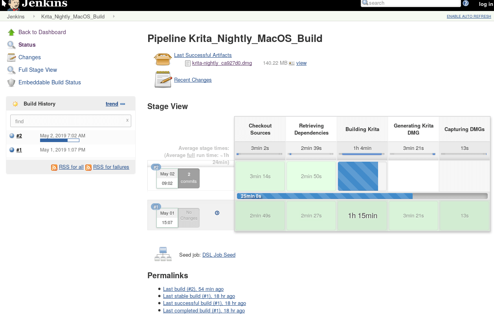

Thanks to the hard work of Ivan Yossi and KDE system admin Ben Cooksley, we've got [nightly builds for macOS](https://binary-factory.kde.org/job/Krita_Nightly_MacOS_Build/) now! (We already had nightly builds for Linux and 64 bit Windows).

[Nightly builds](https://binary-factory.kde.org/job/Krita_Nightly_MacOS_Build/) are created once a day from the freshest code in our git repository. They are a great way to track development: see the latest features taking shape and enjoy the latest bug fixes. And the newest bugs as as well, of course: nightly builds are not meant to be used for production work.

Note that the [macOS nightly builds](https://binary-factory.kde.org/job/Krita_Nightly_MacOS_Build/) are not signed: Apple's expensive and idiosyncratic ideas about how binaries should be signed mean that KDE as an organization cannot sign binaries, so the Krita maintainer, Boudewijn Rempt, has to do that with his personal developer certificate, on his personal Macbook Pro, and that would add a manual step to the process.

So, if you want to run the [nightly builds,](https://binary-factory.kde.org/job/Krita_Nightly_MacOS_Build/) you have to drag the app bundle somewhere and double-click krita.app. You will get a warning dialog which you can close. Then go to the system settings app, select the Security and Privacy page. In the General tab there will be a message "Krita.app was blocked from opening because it is not from an identified developer.” Click on "Open Anyway" and enjoy!
