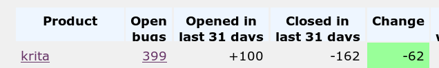
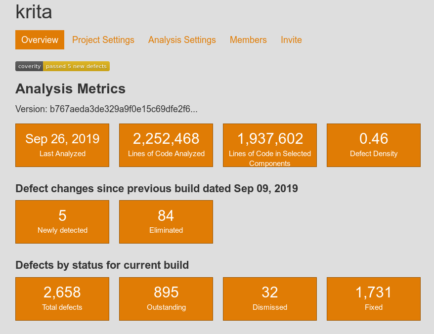

We're about to do another bug-fix release of Krita: that'll be 4.2.7. We're seeing that the number of new bug reports is dropping a bit, week over week: even though most bug reports can be closed instantly as duplicates or not bugs at all, that's probably a sign that our stable releases are getting more and more stable. (See **[here](https://docs.krita.org/en/untranslatable_pages/reporting_bugs.html)** to learn how to make good bug reports.) Though the total number of open bugs remains high, we worked really hard all September to make Krita better:

We also managed make 538 changes to the code in September with 23 developers -- and that excludes translations, since those aren't in our code repository.

We also went back to the [Coverity Static Code analyzer](https://scan.coverity.com/projects/krita?tab=overview) and started analyzing Krita again. That was good for at least a hundred potential bug fixes, and it's something that's ongoing. We hadn't done that for quite some time! There is still plenty to do, but the average defect density for projects the size of Krita is 0.7, so we're not _that_ bad.

Of course, focus on fixing bugs means that there's less time for cool new features, or extending existing features. We did merge Sharaf Zaman's Android port, though, which means that pretty soon we should have signed nightly Android APK's!

Today during our weekly contributors meeting (notes are **[here](https://docs.google.com/document/d/1_GLkMJTtr5o-ruFRkA-14EQLPVvvoF7hILYyLuYoips/edit#)**), we decided we wanted to continue and do another couple of montly bug fix releases in the 4.2 series. In what's currently our master branch, there are quite a few nice new features we'd like to share, though, and we'll start making alpha builds of master in October, and invite everyone to help test what will become Krita 4.3.0.

We had originally wanted to release 4.3.0 in October, and have a fundraiser to celebrate the release. Part of the reason we're postponing 4.3.0 is that we'd like to continue for a while with the stable 4.2 releases. Another reason is that we want 4.3.0 to have a completely reworked system for loading, handling and saving things like brush presets. We've been working on that for a long time now, and things are coming together, but there's still a lot that needs to be done.
