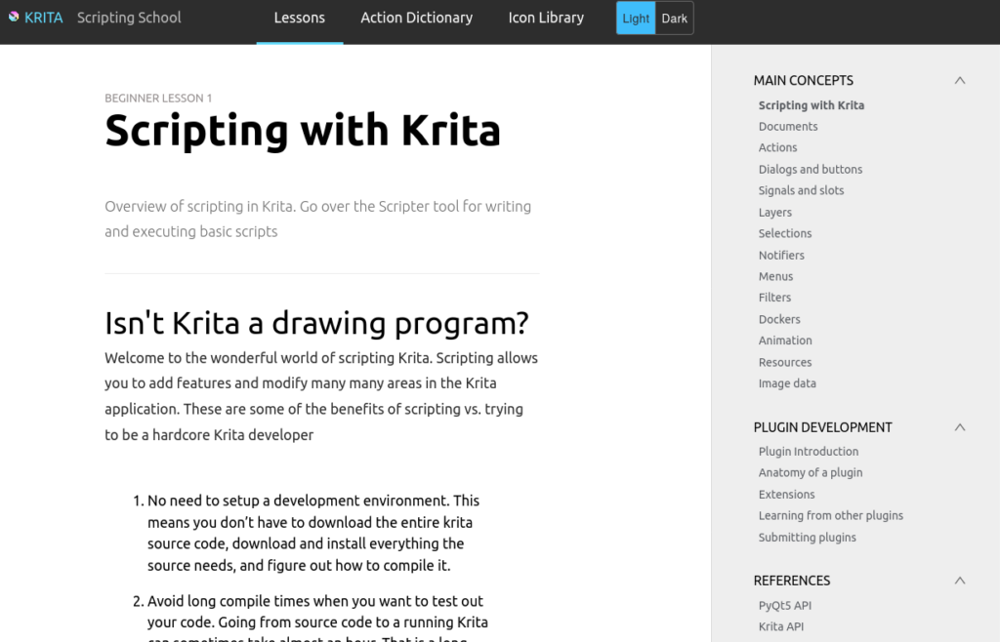

In 2018, we reintroducted scripting to Krita. Unlike our previous attempts to provide scripting, this time it took off! People are making all kinds of useful and fun extensions for Krita. Like a [new color picker and mixer](https://krita-artists.org/t/pigment-o-plugin/4531), a plugin to modify the way Krita's [subwindows are handled](https://krita-artists.org/t/plugin-subwindow-organizer/10225), [new toolboxes](https://krita-artists.org/t/kanvasbuddy-a-minimalist-toolbar/549), integration with other applications like [Autodesk Shotgun](https://github.com/diegogarciahuerta/tk-krita),

But what was missing was a good overview of the various areas that could be scripted. Tutorials and example code on how to use the scripting API in bite-size chunks. The regular [API documentation](https://api.kde.org/appscomplete-api/krita-apidocs/libs/libkis/html/) is generated automatically from the APIDOX comments. It is a good reference but can be difficult to understand since it is generated from the C++ code that provides the scripting bindings.

Scott Petrovic, Krita's UX designer and website maintainer, created a fresh new tutorial website: [Scripting with Krita](https://scripting.krita.org/lessons/introduction):

\[caption id="attachment\_10885" align="aligncenter" width="1024"\] Scripting with Krita\[/caption\]

And there are not just the lessons teaching you about creating scripts, running them, using the Krita scripting API and how to develop plugins, there are also really useful overviews of the actions your script can trigger and the icons you can use!
