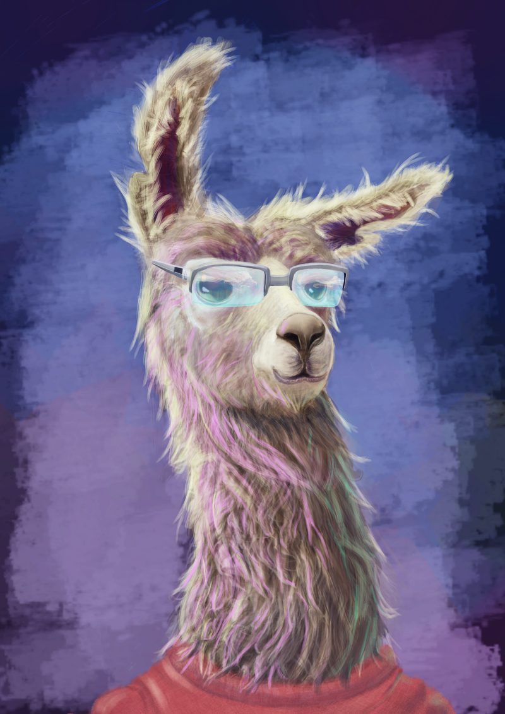
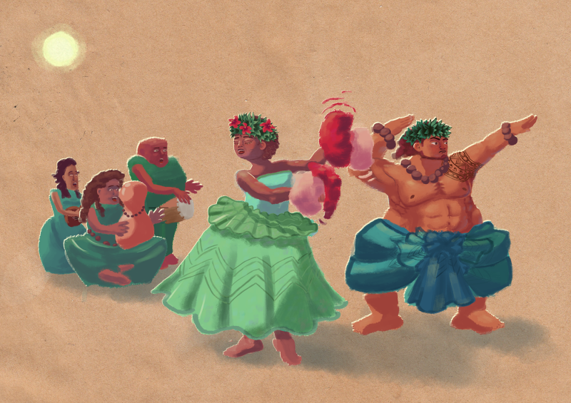
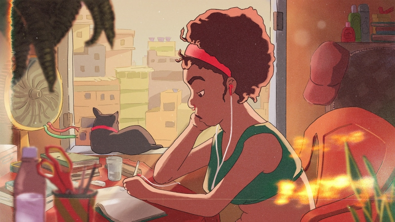

### 

### Could you tell us something about yourself?

I'm Jeff, a brazilian animator and character designer (sometimes illustrator). I have a bachelor's degree in biology and cinema, the latter one being completed in 2019, specialized in animation.

### Do you paint professionally, as a hobby artist, or both?

Both, it's a bit odd, you know, your profession and hobby all mixed together, I'm trying to get back to playing video games and trying to read more non-related things. It's good to get a bit out of the bubble.

### What genre(s) do you work in?

I love to draw animals and make creatures. But recently I'm drawing a lot of people to get better at it, normally some fantasy or superhero themes in urban context.

### Whose work inspires you most -- who are your role models as an artist?

Hmm, the first to come to mind is Chuck Jones, it was the first name I recognized again and again in cartoons and as a child I had thoughts like "he must be the most amazing guy" And after reading his book [_Chuck Amuck_](https://www.goodreads.com/book/show/338619.Chuck_Amuck) and [_The Noble Approach_](https://www.goodreads.com/book/show/15842254-the-noble-approach) by [Maurice Noble](https://en.wikipedia.org/wiki/Maurice_Noble) it turned out to be true.

### How and when did you get to try digital painting for the first time?

My first experience was with an illustrator on a very bad "CGI" course. But what I liked the most was the flash. In this course I received classes in almost the entire suite of Adobe and Maya, all in 2007. In 2009 I went to college, on the biology course, and stopped studying animation and drawing. After 3 years of biology I returned to digital art with pixel art and vectors in inkscape and aseprite.

### What makes you choose digital over traditional painting?

In the beginning it was fear, with pixel art and vectors I had all the control. After that was because of animation, doing 2d animation on paper needs a huge setup and you know what Uncle Ben said, "with big setups comes a big bill to pay". Nowdays I still do animation, but I don't make a choice, I do what each project needs, recently I directed a stop-motion short because it was the right language for the message.

### 

### How did you find out about Krita?

I use Linux as a main OS from time to time, in 2016 I was searching open source alternatives for drawing, back in the days I was using MyPaint, I never liked Gimp for drawing, so I used an "alternative" copy of other software, but not Photoshop, I never liked to draw with Photoshop. Then I found this piece of software that looked like a good alternative and tried. It fit all my expectations.

### What was your first impression?

Wow, it's like Photoshop, hey, the right click what...

### What do you love about Krita?

Tough one. Can I say David Revoy? or Wolthera? I learned so much from those two. Ok, enough kidding, I love the layer management. I don't have to use the mouse to quickly rename and organize everything, I worked in an office where I had to use Photoshop, and man, oh man, I suddenly realized why every artist ever who uses Photoshop doesn't rename layers, it's just terrible.

### What do you think needs improvement in Krita? Is there anything that really annoys you?

The Windows port, it's just slow. I had to get back to Windows a year ago and with a better configuration it's slower than the Linux version. It was the most difficult thing I had to cope with when trying to make some friends get into krita, it's like flipping a coin, sometimes it works, sometimes not.

### What sets Krita apart from the other tools that you use?

The organization of the tools, whenever I'm teaching about Krita, I had the time to "get into the mindset", you don't need a tool for everything, open a dock and a tool has many ways.

### If you had to pick one favourite of all your work done in Krita so far, what would it be, and why?

My static favourite is the version of the lofi girl I did for a twitter thread. I used all my knowledge of art and krita to make it: filter layers, g'mic, collage, masks, textures, brushes et cetera.

My animated favourite is a short animation about coffee making where I made a texture with used coffee filters.

<iframe src="https://player.vimeo.com/video/269417045" width="640" height="479" frameborder="0" allowfullscreen="allowfullscreen"></iframe>

[Café](https://vimeo.com/269417045) from [Jefferson Nascimento](https://vimeo.com/jeffanimation) on [Vimeo](https://vimeo.com).

### What techniques and brushes did you use in it?

I try to be simple. I use some layers, but not many and sometimes I use photobashing because I like to get the mixing of cartoons and photos. As for brushes, I love the recent pack of David Revoy. I like the rough ones, tons of texture in my line.

### Where can people see more of your work?

Twitter: [@jeff\_lhama](https://twitter.com/jeff_lhama) Instagram: [@jeff\_lhama](https://www.instagram.com/jeff_lhama/) Vimeo: [jeffanimation](https://vimeo.com/jeffanimation) Behance: [jeffsn](https://www.behance.net/jeffsn)

### Anything else you'd like to share?

I have this story where I managed to install Krita, Blender and OpenToonz on all computers at the college. My college is UFPEL (Federal University of Pelotas), a public institution, there we have a lot of freedom to use the tool you want, for good and for bad at the same time. In my first semester, I made a small pen drive with all the necessary software; whenever we had some work to do in the classroom, I would turn on the unit and use one of them. Some teachers started asking me from time to time what I was doing and I explained all the advantages. In my second semester we had a great job, making a 2D animation short. At that point there was the addition of the animation tools to Krita and the launch of OpenToonz and I convinced my team to use them, because I was using Linux and I have no option of using flash, Toonboom or even Photoshop at home; therefore, for compatibility reasons, we had to work with these tools. At the moment, I already had a lot of knowledge about the tools, I had a YouTube channel about OpenToonz and Krita. So it was easy to get the team on the boat. After a while, one of the team colleagues asked the professor responsible for the software to install Krita and OpenToonz, because it would be easier to work on any computer. The professor came to me and we installed Krita, OpenToonz and Blender in two laboratories. After the end of the semester, at the beginning of the third, I was surprised, all the computers got Krita, OpenToonz and Blender. And I received invitations to hold workshops on the use of Krita and OpenToonz. Today, most of the short frame-by-frame animations made here are powered by Krita. (And a secret, I helped to change the 3d workflow from Max to Blender too)
