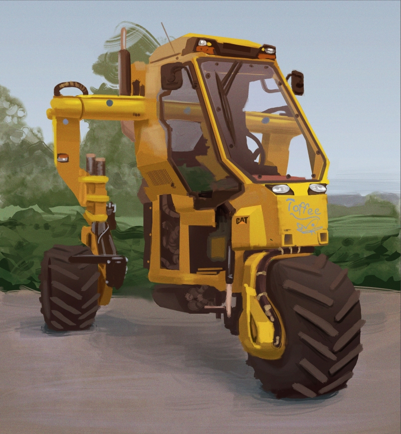
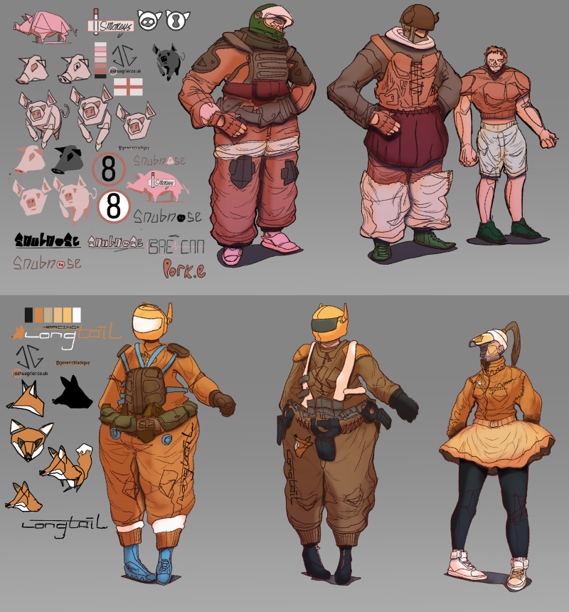
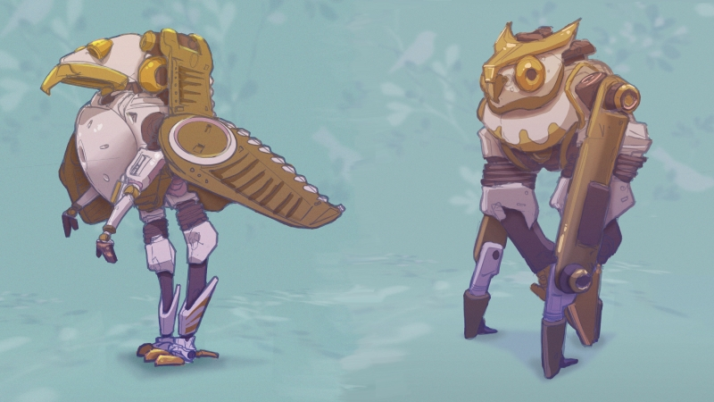
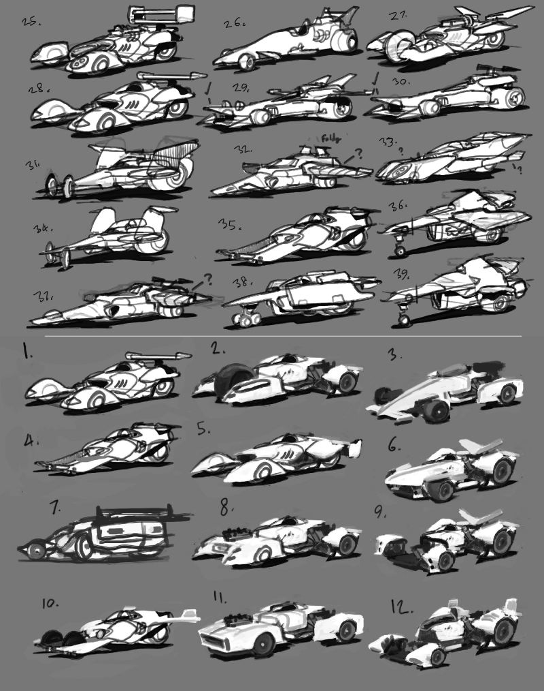

### 

### Could you tell us something about yourself?

I’m Josh, and I love design. There’s nothing better than taking people’s stories, thoughts, feelings, wants and needs and responding to them in practical ways.

### Do you paint professionally, as a hobby artist, or both?

As my full time job I’m a Concept Artist in the video game industry, I spend a lot of my free time practicing as well though.

### What genre(s) do you work in?

Mostly on props, vehicles, toys, mechanical things and environments in my comfort zone. Generally whatever the job requires though in my day to day. Everything is interesting, and drawing is drawing whatever the subject or style.

### Whose work inspires you most -- who are your role models as an artist?

For a long while now it’s been Vaughan Ling, Sinix, Jake Parker and Scott Robertson. By extension though I’d say my friends and peers in the concept art community in general. And going back I have a thing for lithography. Love M.C. Escher and Gustave Dore.

### How and when did you get to try digital painting for the first time?

Some time during primary school on a really old Corel tablet I got as a present haha. I tried doing some ‘Zoids’ fan art and it was a pretty brutal learning curve. I’m sure everyone has some anime fanart attempts deep in the archives!

### What makes you choose digital over traditional painting?

Mostly efficiency as what I create for work needs to be done reasonably quick and needs to be flexible when it comes to making changes and rapidly iterating.

### How did you find out about Krita?

I heard about it through some artists I follow. Sinix and Sycra have Youtube videos showcasing the software from a while back.

### What was your first impression?

I found the brush engine stood out to me over competing programs. It felt and still feels far more intuitive and more well designed for art and design than other packages I’ve tried to use.

### What do you love about Krita?

I love that Krita is accessible to all of the creative community, I love how versatile/customizable it is and how high quality it is and continues to be as it’s improved over the years!

### What do you think needs improvement in Krita? Is there anything that really annoys you?

Most things have been fixed that bothered me, I’d say that some of the animation tools are a little frustrating sometimes when you’re working on something complex. Text tools also.

### What sets Krita apart from the other tools that you use?

For me personally I’ve found the brush engine more forgiving than other pieces of software and through working with others I’ve gotten comfortable with creating my own presets and modifying them when I need specific tools. In most other software I just use whatever the default is haha.

### If you had to pick one favourite of all your work done in Krita so far, what would it be, and why?

Ooh always a tough one haha. Of the recent work I’ve done in Krita that I can share I’d say the car thumbnails for my Masters project are my favourite. To me they represent breaking through to a level of confidence in my professional work I’d not experienced to that level previously.

### What techniques and brushes did you use in it?

I follow a pretty traditional workflow a lot of the time. For that it was mostly a thick marker brush and a thin marker brush with 70-80% opacity and directional stroke turned on to work in and out of my shapes (erasing with the same brushes too to control values.) I’ve found this to nicely simulate the process of using markers and ink to draft up design ideas.

On my Instagram for smaller regular updates [instagram.com/genericblackguy](https://instagram.com/genericblackguy) and on my artstation for my portfolio at [artstation.com/joshuagrier](https://artstation.com/joshuagrier)

### Anything else you'd like to share?

Good luck in your art journeys and feel free to reach out, I’m always happy to interact with the wider community! Check out GD Quest's Krita brush pack, I helped Nathan work on the updated brush pack (not paid or sponsored or anything I just find it useful) [https://gumroad.com/gdquest](https://gumroad.com/gdquest)

Oh and hopefully I can share some even cooler design work I’ve done and will continue to do in Krita in the near future soon, thanks!
